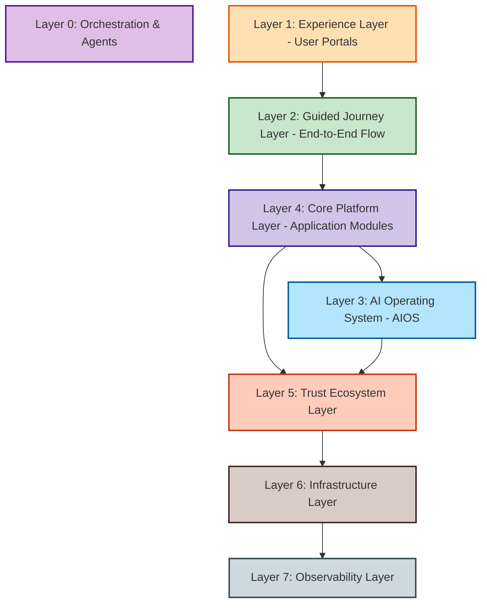
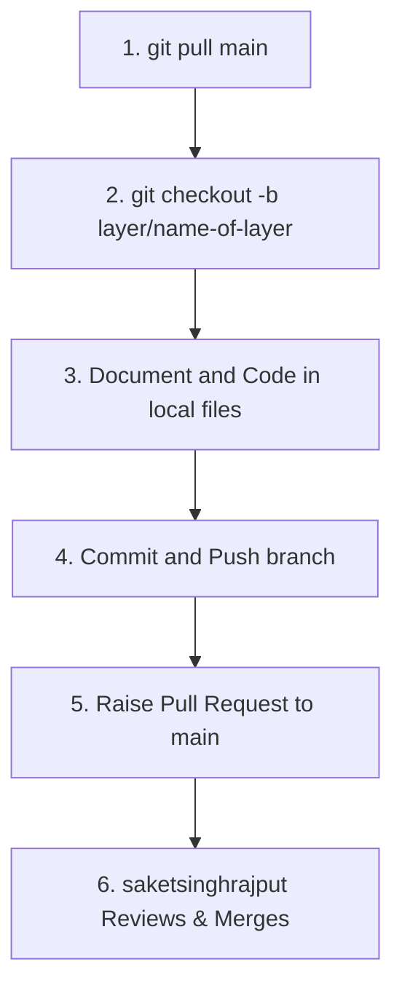

# 🏰 Allure Interiors - Frontend
> **Master Frontend Architecture & Developer Guidelines**

Welcome to the **Allure Interiors** frontend repository. This document outlines our Master Architecture, layer dependencies, endpoint connection rules, service implementation standards, development priority steps, and contribution guidelines for the frontend application.

---

## 👑 Repository Administration & Core Rule
* **Main Administrator / Maintainer:** **saketsinghrajput** ([@saketsinghrajput](https://github.com/saketsinghrajput))
* **CRITICAL PRE-REQUISITE:** Before starting any development work, you **must** run `git pull` on the main branch to ensure you have the latest upstream changes.

---

## 🗺️ Master Architecture Layer Breakdown
The Allure Interiors system consists of 8 interconnected layers. The frontend code is divided into these layers to maintain clean boundaries.



### 🧠 [Layer 0](file:///g:/ALLURE INTERIOR/allure/Allure__Frontend/layer_0): Orchestration & Agents Ecosystem (Internal Development Ecosystem)
Contains configurations and schemas for the **35 specialized AI & Human Agents**:
* **Business:** Chief Orchestration Agent, Chief Systems Architect, MVP Enforcement Agent, Deep Research Architect, Product Manager
* **Design:** Design System Architect, Motion Designer, UI/UX Designer, Human Psychology Expert
* **Engineering:** Frontend Engineer, Backend Engineer, Database Engineer, DevOps Engineer, Security Engineer, Performance Engineer, SRE Engineer, Documentation Engineer
* **AI / Data:** Recommendation Architect, AI Cost Optimizer, Spatial AI Engineer, Data Scientist, NLP Engineer
* **Operations:** QA Engineer, Release Manager, Support Engineer, Content Manager, Community Manager

### 💻 [Layer 1](file:///g:/ALLURE INTERIOR/allure/Allure__Frontend/layer_1): Experience Layer (User Interfaces)
Houses the client-side user interfaces and portal layouts:
* **Public Website:** Homepage, How It Works, Inspiration Hub, About Us, Contact Us, Book Consultation
* **Homeowner Portal:** Dashboard, Projects, Saved Designs, Moodboards, Bookings, Profile & Settings
* **Designer Portal:** Portfolio, Leads, Projects, Analytics, Verification, Profile & Settings
* **Admin Portal:** User Management, Verification & KYC, Content Moderation, Analytics & Reports, System Settings
* **Mobile Experience (Future):** Homeowner App, Designer App, Notifications, Project Updates

### 🗺️ [Layer 2](file:///g:/ALLURE INTERIOR/allure/Allure__Frontend/layer_2): Guided Journey Layer (End-to-End Flow & Support Modules)
Handles flow sequence state logic, navigation, and global support components:
* **The Journey Flow:** Discover Ideas & Inspiration ➔ Select Template ➔ Customize Template ➔ Spatial Preview (3D) ➔ AI Analysis ➔ Designer Match ➔ Quotation Hub ➔ Compare Proposals ➔ Revision Center ➔ Final Walkthrough ➔ Approval ➔ Payment ➔ Execution ➔ Handover
* **Support Modules:** Request Center, Approval Center, Notification Center, Timeline Center, Document Center, Help Center

### 🤖 Layer 3: AI Operating System (AIOS) (Intelligence Layer)
Integrations and communication interfaces with the AI engines:
* **3.0 Cognitive Core (SpiderNet Morgan):** NLP Understanding, Emotion Mimicry Engine, Personality Engine, Strategic Reasoning, Context Awareness, Response Composer, Planner Engine
* **3.5 Governance Core (SpiderNet Friday):** Task Tracker, Audit Engine, Risk Engine, Resource Monitor, Quality Controller, Failure Monitor, Retry Manager, SLA Manager, Performance Monitor, Governance Engine, Feature Activation Manager, AI Cost Controller
* **3.1 Core Intelligence Engines:** Preference Engine (Quiz Parser, Persona Gen), Recommendation Engine (Designer/Budget Matcher), Search Engine (Semantic/Visual Search)
* **3.2 Domain Intelligence Systems:** Nova (Homeowner), Atlas (Designer), Argo (Builder), Sentinel (Trust), Orion (Project)
* **3.3 Spatial Intelligence (AETHER):** Asset Validator, Image/Spatial/Material Mapper, Walkthrough Generator
* **3.4 Shared Services:** Memory, Insights, Scoring, and Monitoring services

### 📦 Layer 4: Core Platform Layer (Application Modules)
Reusable core domain engines and modular components:
* **Design Library:** Floor plans, templates, metadata, material specs
* **Moodboard Engine:** Drag-and-drop components, AI layout assist, PDF exporter
* **Project Management:** Project lifecycle, discovery, execution, archiving
* **Quotation Hub:** Proposal generators, cost breakdowns, comparators
* **Booking Engine:** Appointment schedules, calendar components, reminders
* **Payment Engine:** Invoices, milestone tracking, processing screens
* **Communication Center:** In-app chat wrappers, SMS/Email client modules

### 🛡️ Layer 5: Trust Ecosystem Layer (Verification & Safety)
Governance and trust verification modules:
* **Verification Engine:** Identity, portfolio, and document checks
* **Reputation Engine:** Star ratings, completion rates, timeliness indices
* **Trust Engine:** Dynamic trust scores, system badging, leaderboards
* **Safety & Compliance:** Content moderation filters, fraud signals, dispute interfaces

### ⚙️ Layer 6: Infrastructure Layer (Infra Integration & Auth)
Connectors for core network and backend protocols:
* **Authentication:** JWT, OAuth 2.0, RBAC hooks
* **Database & Cache:** PostgreSQL connection helpers, pgvector queries, Redis rate-limiting hooks
* **Cloud Storage & CDN:** AWS S3 accessors, CloudFront asset delivery helper
* **API Gateway:** Global fetch/axios config, request routing, rate limiting

### 📊 Layer 7: Observability Layer (Telemetry & Auditing)
Monitoring hooks and analytics logging:
* **Telemetry:** Error logs, logging handlers, request tracers
* **Analytics:** Event tracking hooks, user dashboards, AI cost telemetry

---

## 🛠️ Unified MVP Technology Stack

* **Frontend:** Next.js, TypeScript, Tailwind CSS, GSAP, Framer Motion, Lenis, React Three Fiber
* **Backend:** NestJS (Node.js), TypeScript, REST / GraphQL
* **Database:** PostgreSQL (with `pgvector`), Redis
* **AI & Models:** GPT-4o, Gemini 2.5, Claude 3.5, Gemini Vision, Luma AI, Tripo AI, Meshy
* **Infrastructure:** AWS (S3, CloudFront), Vercel, Railway, Docker
* **DevOps & Tools:** GitHub, GitHub Actions, Terraform
* **Monitoring:** Grafana, Prometheus, OpenTelemetry, Sentry

---

## 🔌 Unified Connection Strategy (Endpoints)

To keep the client applications responsive and maintain clear security boundaries:
1. **Unified API Gateway:** All frontend requests to both the NestJS Backend and the AI Operating System (AIOS) must be routed through the central API Gateway (Layer 6).
2. **Endpoint Mappings:**
   * **Backend REST/GraphQL Services:** Routed via `/api/v1/`
   * **AI Intelligence Services:** Routed via `/api/ai/` (mapped to AIOS servers and cognitive models)
3. **Transport Protocols:**
   * Use **REST** and **GraphQL** for standard queries/mutations.
   * Use **WebSockets (WS)** for live-collaboration (e.g., Moodboard Engine, Chat, and real-time AI Agent orchestration).
4. **No Direct Model Calls:** Frontend client components are strictly forbidden from contacting external LLM providers or database servers directly. All communication must authenticate through the backend/AI gateway hooks in Layer 6.

---

## 🚫 Service Deduplication Policy (DRY Principle)

To maintain a clean and maintainable codebase:
* **Single Source of Truth:** A service or core logic helper must only exist in **one** layer. 
* **Anti-Duplication:** If a service or functional capability is already defined in another layer (for example, authentication routines in Layer 6, verification algorithms in Layer 5, or moodboard rendering engines in Layer 4), **do not reimplement or duplicate it** in other modules/layers.
* **Imports Hierarchy:** Upper layers must import services from lower layers (e.g., Layer 1 UI portals import journey state logic from Layer 2, which utilizes application modules from Layer 4, which fetches data using Layer 6 utilities). Downward imports are strictly prohibited to prevent circular dependencies.

---

## 🚀 Development Priority & Workflow Order

When building components, pages, or features, follow the strict **Three-Phase Priority Order**:

1. **🕵️ Phase 1: Research & Discovery (`research.md` / `requirements.md`)**
   * Before writing code, gather functional requirements, UX expectations, and technical research.
   * Document your findings in the local `research.md` file of the target feature folder.
2. **📐 Phase 2: Architecture Specification (`architecture.md` / `api_contract.md`)**
   * Create the folder structure, determine state machines, list UI components, and lay out API endpoints/mock payloads.
   * Document this design in the folder's `architecture.md`.
3. **📄 Phase 3: Other Docs (Defined by Yourself)**
   * Complete all other relevant documentation templates (e.g., `accessibility.md`, `performance.md`, `responsive_design.md`, `security.md`, `seo.md`, `state_machine.md`, `testing.md`, `ui_specification.md`, `ux_strategy.md`, etc.).
   * Customize and define these documentation aspects specifically for the current layer/feature.

---

## 🤝 Step-by-Step Git Contribution Workflow

Follow this step-by-step process for making and submitting changes to the codebase:



### Detailed Steps:

1. **Keep Branch Updated:**
   Before coding, switch to the main branch and pull down the latest updates:
   ```bash
   git checkout main
   git pull origin main
   ```
2. **Create a Dedicated Branch:**
   Create a branch named after the layer or component you are working on:
   ```bash
   git checkout -b layer/layer-name
   # Example: git checkout -b layer/experience-public-website
   ```
3. **Write Documentation:**
   * Write requirements in the directory's local `research.md`.
   * Lay out specifications in `architecture.md`.
   * Complete other documentation files (e.g., `accessibility.md`, `performance.md`, `responsive_design.md`, `security.md`, `seo.md`, `state_machine.md`, `testing.md`, `ui_specification.md`, `ux_strategy.md`) as defined by yourself.
4. **Commit & Push changes:**
   Commit code with descriptive messages, then push your branch:
   ```bash
   git add .
   git commit -m "feat(experience): implement homeowner dashboard layout"
   git push origin layer/layer-name
   ```
5. **Raise a Pull Request (PR):**
   * Go to the GitHub repository and submit a Pull Request.
   * Clearly summarize your changes, links to updated files, and mention which layer it covers.
6. **Code Review & Administration:**
   * Tag the main admin **saketsinghrajput** (`saketsinghrajput`) to review your PR.
   * Address any feedback or changes requested before the PR is merged into main.