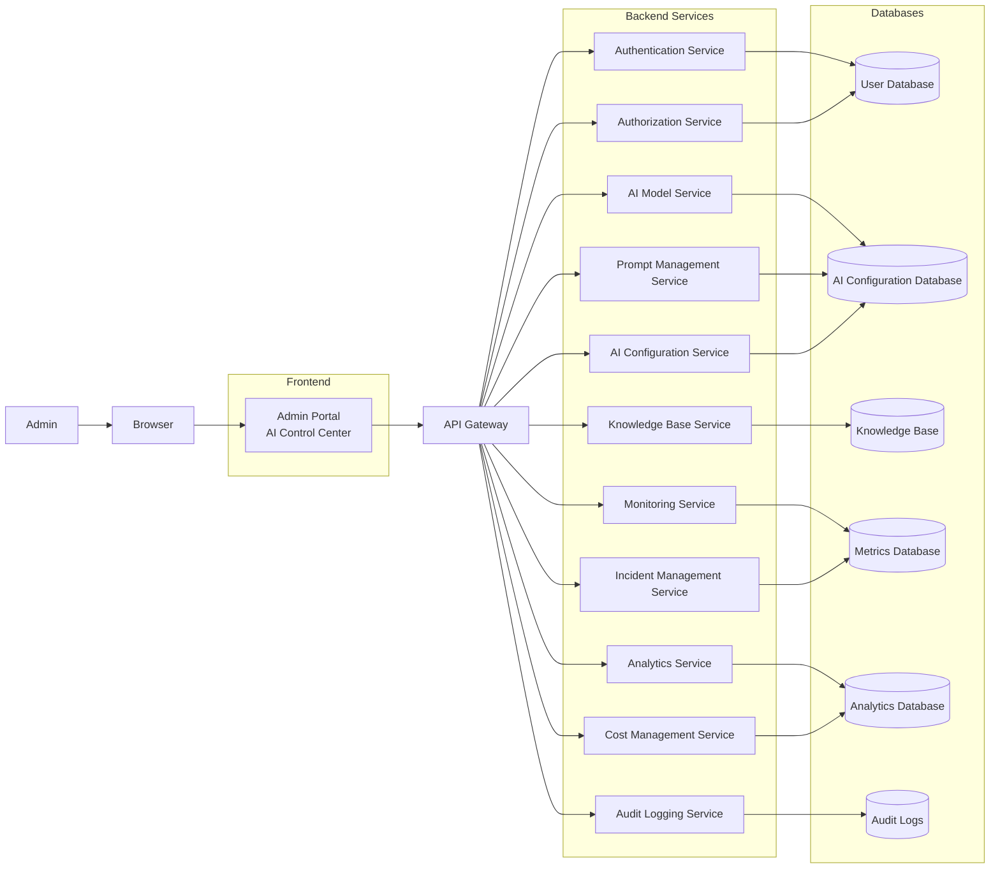
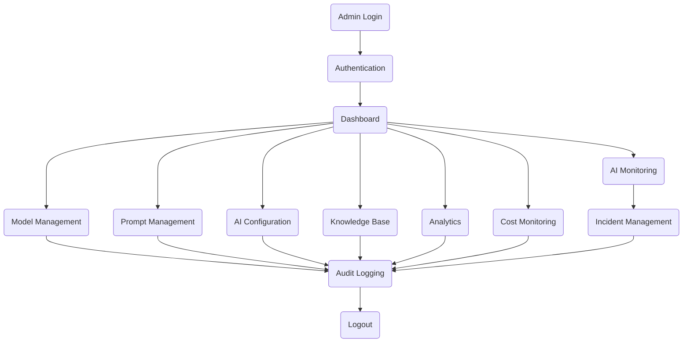

# Admin Workflow

**Layer:** Layer 1 – Experience Layer

**Module:** Admin Portal

**Submodule:** AI Control Center

---

# Purpose

The Admin Workflow defines how administrators interact with the AI Control Center to monitor, configure, control, and optimize AI services across the platform.

The workflow covers the complete lifecycle of AI administration, including authentication, AI operations, monitoring, analytics, incident management, and auditing.

---

# High-Level Workflow



---

# Workflow Description

The administrator accesses the AI Control Center through the Admin Portal.

The request passes through the API Gateway, which routes it to the appropriate backend service.

Depending on the operation, requests are processed by dedicated services responsible for authentication, AI model management, prompt management, analytics, monitoring, configuration, and incident handling.

Each backend service communicates with its respective database while all administrative activities are recorded in the Audit Logging Service.

---

# Workflow Stages

## 1. Authentication

```text
Admin
   │
   ▼
Browser
   │
   ▼
Admin Portal
   │
   ▼
Authentication Service
   │
   ▼
Permission Validation
   │
   ▼
Dashboard
```

Responsibilities

- Authenticate administrator
- Verify MFA
- Validate permissions
- Load dashboard

---

## 2. AI Operations

```text
Dashboard
    │
    ▼
API Gateway
    │
    ├────────────► AI Model Service
    │
    ├────────────► Prompt Management
    │
    ├────────────► AI Configuration
    │
    └────────────► Knowledge Base
```

Operations

- Deploy AI models
- Update prompts
- Configure AI
- Manage AI knowledge
- Rollback model versions

---

## 3. AI Monitoring

```text
Monitoring Service
        │
        ▼
Collect Metrics
        │
        ▼
Analyze Performance
        │
        ▼
Generate Alerts
```

Metrics include:

- API Latency
- Success Rate
- Error Rate
- CPU Usage
- GPU Usage
- Memory Usage
- Token Usage
- Active Requests

---

## 4. Analytics

```text
Analytics Service
        │
        ▼
Collect Usage Data
        │
        ▼
Generate Reports
        │
        ▼
Dashboard Visualization
```

Reports include

- AI usage
- Model performance
- Token consumption
- Cost analysis
- User activity

---

## 5. Cost Management

```text
Cost Service
      │
      ▼
Track Token Usage
      │
      ▼
Calculate Cost
      │
      ▼
Budget Monitoring
```

---

## 6. Incident Management

```text
Alert Generated
       │
       ▼
Incident Service
       │
       ▼
Root Cause Analysis
       │
       ▼
Resolution
       │
       ▼
Verification
```

Common Incidents

- API timeout
- AI model failure
- High latency
- Rate limiting
- Infrastructure failure

---

## 7. Audit Logging

Every administrative operation is recorded.

```text
Admin Action
      │
      ▼
Audit Service
      │
      ▼
Audit Database
```

Captured Information

- Administrator ID
- Timestamp
- Resource
- Previous Value
- Updated Value
- Action Type
- Status
- IP Address

---

# Complete Operational Flow



---

# Workflow Summary

| Workflow | Description |
|-----------|-------------|
| Authentication | Secure administrator login and authorization |
| Dashboard | Central monitoring interface |
| AI Monitoring | Observe AI health and system performance |
| AI Operations | Manage models, prompts, and AI configuration |
| Knowledge Base | Maintain AI knowledge resources |
| Analytics | Generate usage and performance reports |
| Cost Management | Monitor AI operational costs |
| Incident Management | Detect and resolve system issues |
| Audit Logging | Record all administrative activities |
| Logout | End secure administrative session |

---

# Related Documents

- overview.md
- architecture.md
- permissions.md
- business_rules.md
- security.md
- observability.md
- state_machine.md
- api_contract.md
- database.md
- events.md
- implementation_plan.md