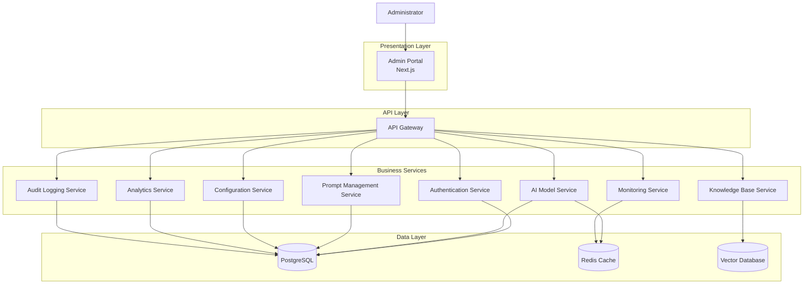

# 📄 Architecture & Contracts
> **Research and compile instructions before starting development.**

### 📋 What to put inside this document (1-4 line guideline):
* Outline the component structure, import hierarchies, file layout, and component state trees. Specify data contracts (REST/GraphQL endpoints or WebSocket schemas) and detail client-backend communication sequences.
# Architecture & Contracts

**Layer:** Layer 1 – Experience Layer

**Module:** Admin Portal

**Submodule:** AI Control Center

**Document Version:** 1.0

**Status:** Active

---

# Purpose

This document defines the architecture and technical contracts for the AI Control Center. It outlines the frontend component structure, project organization, state management, data contracts, and communication patterns between the client application and backend services.

---

# System Architecture Overview

The AI Control Center follows a layered architecture that separates the presentation layer, API management, business services, and data storage. This modular design improves scalability, maintainability, and secure communication between frontend and backend components.


# Component Structure

The AI Control Center is divided into feature-based components.

```text
AIControlCenter
│
├── Dashboard
├── Authentication
├── AI Models
├── Prompt Management
├── AI Configuration
├── Monitoring
├── Analytics
├── Cost Management
├── Incident Management
├── Knowledge Base
├── Audit Logs
└── Shared Components
```

### Component Responsibilities

| Component | Responsibility |
|-----------|----------------|
| Dashboard | Displays AI operational overview |
| Authentication | User authentication and session management |
| AI Models | Manage AI providers and models |
| Prompt Management | Create and manage AI prompts |
| AI Configuration | Configure AI settings |
| Monitoring | Display health and performance metrics |
| Analytics | AI usage and performance reports |
| Cost Management | Token usage and cost tracking |
| Incident Management | Monitor and resolve AI incidents |
| Knowledge Base | Manage AI knowledge sources |
| Audit Logs | Display administrator activity |

---

# Project File Layout

```text
ai_control_center/
│
├── components/
│   ├── Dashboard/
│   ├── Authentication/
│   ├── AIModels/
│   ├── PromptManagement/
│   ├── Configuration/
│   ├── Monitoring/
│   ├── Analytics/
│   ├── CostManagement/
│   ├── IncidentManagement/
│   ├── KnowledgeBase/
│   ├── AuditLogs/
│   └── Shared/
│
├── pages/
├── layouts/
├── hooks/
├── services/
├── api/
├── store/
├── types/
├── utils/
├── constants/
└── assets/
```

---

# Import Hierarchy

Component dependencies follow a top-down architecture.

```text
Pages
   │
   ▼
Layouts
   │
   ▼
Feature Components
   │
   ▼
Shared Components
   │
   ▼
Custom Hooks
   │
   ▼
Service Layer
   │
   ▼
API Client
```

Import Rules

- Pages may import layouts and feature components.
- Feature components may import shared components.
- Services communicate with backend APIs only.
- Shared components must not depend on feature modules.
- Utility modules remain framework-independent.

---

# Component State Tree

```text
AIControlCenter
│
├── UserState
├── DashboardState
├── AIModelState
├── PromptState
├── ConfigurationState
├── MonitoringState
├── AnalyticsState
├── CostState
├── IncidentState
└── NotificationState
```

### State Categories

| State | Purpose |
|--------|----------|
| Global State | User session and shared data |
| Local State | Component-specific UI state |
| API State | Backend response data |
| Loading State | Request status indicators |
| Error State | API and validation errors |

---

# Client–Backend Communication

The frontend communicates with backend services through a centralized API Gateway.

```text
Administrator
      │
      ▼
UI Component
      │
      ▼
Service Layer
      │
      ▼
API Client
      │
      ▼
API Gateway
      │
      ▼
Backend Service
      │
      ▼
Database
      │
      ▼
Response
      │
      ▼
UI Update
```

---

# Data Contracts

## AI Model

```json
{
  "modelId": "string",
  "modelName": "string",
  "provider": "string",
  "version": "string",
  "status": "Active"
}
```

---

## Prompt

```json
{
  "promptId": "string",
  "name": "string",
  "category": "string",
  "content": "string",
  "status": "Published"
}
```

---

## Monitoring Metrics

```json
{
  "service": "Prompt Service",
  "status": "Healthy",
  "latency": "210ms",
  "errorRate": "0.3%"
}
```

---

## Analytics Report

```json
{
  "totalRequests": 25000,
  "successRate": 99.7,
  "averageLatency": 185,
  "tokenUsage": 1250000
}
```

---

# REST API Contracts

| Method | Endpoint | Description |
|----------|----------|-------------|
| POST | `/api/v1/auth/login` | Authenticate administrator |
| GET | `/api/v1/models` | Retrieve AI models |
| POST | `/api/v1/models` | Create AI model |
| PUT | `/api/v1/models/{id}` | Update AI model |
| DELETE | `/api/v1/models/{id}` | Delete AI model |
| GET | `/api/v1/prompts` | Retrieve prompts |
| POST | `/api/v1/prompts` | Create prompt |
| PUT | `/api/v1/prompts/{id}` | Update prompt |
| GET | `/api/v1/monitoring/health` | Retrieve system health |
| GET | `/api/v1/analytics/usage` | Retrieve AI usage analytics |
| GET | `/api/v1/audit-logs` | Retrieve audit logs |

---

# WebSocket Contracts

The AI Control Center uses WebSockets for real-time updates.

## Events

| Event | Description |
|--------|-------------|
| `monitoring.update` | Service health updates |
| `incident.created` | New incident notification |
| `model.status.changed` | AI model status change |
| `analytics.updated` | Analytics refresh |
| `notification.created` | System notification |

### Example Payload

```json
{
  "event": "monitoring.update",
  "timestamp": "2026-07-30T14:30:00Z",
  "service": "AI Model Service",
  "status": "Healthy"
}
```

---

# Client–Backend Request Flow

## Example: Retrieve AI Models

```text
Administrator
      │
      ▼
Dashboard
      │
      ▼
Model Service
      │
      ▼
GET /api/v1/models
      │
      ▼
API Gateway
      │
      ▼
AI Model Service
      │
      ▼
Database
      │
      ▼
API Response
      │
      ▼
Dashboard Updates
```

---

# Security Considerations

- HTTPS for all API communication.
- JWT-based authentication.
- Role-Based Access Control (RBAC).
- Request validation on client and server.
- Secure HTTP headers.
- Audit logging for administrative actions.
- Rate limiting to prevent abuse.
- Encrypted communication between services.

---

# Design Principles

- Modular component architecture.
- Separation of concerns.
- Reusable UI components.
- Feature-based project organization.
- Stateless REST APIs.
- Strong typing for request and response models.
- Scalable microservice integration.
- Consistent naming conventions.

---

# Related Documents

- overview.md
- admin_workflow.md
- api_contract.md
- ADR.md
- ai_context.md
- security.md
- permissions.md
- observability.md

---

# Revision History

| Version | Date | Description |
|----------|------|-------------|
| 1.0 | Initial Release | Initial Architecture & Contracts documentation for the AI Control Center |