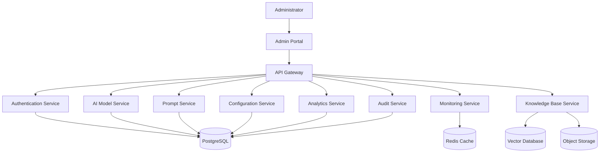
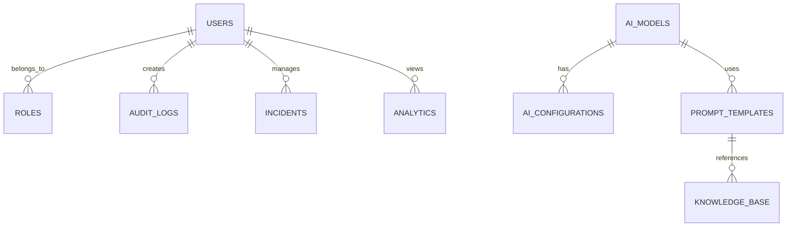

# Database

**Layer:** Layer 1 – Experience Layer

**Module:** Admin Portal

**Submodule:** AI Control Center

**Document Version:** 1.0

**Status:** Active

---

# Purpose

This document defines the database architecture, logical data model, storage strategy, entity relationships, and data management guidelines for the AI Control Center. It provides a consistent foundation for storing, retrieving, securing, and maintaining operational data across all AI administration modules.

---

# Database Overview

The AI Control Center stores and manages data required for AI administration, monitoring, analytics, configuration, and security.

The database supports:

- Administrator Management
- AI Model Management
- Prompt Management
- AI Configuration
- Monitoring & Metrics
- Analytics & Reports
- Audit Logging
- Incident Management
- Knowledge Base
- Notifications

---

# Database Architecture

The AI Control Center uses a multi-storage architecture to support transactional data, caching, and AI knowledge retrieval.



---

# Database Technology Stack

| Database | Purpose |
|----------|---------|
| PostgreSQL | Primary relational database |
| Redis | Session management and caching |
| Vector Database | AI embeddings and semantic search |
| Object Storage | Prompt files, documents, and AI resources |

---

# Database Schema Overview

The primary database consists of the following entities.

```text
Users
Roles
Permissions
AI Models
Prompt Templates
Configurations
Analytics
Monitoring Metrics
Audit Logs
Knowledge Documents
Incidents
Notifications
```

---

# Core Database Tables

## Users

Stores administrator information.

| Column | Type | Description |
|---------|------|-------------|
| user_id | UUID | Primary Key |
| full_name | VARCHAR(100) | Administrator name |
| email | VARCHAR(255) | Unique email address |
| role_id | UUID | Assigned role |
| status | ENUM | Active / Inactive |
| created_at | TIMESTAMP | Creation timestamp |
| updated_at | TIMESTAMP | Last update timestamp |

---

## Roles

Defines administrator roles.

| Column | Type | Description |
|---------|------|-------------|
| role_id | UUID | Primary Key |
| role_name | VARCHAR(50) | Role name |
| description | TEXT | Role description |

---

## AI Models

Stores AI model information.

| Column | Type | Description |
|---------|------|-------------|
| model_id | UUID | Primary Key |
| model_name | VARCHAR(100) | Model name |
| provider | VARCHAR(100) | AI provider |
| version | VARCHAR(20) | Model version |
| status | ENUM | Active / Inactive |
| created_at | TIMESTAMP | Creation timestamp |

---

## Prompt Templates

Stores reusable AI prompts.

| Column | Type | Description |
|---------|------|-------------|
| prompt_id | UUID | Primary Key |
| title | VARCHAR(150) | Prompt title |
| category | VARCHAR(100) | Prompt category |
| content | TEXT | Prompt content |
| version | INTEGER | Prompt version |
| status | ENUM | Draft / Published |

---

## AI Configurations

Stores AI configuration settings.

| Column | Type | Description |
|---------|------|-------------|
| configuration_id | UUID | Primary Key |
| model_id | UUID | Linked AI model |
| parameter_name | VARCHAR(100) | Configuration parameter |
| parameter_value | TEXT | Parameter value |
| updated_at | TIMESTAMP | Last updated timestamp |

---

## Analytics

Stores AI usage analytics.

| Column | Type | Description |
|---------|------|-------------|
| analytics_id | UUID | Primary Key |
| total_requests | BIGINT | Total requests |
| success_rate | DECIMAL | Success percentage |
| average_latency | DECIMAL | Average response time |
| generated_at | TIMESTAMP | Report timestamp |

---

## Monitoring Metrics

Stores operational metrics.

| Column | Type | Description |
|---------|------|-------------|
| metric_id | UUID | Primary Key |
| service_name | VARCHAR(100) | Service name |
| cpu_usage | DECIMAL | CPU utilization |
| memory_usage | DECIMAL | Memory utilization |
| response_time | DECIMAL | Average response time |
| recorded_at | TIMESTAMP | Metric timestamp |

---

## Audit Logs

Stores administrator activity.

| Column | Type | Description |
|---------|------|-------------|
| audit_id | UUID | Primary Key |
| user_id | UUID | Administrator |
| action | VARCHAR(100) | Performed action |
| resource | VARCHAR(100) | Resource affected |
| ip_address | VARCHAR(50) | IP address |
| timestamp | TIMESTAMP | Action timestamp |

---

## Knowledge Base

Stores AI knowledge metadata.

| Column | Type | Description |
|---------|------|-------------|
| document_id | UUID | Primary Key |
| title | VARCHAR(255) | Document title |
| storage_path | TEXT | Object storage location |
| embedding_id | UUID | Vector reference |
| uploaded_at | TIMESTAMP | Upload timestamp |

---

# Entity Relationships



---

# Data Flow

```text
Administrator
      │
      ▼
Admin Portal
      │
      ▼
API Gateway
      │
      ▼
Backend Services
      │
      ▼
Database Layer
      │
      ▼
Processed Response
      │
      ▼
Admin Portal
```

---

# Indexing Strategy

| Table | Indexed Columns |
|--------|-----------------|
| Users | email |
| Roles | role_name |
| AI Models | model_name |
| Prompt Templates | title |
| Analytics | generated_at |
| Monitoring Metrics | recorded_at |
| Audit Logs | timestamp |
| Knowledge Base | title |

---

# Data Validation Rules

| Field | Validation Rule |
|--------|-----------------|
| Email | Must be unique and valid |
| Model Name | Required and unique |
| Prompt Title | Required |
| Prompt Content | Cannot be empty |
| Version | Positive integer |
| Status | Must match supported enum values |
| Foreign Keys | Must reference valid records |

---

# Database Constraints

- Primary keys must be unique.
- Foreign key relationships must be maintained.
- Required fields cannot be NULL.
- Duplicate administrator email addresses are not permitted.
- AI model names must be unique.
- Prompt versions must be sequential.
- Audit log records cannot be modified after creation.

---

# Backup & Recovery

The following backup strategy is recommended:

- Daily automated database backups.
- Incremental backups every hour.
- Point-in-time recovery enabled.
- Backup retention for 30 days.
- Disaster recovery testing performed periodically.
- Backup restoration verified regularly.

---

# Security

The database follows enterprise security practices.

- Encrypt sensitive data at rest.
- Use TLS for database connections.
- Restrict access using Role-Based Access Control (RBAC).
- Store credentials securely using a secrets manager.
- Enable audit logging for database access.
- Apply the principle of least privilege.

---

# Performance Optimization

To maintain optimal performance:

- Create indexes on frequently queried columns.
- Use Redis caching for repeated queries.
- Implement connection pooling.
- Paginate large result sets.
- Archive historical audit logs.
- Optimize long-running queries.
- Monitor database performance metrics.

---

# Data Retention Policy

| Data Type | Retention Period |
|-----------|------------------|
| Audit Logs | 7 Years |
| Monitoring Metrics | 1 Year |
| Analytics Reports | 3 Years |
| AI Configurations | Until Updated |
| Prompt Templates | Permanent (Version Controlled) |
| Knowledge Base Metadata | Permanent |

---

# Related Documents

- overview.md
- architecture.md
- admin_workflow.md
- api_contract.md
- business_rules.md
- security.md
- ADR.md
- ai_context.md
- implementation_checklist.md

---

# Revision History

| Version | Date | Description |
|----------|------|-------------|
| 1.0 | Initial Release | Initial database architecture and schema documentation for the AI Control Center |