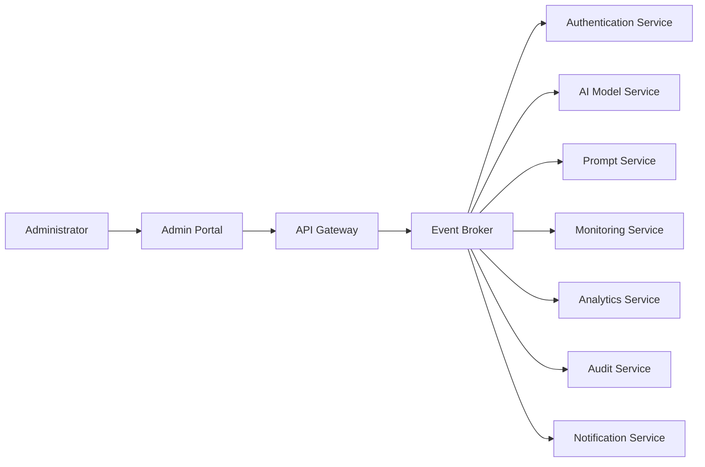

# 📄 Event Driven Interactions
> **Research and compile instructions before starting development.**

### 📋 What to put inside this document (1-4 line guideline):
* Map internal pub/sub event channels, dynamic UI updates, and socket triggers. Outline system event handlers and payload schemas.

# Event Driven Interactions

**Layer:** Layer 1 – Experience Layer

**Module:** Admin Portal

**Submodule:** AI Control Center

**Document Version:** 1.0

**Status:** Active

---

# Purpose

This document defines the event-driven architecture of the AI Control Center. It describes internal publish/subscribe (Pub/Sub) communication, real-time UI updates, WebSocket events, event handlers, and message payload schemas used for asynchronous communication between frontend components and backend services.

---

# Scope

This document covers:

- Internal Pub/Sub communication
- Event producers and consumers
- WebSocket events
- UI event propagation
- Backend event handlers
- Event payload structures
- Event lifecycle
- Event reliability

---

# Event-Driven Architecture Overview

The AI Control Center follows an event-driven architecture to enable real-time updates, asynchronous processing, and loose coupling between services.



---

# Event Flow

```text
Administrator Action
        │
        ▼
Frontend Component
        │
        ▼
API Gateway
        │
        ▼
Backend Service
        │
        ▼
Publish Event
        │
        ▼
Event Broker
        │
        ▼
Subscribed Services
        │
        ▼
WebSocket Notification
        │
        ▼
UI Update
```

---

# Event Channels

| Channel | Purpose |
|----------|---------|
| authentication.events | Authentication events |
| ai.models | AI model lifecycle events |
| prompts.events | Prompt management events |
| monitoring.events | System health updates |
| analytics.events | Analytics refresh |
| incidents.events | Incident notifications |
| audit.events | Audit log creation |
| notifications.events | User notifications |

---

# Event Producers

| Service | Published Events |
|----------|-----------------|
| Authentication Service | Login, Logout, Token Refresh |
| AI Model Service | Model Created, Updated, Deleted |
| Prompt Service | Prompt Created, Updated, Published |
| Monitoring Service | Health Status Updated |
| Analytics Service | Report Generated |
| Incident Service | Incident Created, Resolved |
| Audit Service | Audit Record Created |

---

# Event Consumers

| Service | Consumes |
|----------|----------|
| Notification Service | All critical events |
| Analytics Service | Monitoring and AI events |
| Audit Service | Administrative actions |
| Dashboard | Monitoring and Analytics events |
| Incident Service | Monitoring alerts |

---

# UI Events

| Event | Action |
|--------|--------|
| ModelCreated | Refresh AI Models |
| PromptPublished | Refresh Prompt List |
| IncidentCreated | Display notification |
| MonitoringUpdated | Refresh dashboard |
| AnalyticsGenerated | Update reports |
| UserLoggedOut | Clear session |

---

# WebSocket Events

The Admin Portal receives live updates through WebSocket connections.

| Event Name | Description |
|------------|-------------|
| model.created | AI model created |
| model.updated | AI model updated |
| prompt.updated | Prompt updated |
| monitoring.updated | System health changed |
| analytics.updated | Analytics refreshed |
| incident.created | New incident |
| notification.created | Notification generated |
| audit.created | Audit record created |

---

# WebSocket Payload Schema

## Monitoring Update

```json
{
  "event": "monitoring.updated",
  "timestamp": "2026-07-30T14:30:00Z",
  "service": "AI Model Service",
  "status": "Healthy",
  "latency": 180,
  "errorRate": 0.2
}
```

---

## Incident Event

```json
{
  "event": "incident.created",
  "incidentId": "INC-1001",
  "severity": "Critical",
  "service": "Prompt Service",
  "message": "Prompt processing timeout detected",
  "timestamp": "2026-07-30T14:35:00Z"
}
```

---

## Notification Event

```json
{
  "event": "notification.created",
  "title": "Deployment Completed",
  "type": "Success",
  "message": "AI Model deployed successfully."
}
```

---

# Internal Event Handlers

| Event | Handler | Action |
|--------|---------|--------|
| UserAuthenticated | Authentication Handler | Create session |
| ModelCreated | Model Handler | Refresh model cache |
| PromptUpdated | Prompt Handler | Reload prompts |
| MonitoringAlert | Monitoring Handler | Generate notification |
| AnalyticsGenerated | Analytics Handler | Update dashboard |
| IncidentCreated | Incident Handler | Notify administrators |
| AuditCreated | Audit Handler | Store audit record |

---

# Event Payload Standards

Every event should include the following fields.

| Field | Description |
|--------|-------------|
| event | Event name |
| eventId | Unique event identifier |
| source | Originating service |
| timestamp | Event creation time |
| version | Event schema version |
| payload | Event-specific data |

---

## Standard Event Payload

```json
{
  "eventId": "evt-001",
  "event": "model.created",
  "source": "AI Model Service",
  "timestamp": "2026-07-30T15:00:00Z",
  "version": "1.0",
  "payload": {}
}
```

---

# Event Lifecycle

```text
Event Generated
       │
       ▼
Validation
       │
       ▼
Published
       │
       ▼
Event Broker
       │
       ▼
Subscribers
       │
       ▼
Processing
       │
       ▼
UI Notification / Database Update
```

---

# Event Processing Rules

- Every event must have a unique identifier.
- Events should be immutable after publication.
- Subscribers should process events independently.
- Failed events should be retried according to retry policies.
- Duplicate events must be detected and ignored.
- Invalid payloads should be rejected and logged.

---

# Event Reliability

To ensure reliable event delivery:

- Use durable event queues.
- Support automatic retries.
- Implement dead-letter queues for failed events.
- Guarantee at-least-once delivery where required.
- Log all failed event processing attempts.

---

# Dynamic UI Updates

The Admin Portal updates the interface automatically when events are received.

Examples include:

- Refresh dashboard metrics after monitoring updates.
- Update AI model list after deployment.
- Display notifications for new incidents.
- Refresh analytics without reloading the page.
- Show real-time prompt status changes.

---

# Security Considerations

- Authenticate all WebSocket connections.
- Authorize event subscriptions using RBAC.
- Validate event payloads before processing.
- Encrypt communication using TLS.
- Prevent unauthorized event publishing.
- Audit critical event activity.

---

# Related Documents

- overview.md
- architecture.md
- api_contract.md
- ai_context.md
- business_rules.md
- security.md
- observability.md
- database.md
- implementation_checklist.md

---

# Revision History

| Version | Date | Description |
|----------|------|-------------|
| 1.0 | Initial Release | Initial Event Driven Interactions documentation for the AI Control Center |
