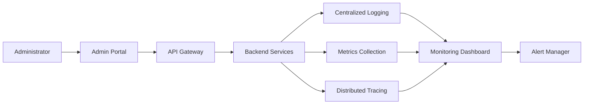

# 📄 Observability & Telemetry
> **Research and compile instructions before starting development.**

### 📋 What to put inside this document (1-4 line guideline):
* Detail logging levels, error classification, trace spans, and health-check rules. Map monitoring alerts, dashboards, and metric thresholds.
# Observability & Telemetry


**Layer:** Layer 1 – Experience Layer

**Module:** Admin Portal

**Submodule:** AI Control Center

**Document Version:** 1.0

**Status:** Active

---

# Purpose

This document defines the observability and telemetry standards for the AI Control Center. It establishes logging policies, telemetry collection, distributed tracing, health monitoring, alerting, and dashboard requirements to ensure system reliability, operational visibility, and rapid incident resolution.

---

# Scope

This document applies to:

- Admin Portal
- API Gateway
- Authentication Service
- AI Model Service
- Prompt Management Service
- AI Configuration Service
- Monitoring Service
- Analytics Service
- Knowledge Base Service
- Audit Logging Service

---

# Observability Architecture



---

# Logging Strategy

Every service should generate structured logs for operational visibility.

## Logging Levels

| Level | Purpose |
|--------|----------|
| DEBUG | Development and troubleshooting |
| INFO | Normal application events |
| WARN | Unexpected but recoverable conditions |
| ERROR | Operation failures |
| FATAL | Critical system failures requiring immediate attention |

---

# Log Structure

Every log entry should contain:

- Timestamp
- Log Level
- Service Name
- Environment
- User ID (if available)
- Request ID
- Correlation ID
- Operation
- Message
- Error Details (if applicable)

---

## Example Log

```json
{
  "timestamp": "2026-08-03T10:30:00Z",
  "level": "INFO",
  "service": "AI Model Service",
  "requestId": "req-12345",
  "correlationId": "corr-98765",
  "operation": "Create Model",
  "message": "AI model created successfully."
}
```

---

# Error Classification

Errors should be categorized to support consistent monitoring and incident management.

| Severity | Description | Example |
|----------|-------------|---------|
| Critical | Service unavailable | Database offline |
| High | Core functionality impacted | AI model deployment failure |
| Medium | Partial feature failure | Prompt validation failed |
| Low | Minor issue with workaround | UI rendering warning |
| Informational | Operational event | Scheduled maintenance |

---

# Distributed Tracing

Distributed tracing enables end-to-end request visibility across services.

## Trace Flow

```text
Administrator
      │
      ▼
Admin Portal
      │
      ▼
API Gateway
      │
      ▼
Backend Service
      │
      ▼
Database
```

---

## Trace Attributes

Every trace should include:

- Trace ID
- Span ID
- Parent Span ID
- Service Name
- Endpoint
- Request Duration
- Response Status

---

## Example Trace

```json
{
  "traceId": "trace-001",
  "spanId": "span-101",
  "service": "Prompt Service",
  "operation": "Publish Prompt",
  "duration": "145ms",
  "status": "Success"
}
```

---

# Health Check Rules

Every backend service should expose a health endpoint.

## Health Endpoint

```http
GET /health
```

---

## Health Response

```json
{
  "status": "Healthy",
  "service": "AI Model Service",
  "version": "1.0.0",
  "database": "Connected",
  "cache": "Connected",
  "timestamp": "2026-08-03T10:30:00Z"
}
```

---

# Health Check Frequency

| Component | Interval |
|------------|----------|
| API Gateway | 30 seconds |
| Authentication Service | 30 seconds |
| AI Model Service | 30 seconds |
| Prompt Service | 30 seconds |
| Monitoring Service | 15 seconds |
| Database | 60 seconds |
| Cache | 60 seconds |

---

# Metrics Collection

The platform should collect operational metrics continuously.

## Application Metrics

- Total Requests
- Successful Requests
- Failed Requests
- API Latency
- Response Time
- Error Rate
- Active Sessions
- Concurrent Users

---

## AI Metrics

- AI Requests
- Model Usage
- Prompt Executions
- Token Consumption
- AI Response Time
- AI Success Rate

---

## Infrastructure Metrics

- CPU Usage
- Memory Usage
- Disk Utilization
- Network Throughput
- Database Connections
- Cache Hit Rate

---

# Metric Thresholds

| Metric | Threshold | Alert Level |
|---------|-----------|-------------|
| API Response Time | > 500 ms | Warning |
| Error Rate | > 5% | Critical |
| CPU Usage | > 80% | Warning |
| Memory Usage | > 85% | Critical |
| Disk Usage | > 90% | Critical |
| Database Connections | > 90% | Warning |
| Token Budget Usage | > 90% | Warning |
| Service Downtime | > 60 seconds | Critical |

---

# Monitoring Dashboards

The following dashboards should be available.

## Operational Dashboard

Displays:

- System Health
- Active Services
- Request Volume
- Response Time
- Error Rate

---

## AI Dashboard

Displays:

- AI Requests
- AI Model Usage
- Prompt Execution Statistics
- Token Consumption
- AI Performance

---

## Infrastructure Dashboard

Displays:

- CPU Utilization
- Memory Usage
- Database Health
- Cache Performance
- Network Metrics

---

## Security Dashboard

Displays:

- Failed Logins
- Unauthorized Requests
- Suspicious Activity
- Audit Events

---

# Alert Management

Alerts should be generated automatically when thresholds are exceeded.

## Alert Categories

| Category | Example |
|----------|---------|
| Critical | Database unavailable |
| High | API latency exceeded |
| Medium | Increased error rate |
| Low | Configuration warning |

---

## Alert Workflow

```text
Metric Threshold Exceeded
          │
          ▼
Generate Alert
          │
          ▼
Notify Administrator
          │
          ▼
Create Incident
          │
          ▼
Track Resolution
```

---

# Telemetry Collection

Telemetry should be collected for:

- User interactions
- API requests
- Service performance
- AI model execution
- Prompt execution
- Error events
- System resource usage

---

# Retention Policy

| Data | Retention |
|------|-----------|
| Application Logs | 90 Days |
| Audit Logs | 7 Years |
| Metrics | 1 Year |
| Trace Data | 30 Days |
| Alert History | 1 Year |

---

# Security & Privacy

Observability data must comply with security requirements.

- Do not log passwords or secrets.
- Mask sensitive personal information.
- Encrypt telemetry data in transit.
- Restrict access to logs and dashboards using RBAC.
- Maintain audit trails for administrative actions.

---

# Verification Checklist

Before deployment, verify:

- Structured logging implemented.
- Health endpoints operational.
- Metrics exported successfully.
- Trace IDs generated correctly.
- Alerts configured.
- Monitoring dashboards available.
- Log retention policies applied.
- Sensitive data excluded from logs.

---

# Success Criteria

The observability implementation is successful when:

- System health is continuously monitored.
- Logs provide sufficient diagnostic information.
- Distributed traces enable request tracking.
- Alerts are generated accurately.
- Dashboards provide real-time operational visibility.
- Performance issues can be identified quickly.
- Critical incidents are detected and escalated automatically.

---

# Related Documents

- overview.md
- architecture.md
- api_contract.md
- database.md
- business_rules.md
- implementation_plan.md
- implementation_checklist.md
- event_driven_interactions.md
- security.md

---

# Revision History

| Version | Date | Description |
|----------|------|-------------|
| 1.0 | Initial Release | Initial Observability & Telemetry specification for the AI Control Center |