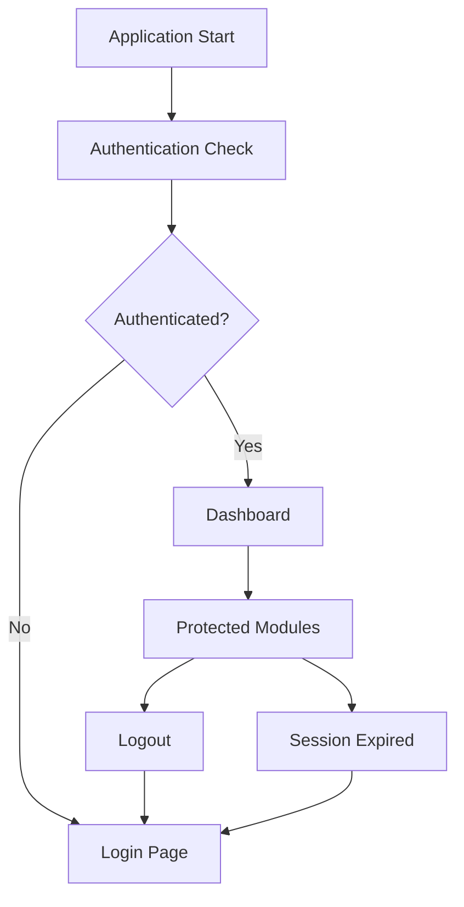
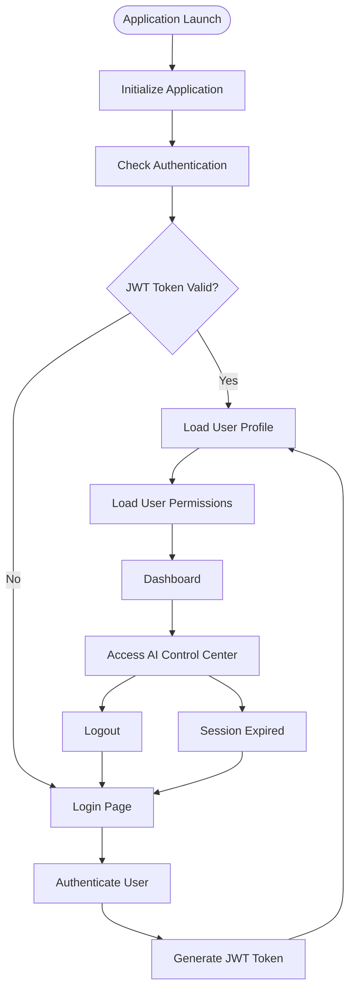
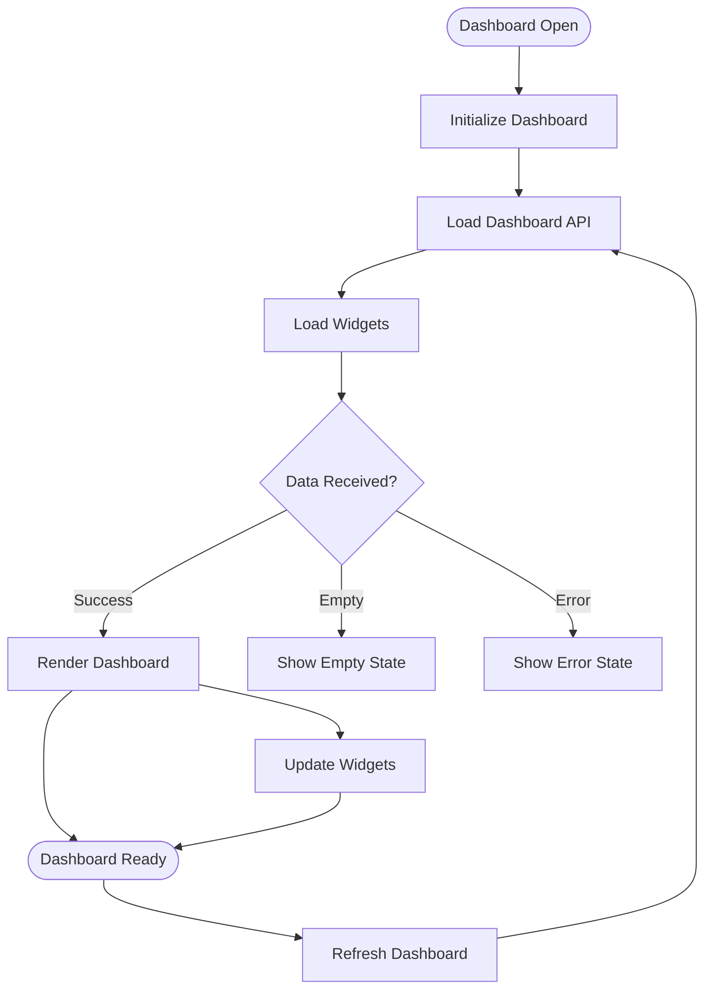
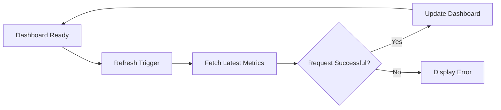

# 📄 Interactive State & Flow
> **Research and compile instructions before starting development.**

### 📋 What to put inside this document (1-4 line guideline):
* Map interactive page states (e.g., loading, success, error, empty) using a finite state diagram or tabular matrix. Explain dynamic transitions, route guards, and local/global store actions.


# Interactive State & Flow


**Layer:** Layer 1 – Experience Layer

**Module:** Admin Portal

**Submodule:** AI Control Center

**Document Version:** 1.0

**Status:** Active

---

# Purpose

This document defines the interactive states, UI transitions, route guards, state management, and data flow for the AI Control Center. It ensures that every screen provides consistent feedback during loading, success, error, and empty states while maintaining predictable navigation and centralized state management.

---

# Scope

This specification applies to:

- Authentication
- Dashboard
- AI Model Management
- Prompt Management
- AI Configuration
- Knowledge Base
- Monitoring
- Analytics
- Incident Management
- Audit Logs

---

# Design Goals

The interaction flow should:

- Provide immediate feedback.
- Minimize user confusion.
- Prevent invalid navigation.
- Handle failures gracefully.
- Maintain consistent state transitions.
- Keep UI synchronized with backend data.

---

# Global Application Flow



---


# Authentication State Flow

The authentication flow ensures that only authenticated administrators can access the AI Control Center.

---



---

## Flow Description

| Step | Description |
|------|-------------|
| Application Launch | Administrator opens the Admin Portal. |
| Initialize Application | Load environment, configuration, and application state. |
| Check Authentication | Verify if a valid authentication session exists. |
| JWT Token Validation | Validate token integrity and expiration. |
| Load User Profile | Retrieve administrator profile information. |
| Load User Permissions | Fetch RBAC roles and permissions. |
| Dashboard | Load the AI Control Center dashboard. |
| Login Page | Redirect unauthenticated users to login. |
| Authenticate User | Validate credentials and complete MFA if enabled. |
| Generate JWT Token | Create a new authenticated session. |
| Access AI Control Center | Administrator accesses protected resources. |
| Session Expired | Redirect to login when the session expires. |
| Logout | End the current session and clear authentication state. |

# Standard Page States

Every page should support the following states.

| State | Description |
|--------|-------------|
| Initial | Component initialized |
| Loading | Data is being fetched |
| Success | Data loaded successfully |
| Empty | No data available |
| Error | Request failed |
| Refreshing | Updating existing data |
| Unauthorized | Access denied |
| Offline | Network unavailable |

---

# Generic State Transition

```text
Initial
    │
    ▼
Loading
    │
    ├──────────────► Success
    │
    ├──────────────► Empty
    │
    └──────────────► Error
```

---

# Dashboard State Flow

The dashboard loads operational data after successful authentication and updates the UI based on the API response.

---



---

## Dashboard State Matrix

| State | Description | Next State |
|---------|-------------|------------|
| Dashboard Open | Administrator opens the dashboard. | Initialize Dashboard |
| Initialize Dashboard | Load application configuration. | Load Dashboard API |
| Load Dashboard API | Fetch dashboard data from backend services. | Load Widgets |
| Load Widgets | Display loading indicators while data is being fetched. | Data Received |
| Success | Dashboard data loaded successfully. | Render Dashboard |
| Empty | No dashboard data is available. | Show Empty State |
| Error | API request failed. | Show Error State |
| Dashboard Ready | Dashboard is fully interactive. | Refresh Dashboard |
| Refresh Dashboard | Refresh live metrics and widgets. | Load Dashboard API |

---

## State Transition Flow

```text
Dashboard Open
      │
      ▼
Initialize Dashboard
      │
      ▼
Load Dashboard Data
      │
      ▼
Loading State
      │
      ▼
Data Available?
     ┌──────────────┬──────────────┐
     │              │              │
  Success        Empty         Error
     │              │              │
     ▼              ▼              ▼
Dashboard      Empty State    Error State
     │
     ▼
Auto Refresh
```

---

## UI Behavior

| State | UI Response |
|---------|------------|
| Loading | Display skeleton loaders for widgets and charts. |
| Success | Render dashboard cards, charts, and metrics. |
| Empty | Display an informative empty-state message with guidance. |
| Error | Show an error message with a retry option. |
| Refreshing | Update widgets without reloading the entire page. |

---

## Refresh Workflow



# AI Model Management States

| State | UI Behavior |
|--------|-------------|
| Loading | Display skeleton loader |
| Success | Show AI models |
| Empty | Show "No Models Available" |
| Saving | Disable Save button |
| Deploying | Show deployment progress |
| Failed | Display error notification |
| Success | Show confirmation message |

---

# Prompt Management States

| State | UI Behavior |
|--------|-------------|
| Loading | Display prompt loader |
| Editing | Enable editor |
| Saving | Disable controls |
| Validation Failed | Highlight invalid fields |
| Published | Show success notification |
| Error | Display retry option |

---

# Monitoring Dashboard States

| State | UI Behavior |
|--------|-------------|
| Loading | Loading animation |
| Connected | Live metrics |
| Refreshing | Partial refresh |
| Alert | Highlight critical metrics |
| Offline | Connection warning |
| Error | Monitoring unavailable |

---

# Analytics States

| State | UI Behavior |
|--------|-------------|
| Loading | Chart skeletons |
| Success | Display reports |
| Empty | No analytics available |
| Exporting | Progress indicator |
| Error | Export failed |

---

# Incident Management States

```text
Open Incident
      │
      ▼
Loading
      │
      ▼
Incident Loaded
      │
      ▼
Update Status
      │
      ▼
Resolved
      │
      ▼
Closed
```

---

# Empty State Guidelines

When no data exists, display:

- Informative message
- Related illustration or icon
- Call-to-action button
- Link to documentation (if applicable)

Example:

> **No AI Models Found**

> Create your first AI model to begin managing AI providers.

---

# Error State Guidelines

Error screens should contain:

- Error title
- Short explanation
- Retry button
- Contact support option (if necessary)

Example:

```text
Unable to Load Dashboard

Something went wrong while retrieving dashboard data.

[Retry]
```

---

# Success States

Success operations should:

- Display toast notifications.
- Refresh affected components.
- Maintain user context.
- Avoid unnecessary page reloads.

Examples:

- AI model deployed successfully.
- Prompt published successfully.
- Configuration updated successfully.

---

# Route Guards

Protected routes require authentication and authorization.

| Route | Authentication | Required Role |
|--------|---------------|---------------|
| Dashboard | Yes | Administrator |
| AI Models | Yes | AI Administrator |
| Prompt Management | Yes | AI Administrator |
| Monitoring | Yes | Operations Administrator |
| Analytics | Yes | Administrator |
| Audit Logs | Yes | Security Administrator |
| User Management | Yes | Super Administrator |

---

# Navigation Flow

```text
Login
   │
   ▼
Dashboard
   │
   ├────────► AI Models
   ├────────► Prompts
   ├────────► Configuration
   ├────────► Monitoring
   ├────────► Analytics
   ├────────► Incidents
   ├────────► Audit Logs
   └────────► Settings
```

---

# Global State Management

Global application state should include:

- Authentication state
- User profile
- User permissions
- Active workspace
- Theme preference
- Notifications
- Sidebar state
- Application configuration

---

# Local Component State

Each component manages:

- Loading
- Form data
- Validation errors
- Modal visibility
- Pagination
- Sorting
- Filters
- Search query

---

# Store Actions

## Authentication Store

Actions:

- Login
- Logout
- Refresh Token
- Update Profile

---

## Dashboard Store

Actions:

- Load Dashboard
- Refresh Metrics
- Update Widgets

---

## AI Models Store

Actions:

- Fetch Models
- Create Model
- Update Model
- Delete Model
- Deploy Model

---

## Prompt Store

Actions:

- Fetch Prompts
- Create Prompt
- Update Prompt
- Publish Prompt
- Archive Prompt

---

## Monitoring Store

Actions:

- Connect
- Disconnect
- Refresh Metrics
- Receive Alerts

---

## Analytics Store

Actions:

- Load Reports
- Export Report
- Refresh Charts

---

# API State Flow

```text
User Action
      │
      ▼
Dispatch Action
      │
      ▼
API Request
      │
      ▼
Loading State
      │
      ▼
Response
      │
      ├────────► Success State
      │
      └────────► Error State
```

---

# Real-Time Update Flow

```text
WebSocket Event
       │
       ▼
Receive Update
       │
       ▼
Update Global Store
       │
       ▼
Refresh UI Components
```

---

# Offline Handling

If network connectivity is lost:

- Display offline banner.
- Pause live updates.
- Disable write operations.
- Retry automatically when connection is restored.

---

# State Transition Rules

- Only one primary page state should be active at a time.
- Loading states block duplicate requests.
- Success states should clear previous errors.
- Error states should preserve user input where possible.
- Refresh operations should not reset page context.

---

# Verification Checklist

Before deployment, verify:

- All pages support loading, success, error, and empty states.
- Route guards prevent unauthorized access.
- Global store updates correctly.
- Local component state resets appropriately.
- API failures are handled gracefully.
- Offline mode behaves correctly.
- Real-time updates synchronize with the UI.

---

# Success Criteria

The interaction flow is considered complete when:

- Every screen has defined interactive states.
- Navigation is predictable and secure.
- Users receive clear feedback for all actions.
- Route protection is enforced.
- Global and local state remain synchronized.
- Error recovery is smooth and user-friendly.

---

# Related Documents

- overview.md
- admin_workflow.md
- interaction_design_spec.md
- architecture.md
- implementation_plan.md
- business_rules.md
- permissions.md
- api_contract.md
- observability.md

---

# Revision History

| Version | Date | Description |
|----------|------|-------------|
| 1.0 | Initial Release | Initial Interactive State & Flow documentation for the AI Control Center |