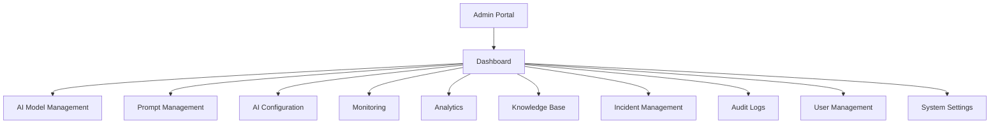
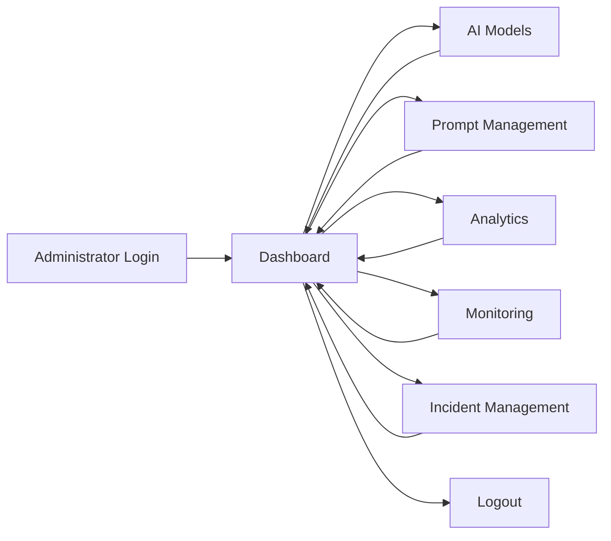

# 📄 UX Specification
> **Research and compile instructions before starting development.**

### 📋 What to put inside this document (1-4 line guideline):
* Detail interactive feedback styles, layout grids, font priorities, spacing metrics, and navigation constraints. Outline how to minimize visual noise and cognitive load.


# UX Specification

> **Research and compile UX requirements before starting development.**

**Layer:** Layer 1 – Experience Layer

**Module:** Admin Portal

**Submodule:** AI Control Center

**Document Version:** 1.0

**Status:** Active

---

# Purpose

This document defines the User Experience (UX) standards for the AI Control Center. It establishes navigation patterns, layout structure, interaction behavior, visual hierarchy, accessibility requirements, spacing guidelines, and usability principles to provide administrators with an efficient, intuitive, and enterprise-grade interface.

---

# Scope

This specification applies to:

- Authentication
- Dashboard
- AI Model Management
- Prompt Management
- AI Configuration
- Knowledge Base
- Monitoring
- Analytics
- Incident Management
- Audit Logs
- User Management

---

# UX Goals

The AI Control Center should:

- Minimize cognitive load.
- Provide intuitive navigation.
- Deliver immediate user feedback.
- Reduce unnecessary clicks.
- Ensure accessibility for all users.
- Maintain a clean and professional interface.
- Support efficient administrative workflows.

---

# UX Principles

The interface should follow these principles:

- **Consistency** – Maintain uniform layouts and interactions.
- **Clarity** – Display only relevant information.
- **Feedback** – Inform users about every action.
- **Efficiency** – Reduce repetitive tasks.
- **Accessibility** – Support keyboard and assistive technologies.
- **Simplicity** – Avoid unnecessary complexity.

---

# Information Architecture

The AI Control Center follows a hierarchical navigation structure that provides administrators with quick access to AI management, monitoring, analytics, and system configuration features.

---



---

# Navigation Hierarchy

| Level | Module | Description |
|--------|--------|-------------|
| Level 1 | Admin Portal | Entry point for administrators |
| Level 2 | Dashboard | Central workspace displaying AI health, metrics, and quick actions |
| Level 3 | AI Model Management | Manage AI providers, models, versions, and deployments |
| Level 3 | Prompt Management | Create, edit, validate, publish, and version prompts |
| Level 3 | AI Configuration | Configure AI parameters, safety policies, and runtime settings |
| Level 3 | Monitoring | Monitor AI services, infrastructure, alerts, and health |
| Level 3 | Analytics | View usage reports, token consumption, and performance metrics |
| Level 3 | Knowledge Base | Manage uploaded documents, indexing, and embeddings |
| Level 3 | Incident Management | Track AI failures, investigate incidents, and resolve issues |
| Level 3 | Audit Logs | Review administrator activities and system events |
| Level 3 | User Management | Manage administrator accounts, roles, and permissions |
| Level 3 | System Settings | Configure global AI platform settings |

---

# Navigation Principles

The navigation follows these UX principles:

- Dashboard acts as the central landing page.
- All major modules are accessible within one click.
- Sidebar navigation remains consistent across all pages.
- Breadcrumbs are displayed on every secondary page.
- Active navigation items are clearly highlighted.
- User permissions determine which modules are visible.

---

# Navigation Flow

```text
Administrator Login
        │
        ▼
Dashboard
        │
        ├── AI Model Management
        ├── Prompt Management
        ├── AI Configuration
        ├── Monitoring
        ├── Analytics
        ├── Knowledge Base
        ├── Incident Management
        ├── Audit Logs
        ├── User Management
        └── System Settings
```

---

# User Journey



# Layout Grid

The application follows a responsive **12-column grid**.

## Desktop (≥ 1440px)

- 12-column layout
- Sidebar: 280px
- Main Content: Flexible
- Content Padding: 32px

---

## Laptop (1024px – 1439px)

- 12-column layout
- Sidebar: 240px
- Content Padding: 24px

---

## Tablet (768px – 1023px)

- 8-column layout
- Collapsible sidebar
- Content Padding: 20px

---

# Navigation Structure

Primary Navigation:

- Dashboard
- AI Models
- Prompt Management
- AI Configuration
- Monitoring
- Analytics
- Knowledge Base
- Incidents
- Audit Logs
- Settings

Secondary Navigation:

- Search
- Notifications
- Profile
- Help

---

# Navigation Constraints

- Maximum 2 navigation levels.
- Keep menu labels concise.
- Highlight the active page.
- Maintain consistent sidebar placement.
- Preserve navigation state after refresh.
- Breadcrumbs should appear on all secondary pages.

---

# Visual Hierarchy

Priority order:

1. Page Title
2. Critical Alerts
3. KPI Cards
4. Charts
5. Tables
6. Secondary Information
7. Footer Actions

---

# Typography

| Element | Font | Size | Weight |
|----------|------|------|--------|
| H1 | Inter | 36px | 700 |
| H2 | Inter | 30px | 700 |
| H3 | Inter | 24px | 600 |
| H4 | Inter | 20px | 600 |
| Body | Inter | 16px | 400 |
| Small | Inter | 14px | 400 |
| Caption | Inter | 12px | 400 |

---

# Font Priorities

Priority order:

1. Inter
2. System UI
3. Arial
4. Sans-serif

---

# Spacing System

| Token | Value |
|--------|-------|
| XS | 4px |
| SM | 8px |
| MD | 16px |
| LG | 24px |
| XL | 32px |
| XXL | 48px |

---

# Component Spacing

| Component | Spacing |
|------------|----------|
| Card Padding | 24px |
| Section Gap | 32px |
| Form Field Gap | 16px |
| Table Cell Padding | 16px |
| Button Gap | 12px |
| Modal Padding | 32px |

---

# Interactive Feedback

The interface should provide clear feedback for all user actions.

## Success

- Green notification
- Confirmation message
- Auto-dismiss after 3–5 seconds

---

## Warning

- Yellow notification
- Clear explanation
- User action required

---

## Error

- Red notification
- Retry option
- Error details (non-sensitive)

---

## Loading

- Skeleton loaders
- Progress indicators
- Disable duplicate actions

---

# Form UX

Forms should:

- Validate input in real time.
- Display inline error messages.
- Preserve entered data after validation errors.
- Clearly indicate required fields.
- Group related fields logically.

---

# Dashboard UX

Dashboard should:

- Display key metrics first.
- Use progressive disclosure for detailed information.
- Refresh live metrics automatically.
- Allow filtering without page reload.

---

# Tables

Tables should support:

- Sorting
- Filtering
- Search
- Pagination
- Column resizing (optional)
- Export actions

---

# Search Experience

Search should provide:

- Instant suggestions
- Highlight matching results
- Recent searches
- Empty-state guidance

---

# Notifications

Notifications should:

- Be concise.
- Clearly describe the event.
- Include severity indicators.
- Avoid interrupting workflows unnecessarily.

---

# Modal Guidelines

Use modals only for:

- Confirmation dialogs
- Critical actions
- Editing forms
- Detailed information

Avoid nested modals.

---

# Empty States

Empty states should include:

- Friendly message
- Relevant illustration or icon
- Clear call-to-action

Example:

> **No AI Models Available**

> Create your first AI model to begin managing AI providers.

---

# Error States

Error pages should include:

- Clear title
- Explanation
- Retry button
- Support link (if applicable)

---

# Accessibility

The application should comply with **WCAG 2.1 AA**.

Requirements:

- Keyboard navigation
- Screen reader compatibility
- Visible focus indicators
- Sufficient color contrast
- Accessible form labels
- Semantic HTML

---

# Responsive Behavior

Desktop:

- Persistent sidebar
- Multi-column layout

Tablet:

- Collapsible sidebar
- Reduced spacing

Mobile (Future Scope):

- Bottom navigation
- Simplified layouts
- Drawer menu

---

# Cognitive Load Reduction

To improve usability:

- Display only essential information.
- Group related actions together.
- Limit the number of primary actions per screen.
- Use progressive disclosure for advanced settings.
- Keep terminology consistent.
- Avoid unnecessary animations.
- Use whitespace to separate content.
- Reduce repetitive user input.

---

# User Feedback Patterns

| User Action | Feedback |
|-------------|----------|
| Save | Success notification |
| Delete | Confirmation dialog |
| Publish | Success notification |
| Error | Error message |
| Loading | Skeleton loader |
| Unauthorized | Access denied page |

---

# UX Best Practices

- Maintain consistent layouts across all modules.
- Use recognizable icons with labels.
- Avoid excessive scrolling on critical pages.
- Prioritize readability over decoration.
- Minimize clicks for frequent administrative tasks.
- Ensure every action has clear feedback.
- Provide contextual help where necessary.

---

# UX Checklist

Before deployment verify:

- Navigation is intuitive.
- Layout follows the design grid.
- Typography is consistent.
- Spacing adheres to design tokens.
- Interactive feedback is implemented.
- Empty and error states are handled.
- Accessibility requirements are satisfied.
- Cognitive load is minimized.

---

# Success Criteria

The UX implementation is considered complete when:

- Users can complete core tasks efficiently.
- Navigation is clear and predictable.
- Feedback is provided for all interactions.
- The interface is accessible and responsive.
- Visual noise is minimized.
- Administrative workflows require minimal effort.

---

# Related Documents

- overview.md
- ui_specification.md
- ui_timing_animation.md
- interaction_design_spec.md
- interactive_state_flow.md
- requirements.md
- performance.md
- architecture.md
- implementation_plan.md

---

# Revision History

| Version | Date | Description |
|----------|------|-------------|
| 1.0 | Initial Release | Initial UX Specification for the AI Control Center |