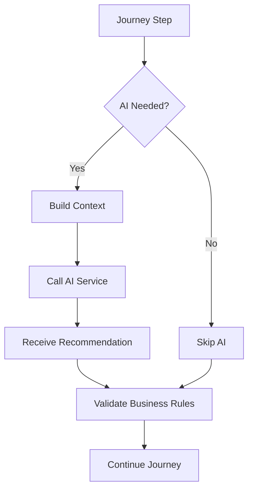
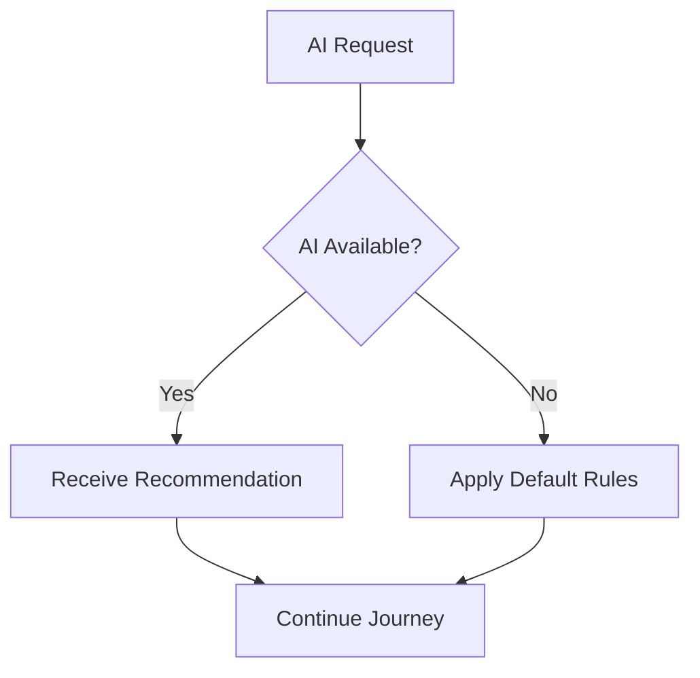

# AI Context

## Document Information

| Property | Value |
|----------|-------|
| Layer | Layer 2 – Guided Journey |
| Document | AI Context |
| Status | Production |
| Version | 1.0 |

---

# Purpose

This document defines how Layer 2 interacts with AI services.

Layer 2 is responsible for orchestrating the customer journey. AI enhances the journey by providing recommendations and insights but does not control workflow execution.

Business rules always take precedence over AI recommendations.

---

# Responsibilities

Layer 2 uses AI to:

- Analyze customer requirements
- Recommend interior design styles
- Suggest templates
- Match suitable designers
- Generate quotations
- Estimate timelines
- Recommend products
- Improve customer experience

Layer 2 does **not** allow AI to:

- Execute payments
- Modify workflow states
- Bypass business rules
- Override security policies
- Perform trust verification

---

# AI Inputs

Typical context provided to AI includes:

- Customer preferences
- Room dimensions
- Budget range
- Design style
- Project requirements
- Selected template
- Location (if applicable)
- Historical journey context

Sensitive information is excluded unless explicitly required and authorized.

---

# AI Outputs

AI may return:

- Design recommendations
- Template suggestions
- Designer rankings
- Product recommendations
- Budget estimates
- Timeline estimates
- Confidence score
- Explanation (optional)

---

# Integration Flow

1. Journey reaches an AI-assisted step.
2. Layer 2 prepares the request context.
3. Request is sent to Layer 3 AI services.
4. AI returns recommendations.
5. Layer 2 validates results against business rules.
6. Journey continues.

---

# Decision Principles

---

# Failure Handling

If AI is unavailable:

---

# Security

- Authenticate AI requests.
- Encrypt data in transit.
- Minimize sensitive data exposure.
- Validate all AI responses before use.

---

# Observability

Monitor:

- AI request count
- Response latency
- Failure rate
- Timeout rate
- Recommendation acceptance rate

---

# Design Principles

- Deterministic workflows
- Explainable AI recommendations
- Loose coupling
- Fault tolerance
- Scalable integration

---

# Related Documents

- overview.md
- ADR.md
- requirements.md
- journey_rules.md
- business_rules.md
- layer_2/diagrams/ai_integration_flow.md
- layer_3/overview.md
