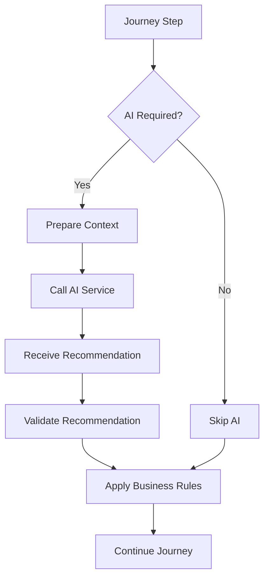
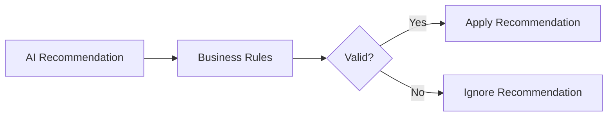
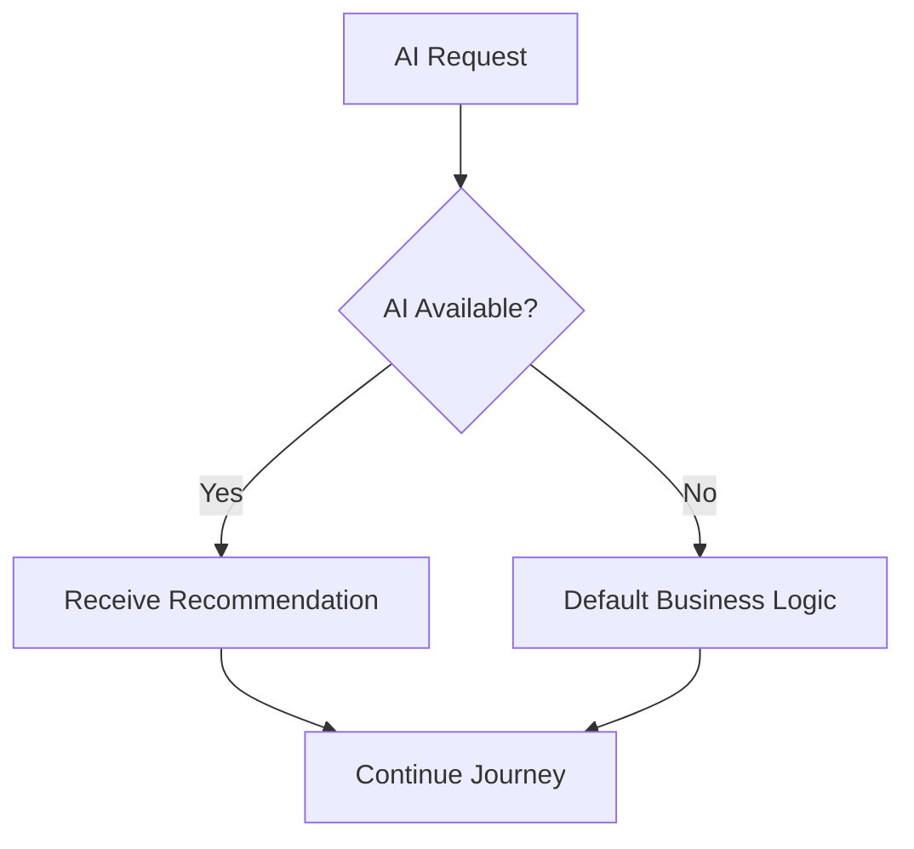

# AI Execution Rules

## Document Information

| Property | Value |
|----------|-------|
| Layer | Layer 2 – Guided Journey |
| Document | AI Execution Rules |
| Status | Production |
| Version | 1.0 |

---

# Purpose

This document defines the execution rules governing AI usage within Layer 2.

AI provides recommendations and insights but never controls the Guided Journey. Layer 2 remains the authoritative orchestrator responsible for workflow execution.

---

# Core Principles

- AI recommendations are optional.
- Business rules always take precedence.
- AI cannot modify workflow state.
- AI cannot bypass approval processes.
- AI failures must never stop the journey.
- Human approval overrides AI recommendations.

---

# AI Execution Lifecycle

---

# AI Decision Matrix

| Scenario | AI Allowed | Notes |
|----------|------------|-------|
| Design Recommendation | Yes | Advisory only |
| Template Recommendation | Yes | Advisory only |
| Designer Matching | Yes | Ranking only |
| Budget Estimation | Yes | Estimate only |
| Timeline Prediction | Yes | Estimate only |
| Product Recommendation | Yes | Suggestion only |
| Payment Processing | No | Managed by Payment Service |
| Trust Verification | No | Managed by Layer 5 |
| State Transition | No | Managed by Journey Orchestrator |

---

# AI Validation Flow

---

# Failure Handling

If AI is unavailable:

- Log the error.
- Use default business logic.
- Continue the journey.
- Notify monitoring systems if required.

---

# AI Failure Flow

---

# Security Rules

- Authenticate AI requests.
- Encrypt communication.
- Validate AI responses.
- Never expose sensitive data unnecessarily.
- Log AI interactions for audit purposes.

---

# Execution Constraints

AI must never:

- Execute payments
- Change workflow states
- Skip approvals
- Override security policies
- Modify trust scores
- Perform direct database updates

---

# Observability

Monitor:

- AI request count
- Response latency
- Timeout rate
- Error rate
- Recommendation acceptance rate

---

# Related Documents

- AI_CONTEXT.md
- ADR.md
- journey_rules.md
- business_rules.md
- layer_2/diagrams/ai_integration_flow.md
- layer_3/overview.md
