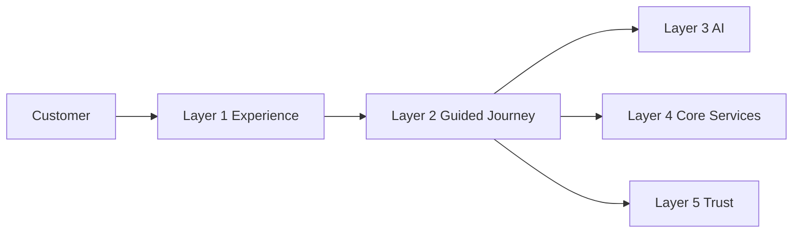
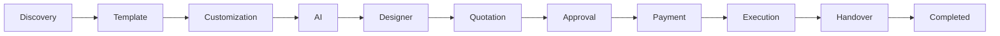
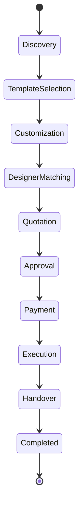
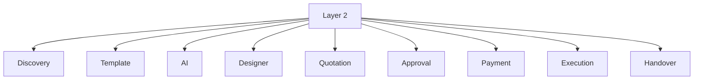

# Layer 2 – Guided Journey

## Overview

Layer 2 is responsible for orchestrating the complete customer journey across the platform.

It coordinates every major business workflow from design discovery to project completion while interacting with AI services, payment systems, trust verification, and execution services.

Layer 2 does not contain heavy business logic of downstream services. Instead, it coordinates workflows, maintains state, enforces business rules, and reacts to events.

---

# Responsibilities

- Customer journey orchestration
- Workflow management
- Business rule enforcement
- AI integration
- Payment orchestration
- Trust verification
- Event handling
- State management
- Recovery and retry
- Observability

---

# High-Level Architecture



---

# Guided Journey Flow



---

# State Lifecycle



---

# Component Hierarchy



---

# Directory Structure

```text
layer_2/
│
├── README.md
├── ADR.md
├── AI_CONTEXT.md
├── AI_EXECUTION_RULES.md
│
├── diagrams/
│   ├── component_hierarchy.md
│   ├── dependency_graph.md
│   ├── error_flow.md
│   ├── journey_flow.md
│   ├── routing_tree.md
│   ├── state_diagram.md
│   └── rendering_architecture.md
│
└── payment/
    ├── overview.md
    ├── requirements.md
    ├── api_contract.md
    ├── api_usage.md
    ├── events.md
    ├── state_machine.md
    ├── testing.md
    ├── security.md
    ├── performance.md
    └── ...
```

---

# Design Principles

- Event-driven architecture
- Deterministic workflows
- Saga orchestration
- State machine execution
- AI-assisted decisions
- Business rule enforcement
- Idempotent operations
- Fault tolerance
- Horizontal scalability

---

# External Dependencies

Layer 2 communicates with:

- Layer 1 Experience
- Layer 3 AI Operating System
- Layer 4 Core Services
- Layer 5 Trust Ecosystem
- Kafka Event Bus
- Redis Cache
- Journey Database

---

# Related Documents

## Core

- ADR.md
- AI_CONTEXT.md
- AI_EXECUTION_RULES.md

## Diagrams

- diagrams/component_hierarchy.md
- diagrams/dependency_graph.md
- diagrams/error_flow.md
- diagrams/journey_flow.md
- diagrams/state_diagram.md

## Payment Module

- payment/overview.md
- payment/state_machine.md
- payment/events.md
- payment/security.md
- payment/testing.md
