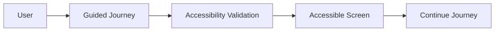
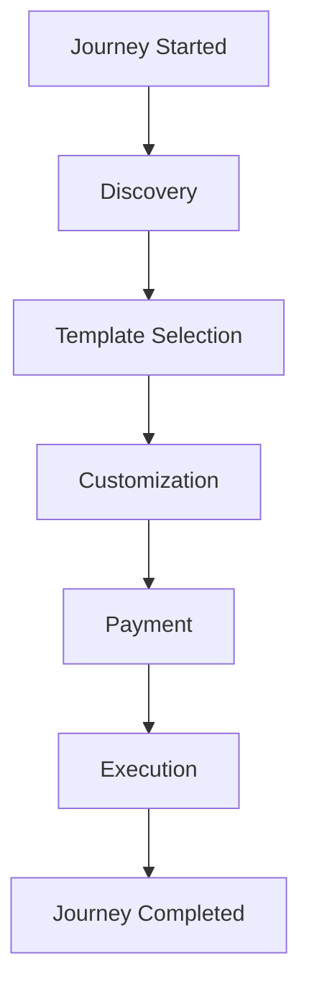
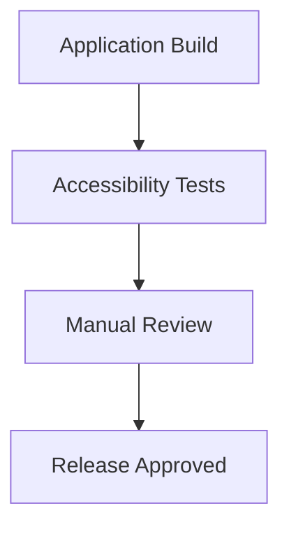

# Accessibility

## Document Information

| Property | Value |
|----------|-------|
| Layer | Layer 2 – Guided Journey |
| Document | Accessibility |
| Status | Production |
| Version | 1.0 |

---

# Purpose

This document defines the accessibility requirements for the Guided Journey.

The objective is to ensure that every customer can complete the journey regardless of physical, visual, auditory, or cognitive ability.

Accessibility requirements apply to all user interactions coordinated by Layer 2.

---

# Accessibility Principles

- Perceivable
- Operable
- Understandable
- Robust

The implementation should conform to WCAG 2.2 Level AA wherever practical.

---

# Accessibility Workflow

---

# Journey Accessibility Flow

---

# Accessibility Requirements

## Keyboard Navigation

Every interactive element must support keyboard navigation.

Examples

- Tab navigation
- Shift + Tab
- Enter
- Escape
- Arrow keys where appropriate

---

## Screen Reader Support

All screens should provide

- Meaningful labels
- Accessible names
- Semantic headings
- Landmark regions

---

## Color and Contrast

Requirements

- Sufficient text contrast
- Information not conveyed by color alone
- Visible focus indicators

---

## Forms

Every form should include

- Labels
- Required field indicators
- Error messages
- Validation guidance

---

## Images

Images should include

- Alternative text
- Decorative images marked appropriately

---

## Error Handling

Errors should

- Explain the problem
- Describe how to resolve it
- Preserve user input where possible

---

## Responsive Design

The journey should support

- Mobile devices
- Tablets
- Desktop browsers
- Screen zoom up to 200%

---

## Motion

Animations should

- Be minimal
- Respect reduced-motion preferences
- Never block interaction

---

# Accessibility Validation

---

# Testing Checklist

- Keyboard-only navigation
- Screen reader compatibility
- Color contrast verification
- Responsive layouts
- Focus management
- Form validation
- Error message accessibility

---

# Standards

- WCAG 2.2 Level AA
- WAI-ARIA
- HTML Accessibility Best Practices

---

# Related Documents

- README.md
- requirements.md
- interaction_design.md
- screen_flow.md
- testing.md
