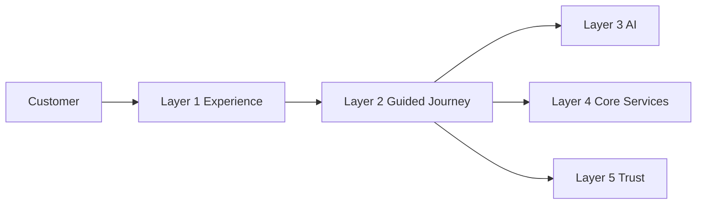
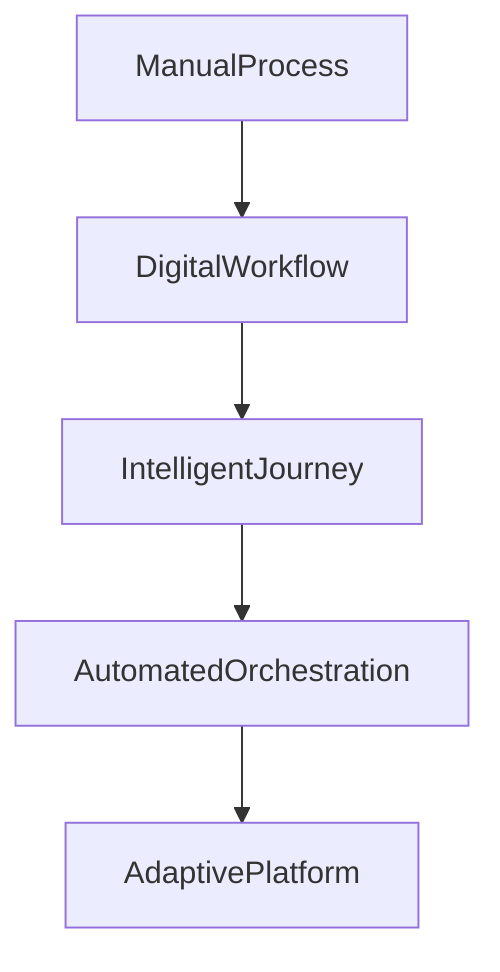

# Vision

## Document Information

| Property | Value |
|----------|-------|
| Layer | Layer 2 – Guided Journey |
| Document | Vision |
| Status | Production |
| Version | 1.0 |

---

# Vision Statement

Layer 2 aims to provide an intelligent, reliable, and seamless Guided Journey that transforms complex interior design projects into a structured, transparent, and personalized customer experience.

It serves as the orchestration engine that connects people, AI, business services, and execution workflows into a single, consistent journey.

---

# Mission

Provide a scalable workflow orchestration platform that:

- Simplifies customer decision making
- Coordinates every business process
- Integrates AI intelligently
- Maintains workflow consistency
- Enables reliable project execution

---

# Vision Architecture

---

# Customer Journey Vision

---

# Platform Evolution

---

# Strategic Goals

- Deliver a seamless customer journey
- Reduce project complexity
- Increase automation
- Enable intelligent recommendations
- Improve workflow transparency
- Support enterprise scalability
- Build a resilient orchestration platform

---

# Core Principles

- Customer-first experience
- Business rule driven workflows
- AI-assisted decision support
- Event-driven architecture
- Security by design
- High availability
- Operational transparency
- Continuous improvement

---

# Long-Term Objectives

### Customer Experience

- Personalized journeys
- Faster project completion
- Transparent progress tracking
- Simplified collaboration
- Consistent experience across devices

### Business

- Scalable workflow orchestration
- Standardized business processes
- Efficient resource utilization
- Reduced operational complexity

### Engineering

- Modular architecture
- Independent services
- Fault tolerance
- Continuous deployment
- Comprehensive observability

---

# Success Indicators

The vision is achieved when Layer 2 can:

- Orchestrate complete customer journeys
- Coordinate distributed services reliably
- Recover automatically from failures
- Deliver personalized recommendations
- Scale to enterprise workloads
- Maintain high customer satisfaction

---

# Future Direction

Future enhancements may include:

- Adaptive journey personalization
- Predictive workflow optimization
- Intelligent resource allocation
- Multi-region orchestration
- Cross-platform journey synchronization
- Advanced analytics and insights

---

# Related Documents

- README.md
- overview.md
- architecture.md
- journey_architecture.md
- AI_CONTEXT.md
- implementation_order.md
- observability.md
- ADR.md
