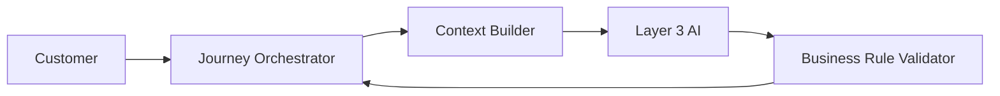
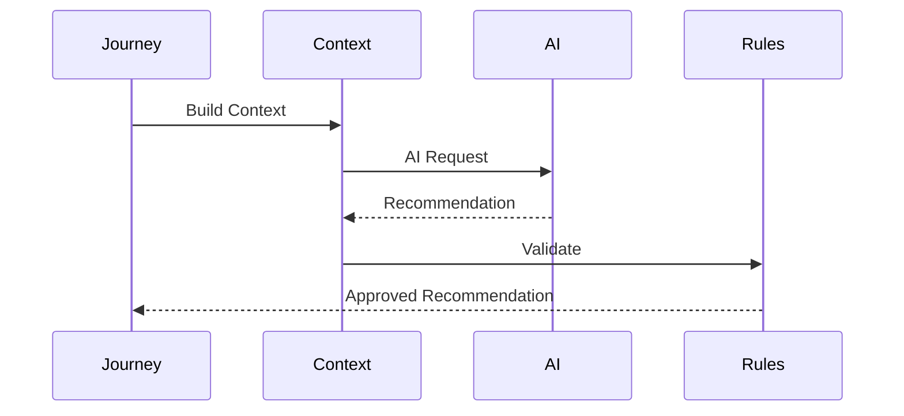
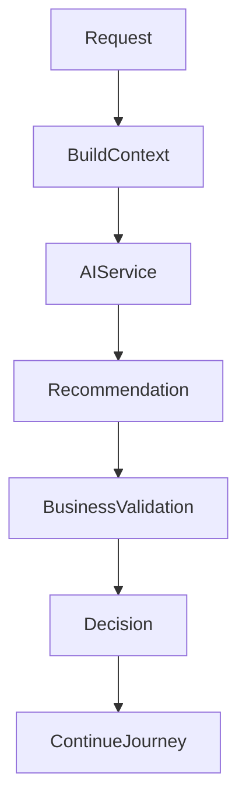
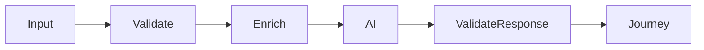
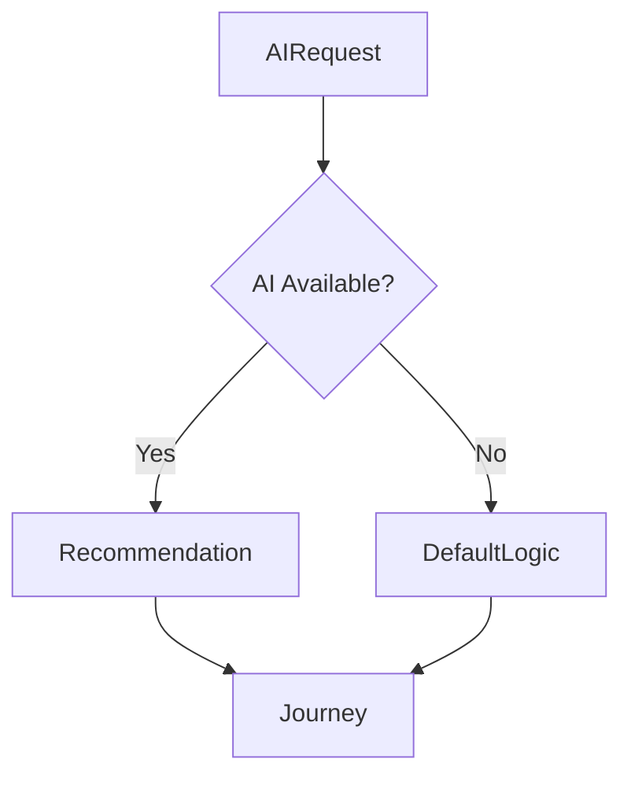

# AI Context

## Document Information

| Property | Value |
|----------|-------|
| Module | AI Analysis |
| Layer | Layer 2 – Guided Journey |
| Document | AI Context |
| Status | Production |
| Version | 1.0 |

---

# Purpose

This document defines the contextual information exchanged between the AI Analysis module and the AI platform.

The AI Analysis module prepares structured business context, submits it to Layer 3 AI services, validates the returned recommendations, and forwards approved recommendations to the Journey Orchestrator.

The AI module **does not make business decisions**. It provides decision support only.

---

# Objectives

- Standardize AI inputs
- Standardize AI outputs
- Ensure deterministic workflow execution
- Protect sensitive information
- Enable explainable recommendations
- Support future AI model evolution

---

# AI Context Architecture

---

# AI Request Lifecycle

---

# AI Decision Flow

---

# AI Input Context

The AI service may receive:

## Customer Information

- Customer preferences
- Project objectives
- Budget range
- Preferred timeline
- Location (when required)

---

## Project Information

- Room dimensions
- Property type
- Number of rooms
- Design category
- Existing layout
- Selected template

---

## Journey Context

- Current workflow stage
- Previous journey decisions
- Completed milestones
- Pending approvals
- Workflow history

---

## Business Context

- Available designers
- Available templates
- Pricing rules
- Service availability
- Business constraints

---

# AI Output

The AI service returns:

- Design recommendations
- Designer ranking
- Template recommendations
- Material suggestions
- Estimated budget
- Estimated timeline
- Confidence score
- Alternative recommendations

---

# Context Validation

Validation includes:

- Required fields
- Data consistency
- Supported formats
- Business constraints

---

# Security

Sensitive information should:

- Be minimized
- Be encrypted during transmission
- Never expose credentials
- Never expose payment information
- Never expose authentication tokens

---

# Privacy Rules

The AI context must not contain:

- Passwords
- Authentication tokens
- Payment credentials
- Internal security policies
- Private encryption keys

Personally identifiable information should only be included when strictly required for the recommendation.

---

# Failure Handling

If AI is unavailable:

- Continue using predefined business rules.
- Log the failure.
- Generate operational metrics.
- Preserve workflow continuity.

---

# Design Principles

- AI is advisory only.
- Business rules always take precedence.
- Context should be deterministic.
- Requests should be traceable.
- Responses should be explainable.
- Communication should be stateless.

---

# Observability

Track:

- AI request count
- AI response time
- Context generation time
- Validation failures
- AI timeout rate
- Recommendation acceptance rate

---

# Related Documents

- ADR.md
- architecture.md
- AI_EXECUTION_RULES.md
- interaction_architecture.md
- observability.md
- security.md
- implementation_rules.md
- overview.md
