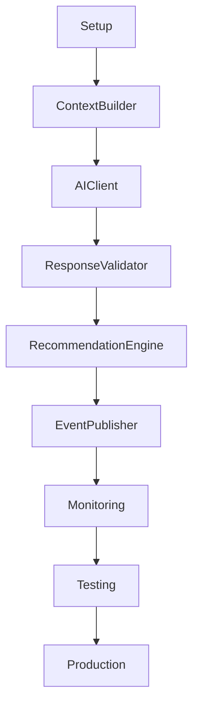
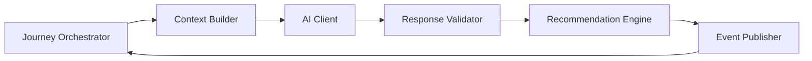
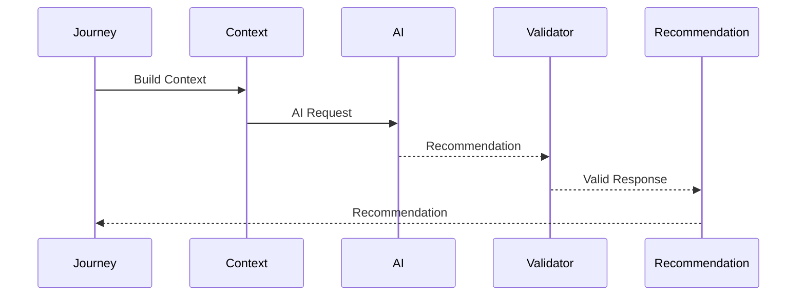
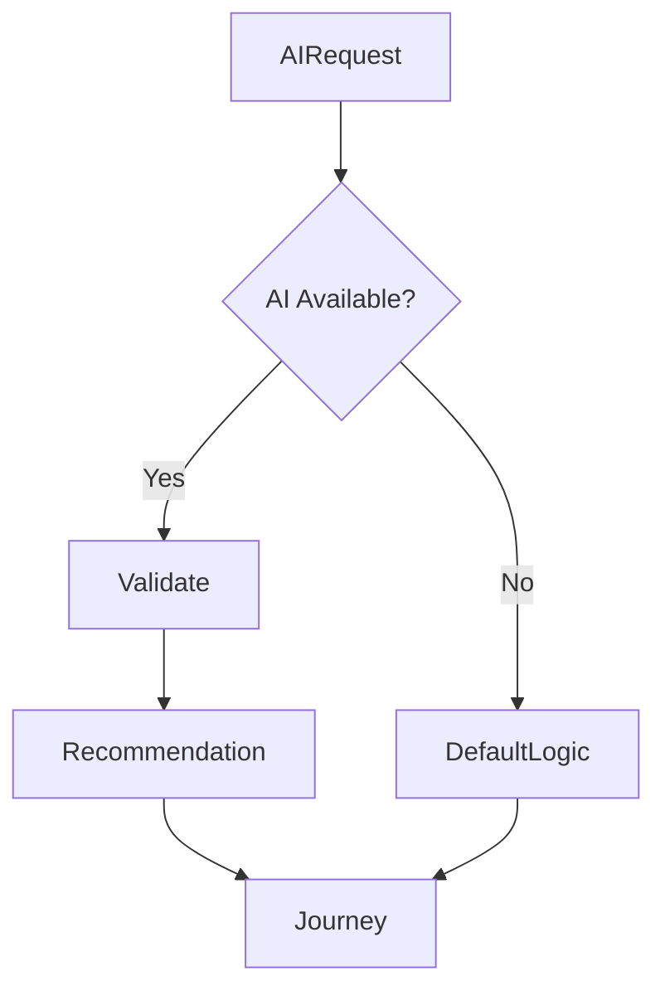
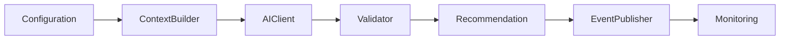

# AI Analysis Implementation Manifest

## Document Information

| Property | Value |
|----------|-------|
| Module | AI Analysis |
| Layer | Layer 2 – Guided Journey |
| Document | Implementation Manifest |
| Status | Production |
| Version | 1.0 |

---

# Purpose

This document defines the implementation blueprint for the AI Analysis module.

It specifies the implementation principles, execution flow, architectural constraints, dependencies, and completion criteria required to build a production-ready AI Analysis component.

The AI Analysis module is responsible for generating intelligent recommendations that assist the Guided Journey. It never executes business decisions directly.

---

# Module Responsibilities

The AI Analysis module is responsible for:

- Building AI request context
- Calling Layer 3 AI services
- Receiving AI recommendations
- Validating AI responses
- Returning recommendations to the Journey Orchestrator
- Recording observability data

The module is **not responsible** for:

- Workflow orchestration
- Payment execution
- Trust verification
- State transitions
- Database ownership
- Authentication

---

# Implementation Roadmap

---

# Component Architecture

---

# Request Lifecycle

---

# Implementation Phases

## Phase 1

- Module structure
- Configuration
- Dependency setup
- Logging

---

## Phase 2

- Context Builder
- Input validation
- Request generation

---

## Phase 3

- AI Client
- Retry policy
- Timeout handling
- Secure communication

---

## Phase 4

- Response validation
- Confidence evaluation
- Recommendation filtering

---

## Phase 5

- Event publishing
- Metrics
- Distributed tracing
- Audit logging

---

## Phase 6

- Unit testing
- Integration testing
- Performance testing
- Security validation

---

# Context Construction

The request context should include:

- Customer preferences
- Budget
- Timeline
- Project details
- Design preferences
- Journey state
- Business constraints

Sensitive information should only be included when required.

---

# Response Validation

Validate:

- Response format
- Required fields
- Confidence score
- Business constraints
- Recommendation quality
- Data consistency

Reject malformed or incomplete responses.

---

# Failure Handling

If AI becomes unavailable:

- Apply predefined business rules
- Record metrics
- Log the failure
- Continue the customer journey

---

# Dependency Order

---

# Security Requirements

- JWT authentication
- TLS encryption
- Request validation
- Response validation
- Input sanitization
- Correlation IDs
- Audit logging

---

# Performance Targets

| Metric | Target |
|----------|---------|
| Context generation | < 100 ms |
| AI request timeout | < 5 s |
| Response validation | < 100 ms |
| Recommendation processing | < 200 ms |
| End-to-end latency | < 6 s |

---

# Observability

Capture:

- AI request count
- AI latency
- Validation failures
- Timeout rate
- Recommendation acceptance rate
- Error rate
- Retry count

---

# Completion Checklist

- Context Builder implemented
- AI Client implemented
- Response Validator implemented
- Recommendation Engine implemented
- Event publishing implemented
- Logging enabled
- Metrics enabled
- Distributed tracing enabled
- Unit tests completed
- Integration tests completed
- Security review completed
- Documentation completed

---

# Success Criteria

The implementation is complete when:

- AI recommendations are generated successfully.
- Invalid responses are rejected.
- Business rules validate every recommendation.
- Failures do not interrupt the journey.
- Metrics and traces are available.
- Performance targets are achieved.
- All tests pass.

---

# Related Documents

- ADR.md
- AI_CONTEXT.md
- architecture.md
- implementation_rules.md
- observability.md
- security.md
- testing_strategy.md
- overview.md
