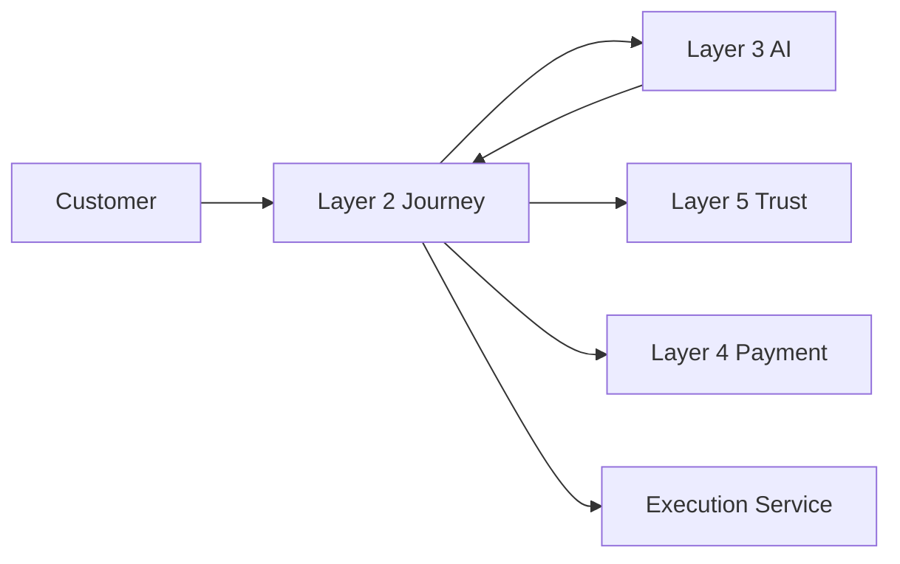
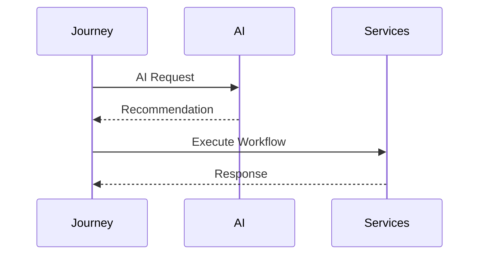
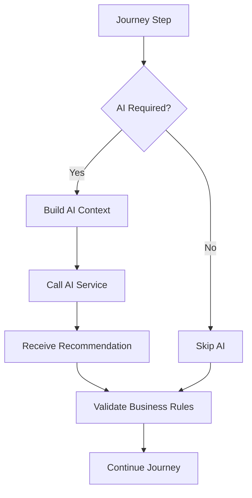
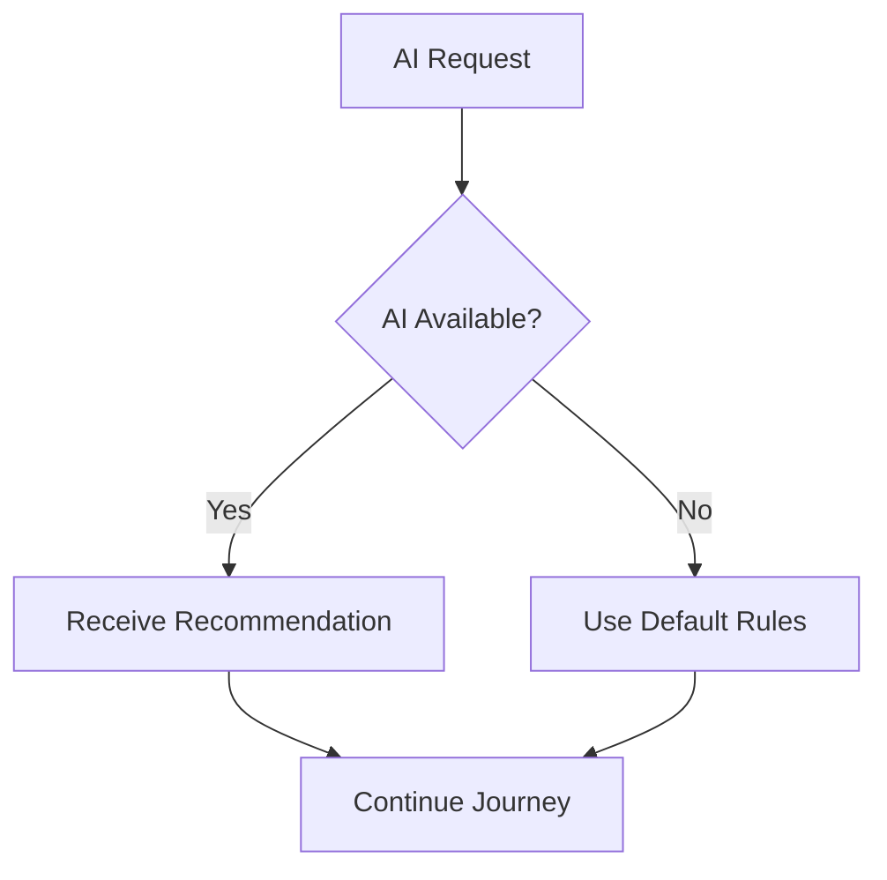

# AI Integration Architecture

## Document Information

| Property | Value |
|----------|-------|
| Layer | Layer 2 – Guided Journey |
| Document | AI Integration Architecture |
| Status | Production |
| Version | 1.0 |

---

# Overview

Layer 2 integrates with Layer 3 (AI Operating System) to provide intelligent recommendations throughout the customer journey.

Layer 2 remains responsible for orchestration, while Layer 3 performs AI inference and returns recommendations.

Business rules always have higher priority than AI recommendations.

---

# Objectives

- Improve customer experience
- Personalize the journey
- Recommend suitable designers
- Recommend templates
- Estimate budgets
- Predict project timelines
- Recommend products

---

# Architecture

---

# AI Request Lifecycle

---

# AI Decision Flow

---

# AI Context

AI receives:

- Customer preferences
- Design requirements
- Room dimensions
- Budget
- Timeline
- Selected template
- Journey history

---

# AI Services

Layer 3 provides:

- Design recommendation
- Template recommendation
- Designer matching
- Product recommendation
- Budget estimation
- Timeline estimation
- Layout optimization

---

# AI Response

Typical response includes:

- Recommendation
- Confidence score
- Ranking
- Explanation
- Suggested alternatives

---

# Failure Handling

---

# Integration Principles

- AI is advisory only.
- Journey remains deterministic.
- AI cannot modify workflow state.
- AI cannot initiate payments.
- AI cannot bypass approvals.
- AI recommendations are validated.

---

# Security

- JWT Authentication
- TLS Encryption
- Request Validation
- Response Validation
- Audit Logging

---

# Observability

Monitor:

- AI latency
- Request volume
- Error rate
- Timeout rate
- Recommendation acceptance rate

---

# Benefits

- Personalized customer journey
- Improved recommendation quality
- Reduced manual effort
- Better designer matching
- Faster quotation generation
- Modular AI architecture

---

# Related Documents

- README.md
- ADR.md
- AI_CONTEXT.md
- AI_EXECUTION_RULES.md
- journey_rules.md
- business_rules.md
- layer_3/overview.md
