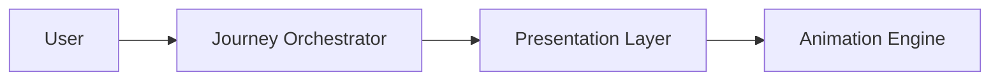
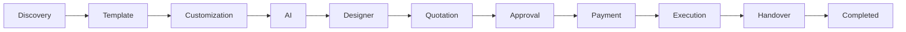
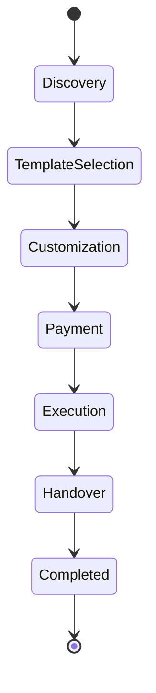
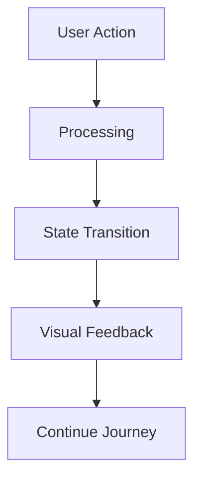

# Animation Architecture

## Document Information

| Property | Value |
|----------|-------|
| Layer | Layer 2 – Guided Journey |
| Document | Animation Architecture |
| Status | Production |
| Version | 1.0 |

---

# Overview

The Animation Architecture defines how visual feedback is presented to users throughout the Guided Journey.

Animations communicate progress, state transitions, loading states, success, failures, and workflow completion without affecting business logic.

Animations are presentation-layer concerns and never influence workflow execution.

---

# Objectives

- Improve user experience
- Visualize journey progress
- Provide clear feedback
- Reduce perceived waiting time
- Improve accessibility
- Maintain consistent UI behavior

---

# High-Level Architecture

---

# Journey Animation Flow

---

# State Transition Animation

---

# Animation Lifecycle

---

# Animation Types

The journey supports:

- Progress indicators
- Loading animations
- Success confirmations
- Error notifications
- Transition animations
- Timeline progress
- Skeleton loading
- Micro-interactions

---

# Animation Rules

- Never block user interaction.
- Never affect business logic.
- Respect reduced-motion preferences.
- Keep transitions consistent.
- Provide clear visual feedback.
- Avoid excessive motion.

---

# Accessibility

Animations must:

- Respect prefers-reduced-motion
- Avoid flashing content
- Preserve readability
- Remain keyboard accessible

---

# Related Documents

- README.md
- accessibility.md
- AI_CONTEXT.md
- journey_rules.md
- interaction_design.md
