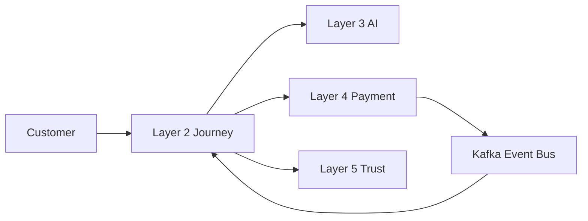
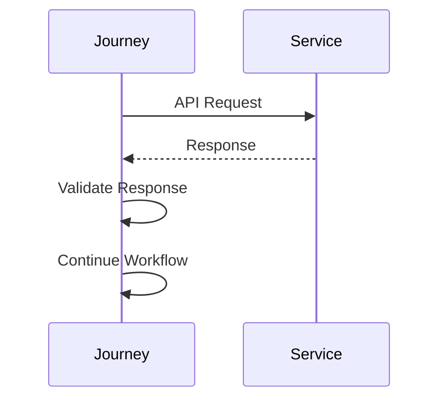
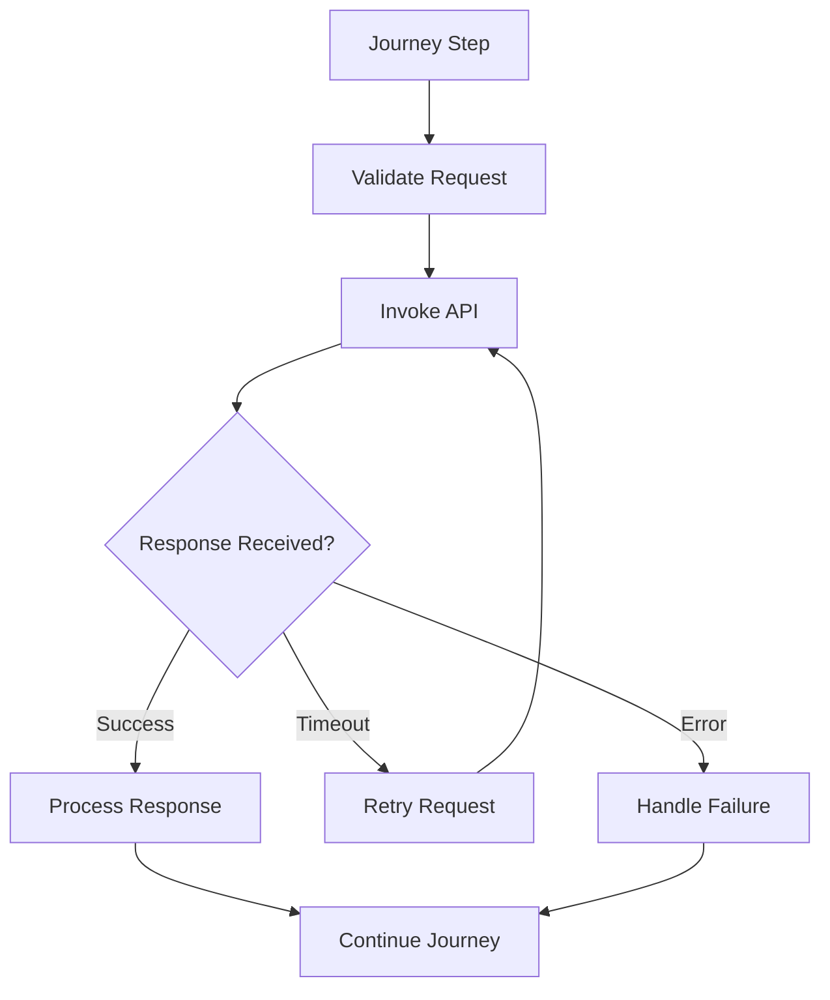

# API Usage Rules

## Document Information

| Property | Value |
|----------|-------|
| Layer | Layer 2 – Guided Journey |
| Document | API Usage Rules |
| Status | Production |
| Version | 1.0 |

---

# Purpose

This document defines the standards and rules governing API consumption within Layer 2.

Layer 2 acts as the orchestration layer and communicates with downstream services using secure, reliable, and idempotent APIs.

---

# API Communication Principles

- Use synchronous APIs only when an immediate response is required.
- Prefer asynchronous events for long-running operations.
- APIs must be stateless.
- APIs must be versioned.
- Every request must include a correlation ID.
- Every write operation must support idempotency.

---

# API Interaction Architecture

---

# API Request Lifecycle

---

# API Usage Flow

---

# Authentication Rules

Every API request must include:

- JWT access token
- Correlation ID
- Content-Type
- Authorization header

---

# Idempotency Rules

Required for:

- Payment requests
- Quotation creation
- Approval requests
- Order creation

Duplicate requests must return the original response without creating duplicate operations.

---

# Retry Rules

Retry only for:

- Network timeout
- Temporary service failure
- HTTP 503
- HTTP 429

Do not retry:

- Validation errors
- Authentication failures
- Authorization failures
- Business rule violations

---

# Timeout Rules

Recommended limits:

| Operation | Timeout |
|-----------|---------|
| AI Request | 5 s |
| Payment | 30 s |
| Trust Verification | 10 s |
| Internal Services | 5 s |

---

# Error Handling

- Validate every response.
- Log failed requests.
- Return meaningful error messages.
- Publish failure events when necessary.
- Continue the journey where recovery is possible.

---

# Security Rules

- Use HTTPS/TLS.
- Never expose internal APIs publicly.
- Validate request payloads.
- Sanitize inputs.
- Verify JWT tokens.
- Enforce authorization.

---

# Observability

Monitor:

- API latency
- Success rate
- Error rate
- Retry count
- Timeout count

---

# Best Practices

- Keep APIs stateless.
- Prefer event-driven communication for asynchronous work.
- Avoid cascading synchronous calls.
- Use API versioning.
- Maintain backward compatibility.
- Validate all inputs and outputs.

---

# Related Documents

- README.md
- ADR.md
- requirements.md
- api_contract.md
- api_usage.md
- events.md
- security.md
- observability.md
