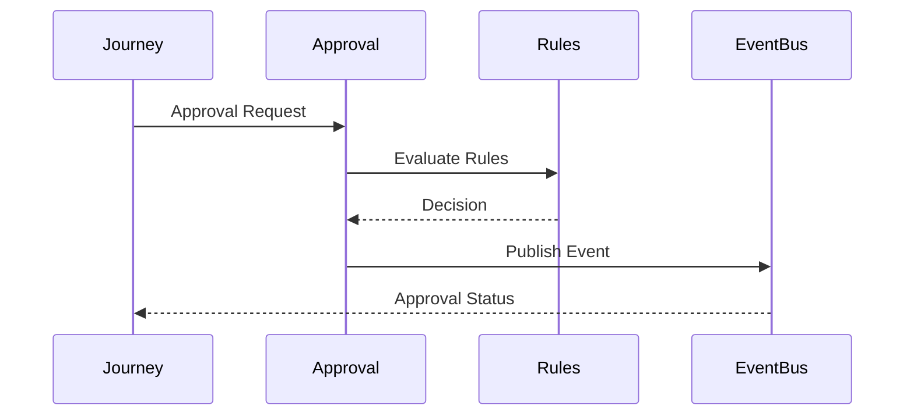
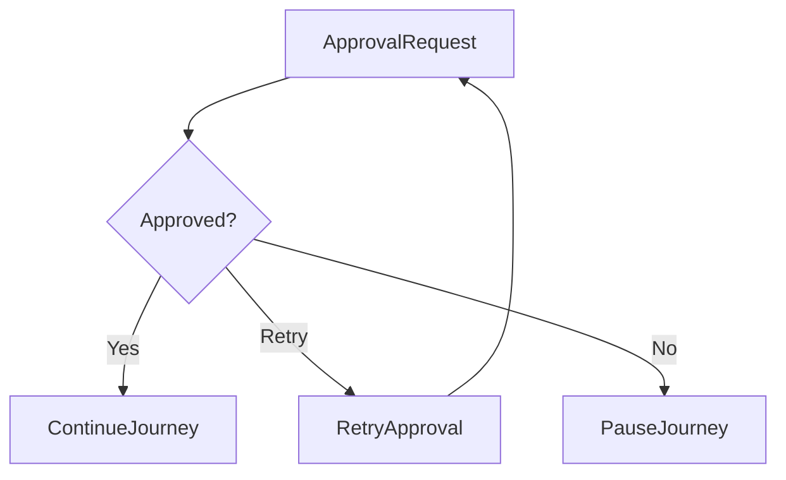

# Architecture Decision Record (ADR)

## Document Information

| Property | Value |
|----------|-------|
| Module | Approval |
| Layer | Layer 2 – Guided Journey |
| Document | Architecture Decision Record |
| Status | Accepted |
| Version | 1.0 |

---

# Purpose

This document records the key architectural decisions made for the Approval module.

The Approval module governs business approvals required before a customer journey progresses to the next stage. It ensures that approvals are deterministic, auditable, secure, and recoverable.

---

# ADR-001: Approval as a Dedicated Module

## Status

Accepted

### Decision

Approval is implemented as an independent business module.

### Rationale

Approval has its own lifecycle, business rules, audit requirements, and integrations.

### Consequences

**Benefits**

- Loose coupling
- Independent evolution
- Easier testing
- Clear ownership

---

# ADR-002: Deterministic Approval Workflow

## Status

Accepted

### Decision

Approval decisions follow predefined business rules.

### Rationale

Approval outcomes must be predictable and auditable.

### Consequences

- No ambiguous decisions
- Easier compliance
- Repeatable workflows

---

# ADR-003: State Machine Driven Approval

## Status

Accepted

### Decision

Approval lifecycle is managed using a finite state machine.

### Rationale

Explicit states prevent invalid workflow transitions.

### Consequences

- Controlled transitions
- Easier recovery
- Better traceability

---

# ADR-004: Event-Driven Approval Notifications

## Status

Accepted

### Decision

Approval changes are published as domain events.

### Rationale

Decouples the Approval module from downstream services.

### Consequences

- Independent consumers
- Better scalability
- Asynchronous processing

---

# ADR-005: Journey Orchestrator Owns Workflow

## Status

Accepted

### Decision

The Journey Orchestrator invokes the Approval module.

### Rationale

Workflow coordination remains centralized.

### Consequences

- Single orchestration point
- Consistent execution
- Reduced coupling

---

# ADR-006: Idempotent Approval Requests

## Status

Accepted

### Decision

Repeated approval requests produce the same outcome.

### Rationale

Protects against retries and duplicate submissions.

### Consequences

- Safe retries
- Duplicate prevention
- Reliable recovery

---

# ADR-007: Human Approval for Critical Actions

## Status

Accepted

### Decision

High-impact business decisions require manual approval.

### Rationale

Critical workflow stages require accountability.

### Consequences

- Human oversight
- Better governance
- Reduced operational risk

---

# ADR-008: Automatic Approval for Low-Risk Cases

## Status

Accepted

### Decision

Low-risk requests may be approved automatically using business rules.

### Rationale

Improves workflow efficiency without compromising governance.

### Consequences

- Faster processing
- Reduced manual effort
- Consistent automation

---

# ADR-009: Approval Failure Pauses Journey

## Status

Accepted

### Decision

Permanent approval failures pause the customer journey.

### Rationale

Prevent invalid progression through the workflow.

### Consequences

- Workflow integrity
- Manual intervention possible
- Controlled recovery

---

# ADR-010: Full Audit Trail

## Status

Accepted

### Decision

Every approval action is recorded.

### Rationale

Supports compliance, troubleshooting, and accountability.

### Consequences

- Complete audit history
- Easier investigations
- Regulatory support

---

# Approval Decision Architecture

---

# Approval Request Lifecycle

---

# Failure Recovery

---

# Decision Summary

| ADR | Decision |
|------|----------|
| ADR-001 | Dedicated Approval module |
| ADR-002 | Deterministic business rules |
| ADR-003 | State machine workflow |
| ADR-004 | Event-driven notifications |
| ADR-005 | Journey Orchestrator controls approval |
| ADR-006 | Idempotent approval requests |
| ADR-007 | Manual approval for critical cases |
| ADR-008 | Automatic approval for low-risk cases |
| ADR-009 | Journey pauses on permanent failure |
| ADR-010 | Complete audit trail |

---

# Related Documents

- overview.md
- architecture.md
- business_rules.md
- state_machine.md
- events.md
- security.md
- observability.md
- implementation_rules.md
