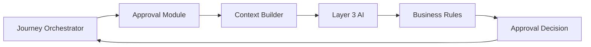
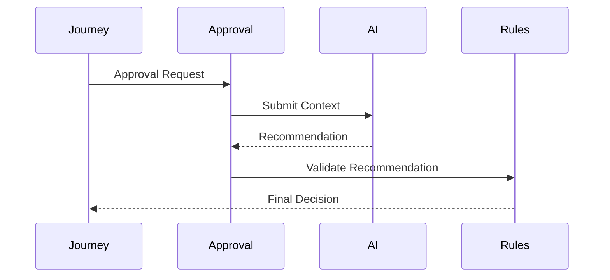
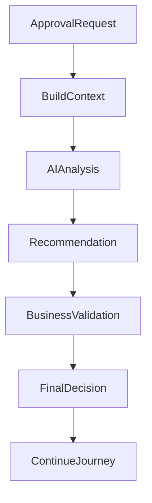
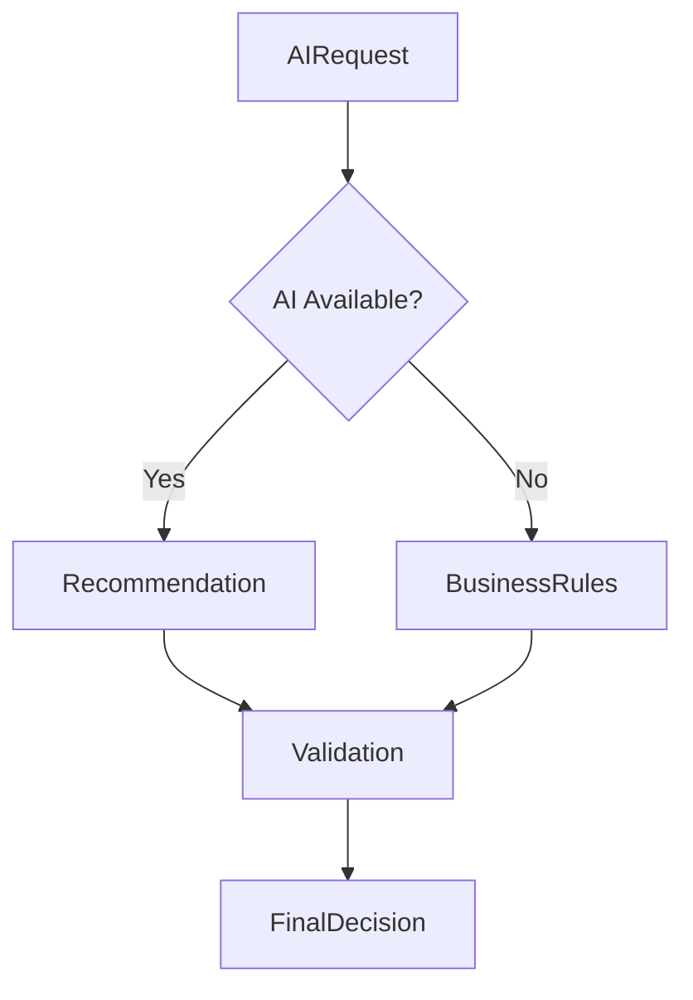

# AI Context

## Document Information

| Property | Value |
|----------|-------|
| Module | Approval |
| Layer | Layer 2 – Guided Journey |
| Document | AI Context |
| Status | Production |
| Version | 1.0 |

---

# Purpose

This document defines how the Approval module interacts with AI services.

AI assists the approval process by providing recommendations, risk assessments, and supporting insights. The final approval decision is always governed by business rules and organizational policies.

The Approval module never delegates authority to AI.

---

# Objectives

- Standardize AI interactions
- Improve approval efficiency
- Support explainable recommendations
- Maintain deterministic workflows
- Ensure secure AI communication

---

# AI Integration Architecture



---

# AI Request Lifecycle



---

# AI Decision Flow



---

# AI Input Context

The Approval module may provide:

## Journey Context

- Journey ID
- Current workflow stage
- Previous approval history
- Pending approvals

---

## Business Context

- Project value
- Budget
- Timeline
- Business policies
- Approval thresholds

---

## Customer Context

- Customer profile
- Project requirements
- Selected services
- Previous interactions

---

# AI Recommendations

The AI service may return:

- Approval recommendation
- Risk assessment
- Confidence score
- Reasoning summary
- Suggested reviewer
- Escalation recommendation
- Supporting observations

---

# Validation Rules

Every AI recommendation must be validated against:

- Business rules
- Approval policies
- Regulatory requirements
- Organization constraints

Invalid recommendations are rejected.

---

# Approval Authority

AI can:

- Recommend approval
- Recommend rejection
- Assess risk
- Prioritize reviews
- Suggest escalation

AI cannot:

- Approve requests
- Reject requests
- Override business rules
- Modify workflow state
- Skip mandatory approvals

---

# Security

AI requests must:

- Use authenticated service communication
- Be encrypted in transit
- Exclude sensitive credentials
- Include correlation IDs
- Generate audit logs

---

# Privacy

The AI context must never include:

- Passwords
- Authentication tokens
- Banking credentials
- Private encryption keys
- Internal security secrets

Personally identifiable information should only be shared when required for the analysis.

---

# Failure Handling



If AI becomes unavailable:

- Continue using business rules.
- Log the incident.
- Record operational metrics.
- Maintain workflow continuity.

---

# Observability

Capture:

- AI request count
- AI latency
- Recommendation acceptance rate
- Validation failures
- Timeout rate
- Error rate
- Retry count

---

# Design Principles

- AI is advisory only.
- Business rules always take precedence.
- Approval decisions remain deterministic.
- Every AI interaction is traceable.
- AI recommendations must be explainable.
- Human oversight remains available for critical approvals.

---

# Related Documents

- ADR.md
- architecture.md
- implementation_rules.md
- business_rules.md
- events.md
- state_machine.md
- observability.md
- security.md
- overview.md
```
