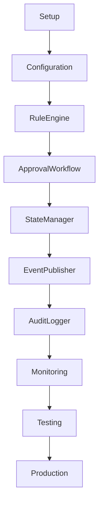
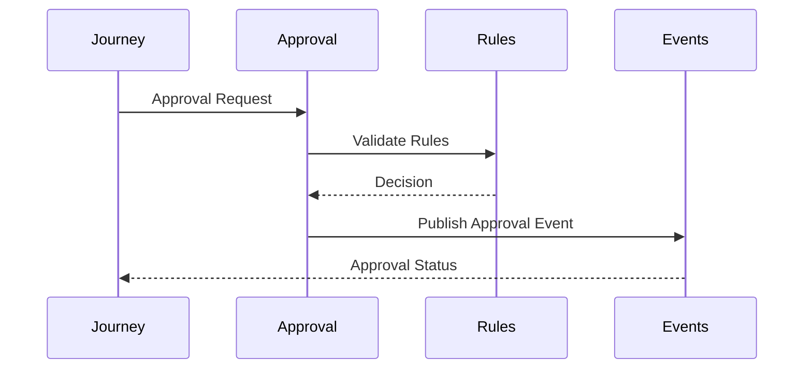
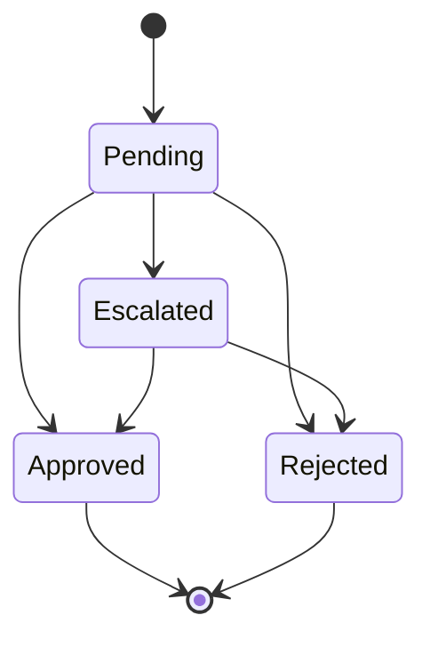
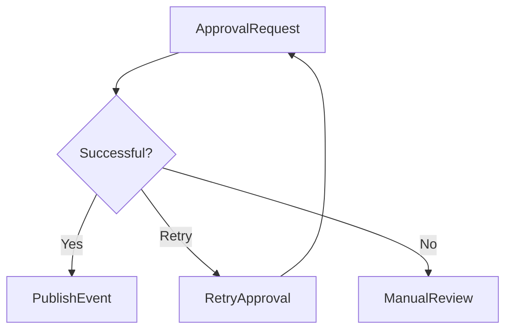
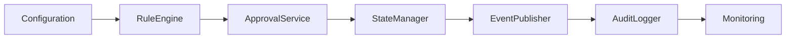

# Approval Implementation Manifest

## Document Information

| Property | Value |
|----------|-------|
| Module | Approval |
| Layer | Layer 2 – Guided Journey |
| Document | Implementation Manifest |
| Status | Production |
| Version | 1.0 |

---

# Purpose

This document defines the implementation blueprint for the Approval module.

It describes the implementation phases, architectural boundaries, dependencies, execution flow, validation requirements, and production readiness criteria.

The Approval module ensures that business approvals are executed consistently, securely, and transparently before the customer journey proceeds.

---

# Module Responsibilities

The Approval module is responsible for:

- Receiving approval requests
- Validating approval rules
- Executing approval workflows
- Recording approval decisions
- Publishing approval events
- Supporting retries and recovery
- Maintaining audit history

The Approval module is **not responsible** for:

- Journey orchestration
- Payment execution
- AI inference
- Trust verification
- Authentication services
- Database ownership

---

# Implementation Roadmap



---

# Component Architecture


---

# Approval Lifecycle



---

# Implementation Phases

## Phase 1

- Module setup
- Configuration
- Dependency registration
- Logging

---

## Phase 2

- Approval request handling
- Rule validation
- Input validation

---

## Phase 3

- State machine
- Approval lifecycle
- Retry mechanism
- Timeout handling

---

## Phase 4

- Event publishing
- Event consumption
- Audit logging

---

## Phase 5

- Metrics
- Distributed tracing
- Monitoring
- Alerts

---

## Phase 6

- Unit testing
- Integration testing
- Security validation
- Performance testing

---

# Approval Validation

Validate:

- Required fields
- Business policies
- Approval authority
- Workflow state
- Duplicate requests
- Idempotency

Reject invalid approval requests before execution.

---

# State Management



---

# Failure Handling



If approval processing fails:

- Retry transient failures.
- Pause workflow when necessary.
- Escalate permanent failures.
- Preserve approval state.
- Record audit information.

---

# Dependency Order



---

# Security Requirements

- JWT authentication
- Role-based authorization
- HTTPS/TLS
- Request validation
- Audit logging
- Correlation IDs
- Input sanitization

---

# Performance Targets

| Metric | Target |
|----------|---------|
| Approval validation | < 200 ms |
| Rule evaluation | < 100 ms |
| Approval decision | < 500 ms |
| Event publication | < 100 ms |
| End-to-end approval | < 2 s |

---

# Observability

Capture:

- Approval requests
- Approval latency
- Rule evaluation time
- Approval success rate
- Rejection rate
- Retry count
- Error rate
- Event publication latency

---

# Completion Checklist

- Approval service implemented
- Business rules implemented
- State machine implemented
- Event publishing enabled
- Audit logging enabled
- Monitoring configured
- Metrics available
- Distributed tracing enabled
- Unit tests completed
- Integration tests completed
- Security validation completed
- Documentation completed

---

# Success Criteria

The implementation is complete when:

- Approval workflows execute correctly.
- Business rules are consistently enforced.
- State transitions are validated.
- Events are published successfully.
- Failures recover gracefully.
- Audit logs are complete.
- Performance targets are achieved.
- All automated tests pass.

---

# Related Documents

- ADR.md
- AI_CONTEXT.md
- architecture.md
- business_rules.md
- state_machine.md
- events.md
- observability.md
- security.md
- testing_strategy.md
- overview.md
```
