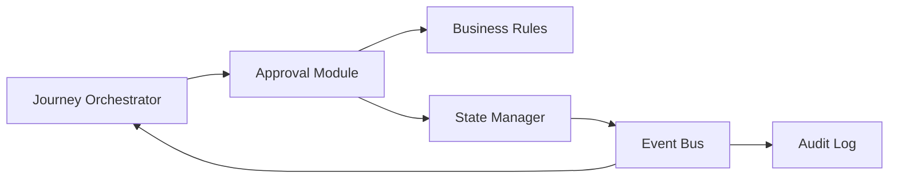
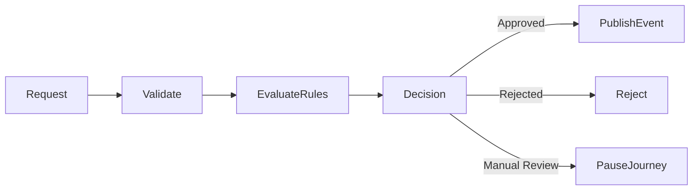
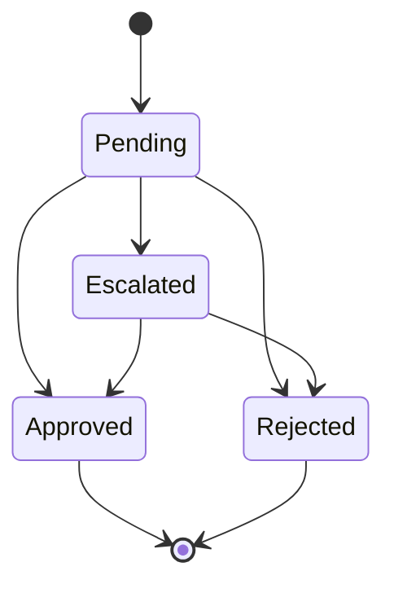

# Approval Module

## Overview

The Approval module manages business approval workflows within Layer 2 of the Guided Journey.

It validates approval requests, enforces business rules, manages approval states, records audit information, and publishes approval events before allowing the customer journey to proceed.

The module ensures that approval decisions are consistent, traceable, secure, and recoverable.

---

# Responsibilities

The Approval module is responsible for:

- Processing approval requests
- Business rule validation
- Approval state management
- Manual and automatic approvals
- Event publishing
- Audit logging
- Failure recovery
- Workflow continuation

---

# Module Architecture



---

# Approval Workflow



---

# Approval Lifecycle



---

# Features

- Deterministic approval workflow
- Business rule enforcement
- Automatic approvals
- Manual approvals
- Approval escalation
- Retry support
- Audit trail
- Event-driven architecture
- Observability

---

# Folder Structure

```text
approval/
│
├── README.md
├── overview.md
├── architecture.md
├── ADR.md
├── AI_CONTEXT.md
├── IMPLEMENTATION_MANIFEST.md
├── implementation_rules.md
├── implementation_order.md
├── business_rules.md
├── state_machine.md
├── events.md
├── security.md
├── observability.md
├── testing_strategy.md
├── requirements.md
├── performance.md
├── cache.md
├── dependencies.md
├── configuration.md
├── glossary.md
└── diagrams/
```

---

# Key Components

- Approval Service
- Rule Engine
- State Manager
- Event Publisher
- Audit Logger
- Retry Manager
- Metrics Collector

---

# Design Principles

- Business-rule driven
- Deterministic execution
- Event-driven communication
- Explicit state transitions
- Idempotent processing
- Loose coupling
- High availability
- Complete auditability

---

# External Dependencies

The Approval module communicates with:

- Journey Orchestrator
- Layer 3 AI Services
- Layer 4 Core Services
- Kafka Event Bus
- Audit Service
- Monitoring Platform

---

# Security

- JWT Authentication
- Role-Based Access Control (RBAC)
- HTTPS/TLS
- Audit Logging
- Input Validation
- Correlation IDs

---

# Observability

Monitor:

- Approval requests
- Approval latency
- Approval success rate
- Rejection rate
- Retry count
- Event publication latency
- Error rate

---

# Related Documents

## Architecture

- architecture.md
- ADR.md
- IMPLEMENTATION_MANIFEST.md

## Business

- business_rules.md
- state_machine.md
- events.md

## Operations

- observability.md
- security.md
- testing_strategy.md
- performance.md

## AI

- AI_CONTEXT.md
