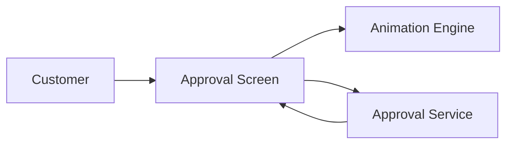
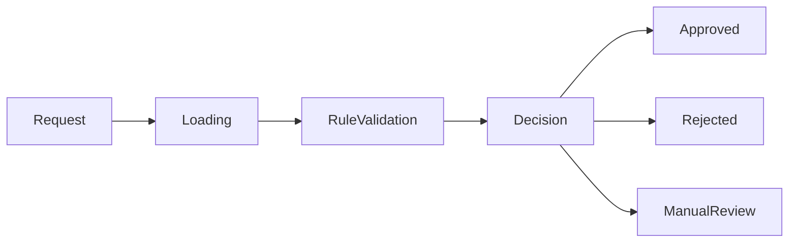
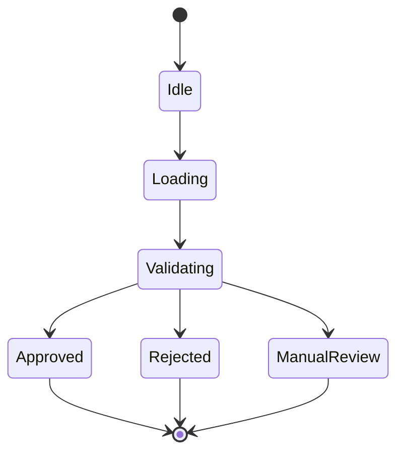
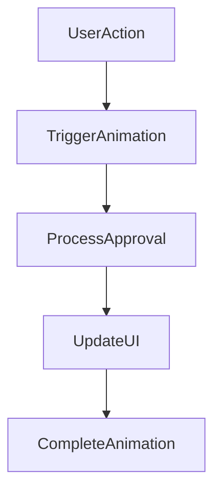
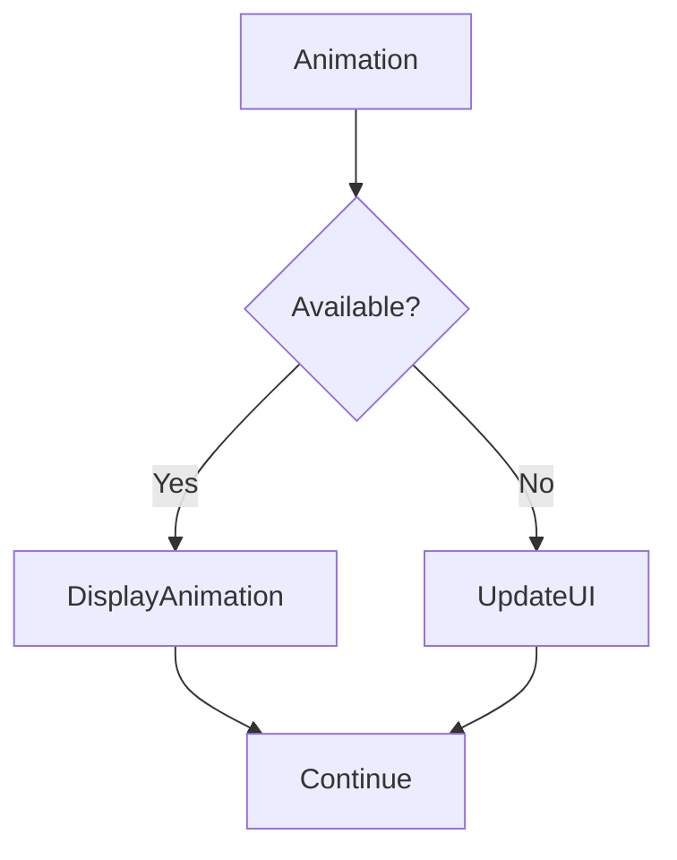

# Animation

## Document Information

| Property | Value |
|----------|-------|
| Module | Approval |
| Layer | Layer 2 – Guided Journey |
| Document | Animation |
| Status | Production |
| Version | 1.0 |

---

# Purpose

This document defines the animation guidelines for the Approval module.

Animations provide visual feedback during approval processing without affecting business logic or workflow execution.

The Approval module remains fully functional even if animations are unavailable.

---

# Objectives

- Improve user experience
- Indicate approval progress
- Provide visual feedback
- Reduce perceived waiting time
- Maintain accessibility
- Ensure consistent UI behavior

---

# Animation Architecture



---

# Approval Animation Flow



---

# Approval State Animation



---

# Animation Lifecycle



---

# Animation Types

The Approval module supports:

- Button feedback
- Loading indicators
- Progress indicators
- Success animation
- Error animation
- Approval confirmation
- Rejection notification
- Manual review notification

---

# Animation Rules

- Animations must never block approval processing.
- Approval decisions must not depend on animations.
- Animations should complete independently of backend execution.
- Long-running operations should display loading indicators.
- Multiple animations should not overlap unnecessarily.

---

# Accessibility

Animations must:

- Respect reduced-motion preferences.
- Avoid flashing effects.
- Preserve keyboard accessibility.
- Maintain readable content.
- Support screen readers.

---

# Performance Guidelines

- Keep animations lightweight.
- Avoid excessive rendering.
- Minimize animation duration.
- Do not delay workflow execution.
- Render only visible animations.

---

# Failure Handling



Animation failures must never interrupt the approval workflow.

---

# Best Practices

- Keep transitions smooth.
- Use consistent animation timing.
- Provide immediate visual feedback.
- Minimize unnecessary motion.
- Ensure animations reinforce workflow status.

---

# Related Documents

- README.md
- architecture.md
- interaction_design.md
- rendering_architecture.md
- accessibility.md
- observability.md
- state_machine.md
- implementation_rules.md
```
