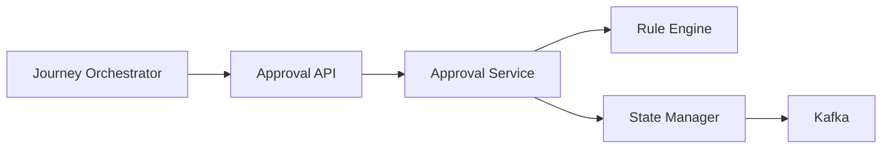
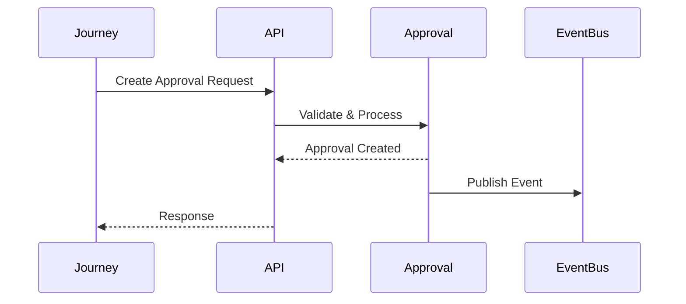
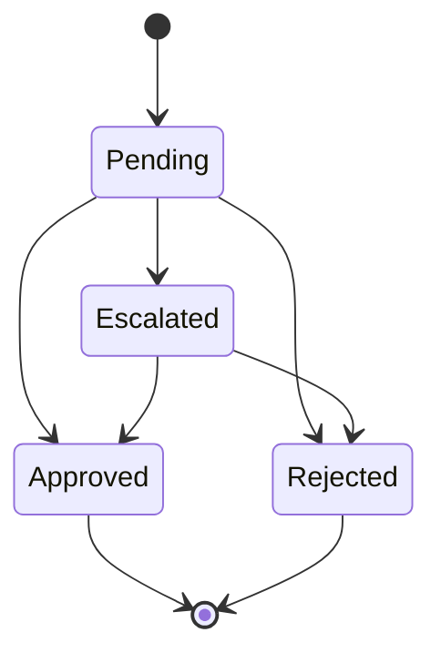

# API Contract

## Document Information

| Property | Value |
|----------|-------|
| Module | Approval |
| Layer | Layer 2 – Guided Journey |
| Document | API Contract |
| Status | Production |
| Version | 1.0 |

---

# Purpose

This document defines the API contracts exposed by the Approval module.

The APIs enable the Journey Orchestrator and authorized platform services to create approval requests, retrieve approval status, process approval decisions, and monitor approval workflows.

---

# API Architecture



---

# Approval Request Flow



---

# REST Endpoints

| Method | Endpoint | Description |
|---------|----------|-------------|
| POST | `/api/v1/approvals` | Create approval request |
| GET | `/api/v1/approvals/{approvalId}` | Retrieve approval details |
| GET | `/api/v1/approvals/{approvalId}/status` | Get approval status |
| POST | `/api/v1/approvals/{approvalId}/approve` | Approve request |
| POST | `/api/v1/approvals/{approvalId}/reject` | Reject request |
| POST | `/api/v1/approvals/{approvalId}/escalate` | Escalate approval |
| GET | `/api/v1/approvals` | Search approvals |

---

# Request Headers

| Header | Required |
|----------|----------|
| Authorization | Yes |
| Content-Type | Yes |
| Correlation-Id | Yes |
| Idempotency-Key | Recommended |

---

# Create Approval Request

### Request

```json
{
  "journeyId": "JR-1001",
  "approvalType": "Quotation",
  "requestedBy": "customer",
  "priority": "NORMAL",
  "payload": {}
}
```

### Response

```json
{
  "approvalId": "APR-2001",
  "status": "PENDING",
  "createdAt": "2026-08-04T10:00:00Z"
}
```

---

# Approval Decision

### Request

```json
{
  "decision": "APPROVED",
  "comments": "Approved after policy validation"
}
```

### Response

```json
{
  "approvalId": "APR-2001",
  "status": "APPROVED",
  "processedAt": "2026-08-04T10:02:15Z"
}
```

---

# Approval States



---

# Response Codes

| Code | Meaning |
|------|---------|
| 200 | Success |
| 201 | Approval created |
| 202 | Accepted for processing |
| 400 | Invalid request |
| 401 | Authentication failed |
| 403 | Access denied |
| 404 | Approval not found |
| 409 | Duplicate request |
| 422 | Business rule violation |
| 429 | Too many requests |
| 500 | Internal server error |
| 503 | Service unavailable |

---

# Error Response

```json
{
  "code": "APPROVAL_RULE_FAILED",
  "message": "Approval cannot proceed because mandatory validation failed.",
  "correlationId": "5dd4c12e"
}
```

---

# Security Requirements

- JWT Authentication
- HTTPS/TLS
- RBAC Authorization
- Input Validation
- Correlation IDs
- Audit Logging

---

# Idempotency

The following operations must be idempotent:

- Create approval request
- Approve request
- Reject request
- Escalate request

Duplicate requests using the same **Idempotency-Key** should return the original response without creating duplicate approval records.

---

# Events

The Approval API publishes:

- ApprovalCreated
- ApprovalApproved
- ApprovalRejected
- ApprovalEscalated
- ApprovalCompleted

---

# Performance Targets

| Metric | Target |
|----------|---------|
| Create Approval | < 500 ms |
| Get Approval | < 200 ms |
| Approval Decision | < 500 ms |
| Status Lookup | < 150 ms |

---

# Versioning

- URI Versioning (`/api/v1`)
- Backward compatible changes only within the same major version
- Breaking changes require a new major version

---

# Related Documents

- README.md
- architecture.md
- ADR.md
- events.md
- state_machine.md
- business_rules.md
- security.md
- observability.md
- implementation_rules.md
