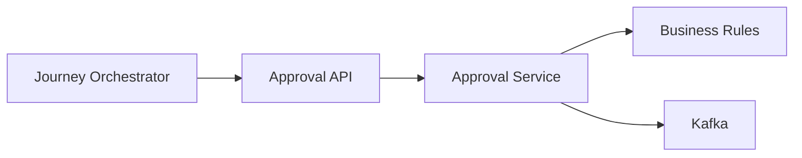
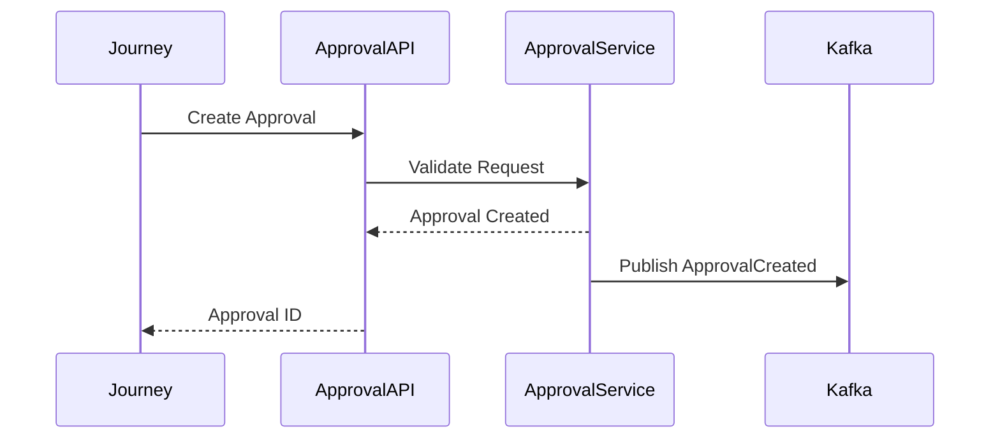
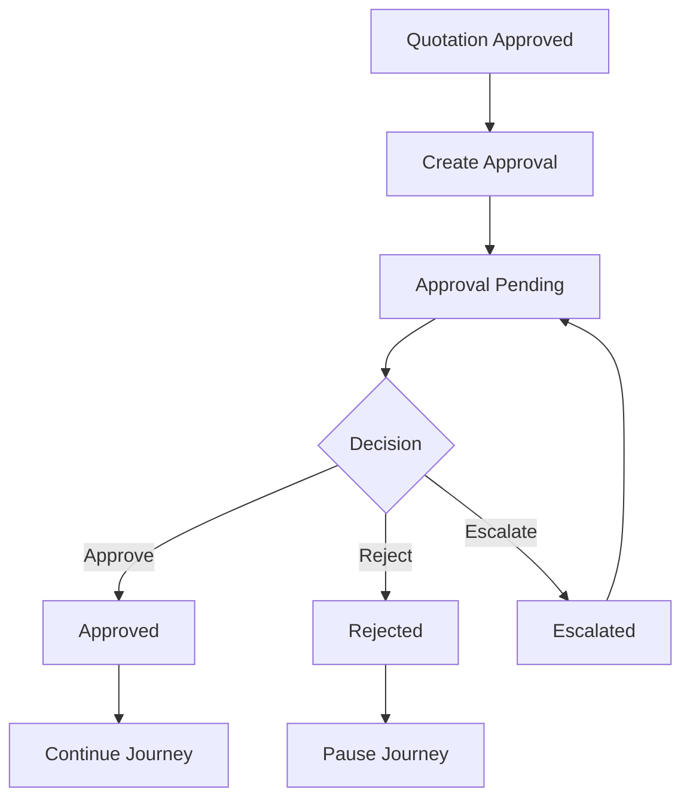
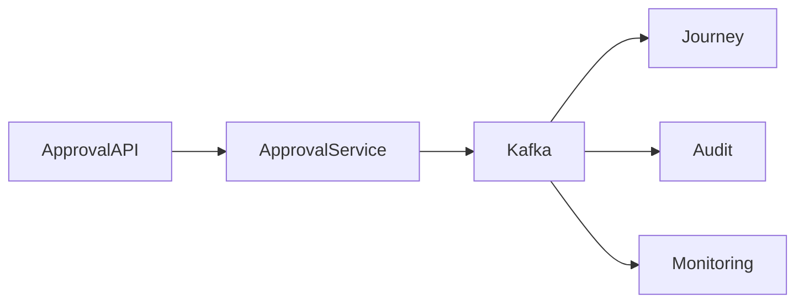
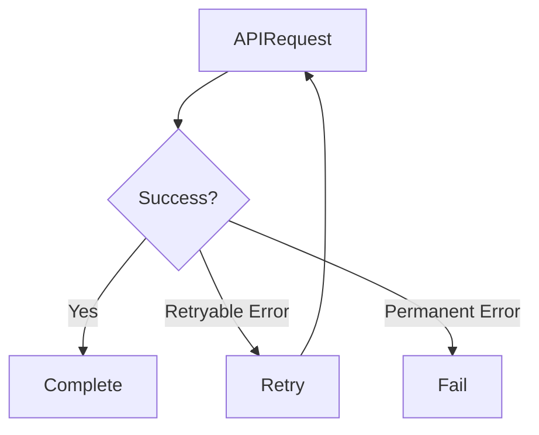

# API Usage

## Document Information

| Property | Value |
|----------|-------|
| Module | Approval |
| Layer | Layer 2 – Guided Journey |
| Document | API Usage |
| Status | Production |
| Version | 1.0 |

---

# Purpose

This document explains how the Approval module APIs are used throughout the Guided Journey.

It demonstrates the interaction between the Journey Orchestrator and the Approval module during approval workflows.

---

# API Usage Architecture



---

# Typical Approval Flow



---

# Complete Approval Journey



---

# API Usage Examples

## Create Approval

```
POST /api/v1/approvals
```

Purpose

- Create a new approval request
- Initialize approval workflow
- Generate Approval ID

---

## Get Approval Status

```
GET /api/v1/approvals/{approvalId}/status
```

Purpose

- Retrieve current approval state
- Display workflow progress
- Resume paused journeys

---

## Approve Request

```
POST /api/v1/approvals/{approvalId}/approve
```

Purpose

- Complete approval
- Publish approval event
- Resume customer journey

---

## Reject Request

```
POST /api/v1/approvals/{approvalId}/reject
```

Purpose

- Reject approval
- Pause workflow
- Notify Journey Orchestrator

---

## Escalate Approval

```
POST /api/v1/approvals/{approvalId}/escalate
```

Purpose

- Assign higher approval authority
- Continue approval workflow
- Preserve audit trail

---

# Event Integration



---

# Retry Strategy



Retry only for:

- Network timeout
- Temporary service failure
- HTTP 503
- HTTP 429

Do not retry:

- Validation errors
- Authorization failures
- Business rule violations

---

# Authentication

Every API request should include:

- JWT Access Token
- Correlation ID
- Content-Type
- Authorization Header

---

# Best Practices

- Use idempotency for write operations.
- Validate request payloads before submission.
- Always provide a Correlation ID.
- Handle retryable failures gracefully.
- Consume approval events asynchronously.
- Avoid polling when events are available.

---

# Related Documents

- api_contract.md
- architecture.md
- events.md
- state_machine.md
- security.md
- observability.md
- implementation_rules.md
- README.md
