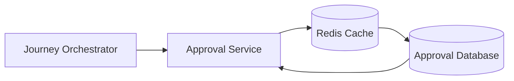
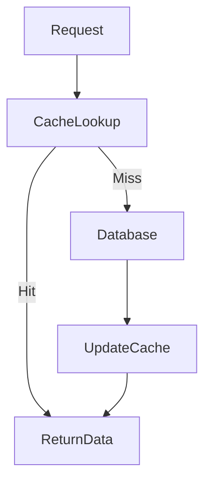
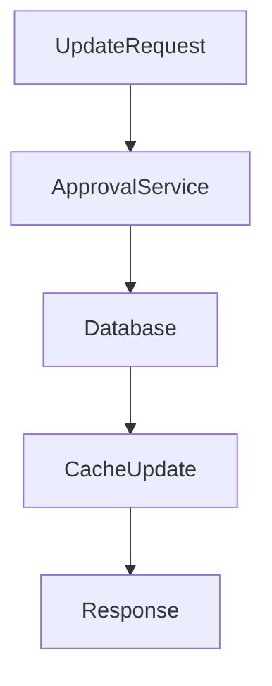
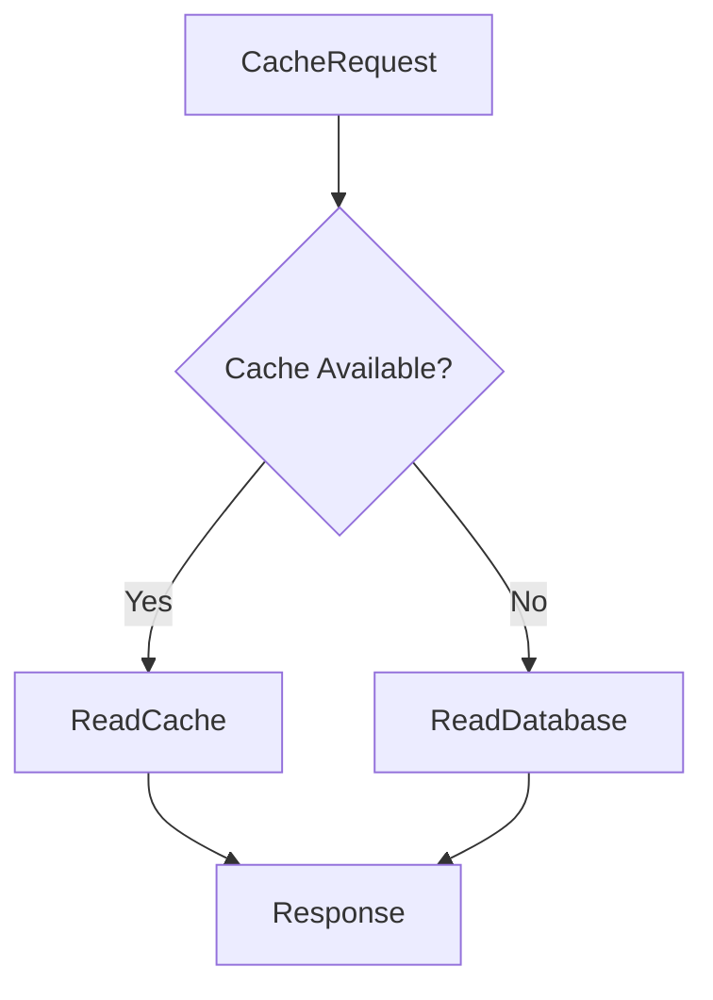

# Cache

## Document Information

| Property | Value |
|----------|-------|
| Module | Approval |
| Layer | Layer 2 – Guided Journey |
| Document | Cache |
| Status | Production |
| Version | 1.0 |

---

# Purpose

This document defines the caching strategy for the Approval module.

Caching improves response time, reduces database load, and increases system scalability while ensuring approval data remains consistent and reliable.

The cache is an optimization layer and must never become the source of truth.

---

# Objectives

- Reduce database queries
- Improve approval lookup performance
- Cache frequently accessed metadata
- Support horizontal scalability
- Ensure cache consistency
- Enable graceful cache failure handling

---

# Cache Architecture

---

# Read Flow

---

# Write Flow

---

# Cached Data

The following information may be cached:

- Approval details
- Approval status
- Approval metadata
- Business rule configuration
- User permissions
- Frequently accessed reference data

---

# Non-Cached Data

The following should **never** be cached:

- JWT tokens
- Passwords
- Encryption keys
- Secrets
- Payment credentials
- Audit logs

---

# Cache Keys

Example naming convention:

| Data | Cache Key |
|------|-----------|
| Approval | `approval:{approvalId}` |
| Approval Status | `approval:status:{approvalId}` |
| Rule Configuration | `approval:rules` |
| User Permissions | `approval:user:{userId}` |

---

# Cache Invalidation

Invalidate cache when:

- Approval status changes
- Approval is created
- Approval is updated
- Approval is deleted
- Business rules are modified
- Permissions are updated

---

# Cache Expiration

| Data | Suggested TTL |
|------|---------------|
| Approval Status | 5 minutes |
| Approval Details | 10 minutes |
| Rule Configuration | 30 minutes |
| User Permissions | 15 minutes |
| Reference Data | 1 hour |

---

# Cache Failure Handling

**Rule:** Cache failures must never block approval processing.

---

# Cache Consistency

Rules:

- Database remains the source of truth.
- Cache is updated only after successful database writes.
- Stale cache entries must be invalidated.
- Cache refresh should be asynchronous where possible.

---

# Performance Targets

| Metric | Target |
|----------|---------|
| Cache Read | < 20 ms |
| Cache Write | < 30 ms |
| Cache Hit Rate | > 90% |
| Cache Refresh | < 100 ms |

---

# Security

- Encrypt cache communication.
- Restrict cache access to trusted services.
- Never store sensitive credentials.
- Apply TTL to temporary data.
- Audit cache configuration changes.

---

# Monitoring

Monitor:

- Cache hit ratio
- Cache miss ratio
- Cache latency
- Cache availability
- Cache memory usage
- Cache eviction count
- Cache refresh failures

---

# Best Practices

- Cache only frequently accessed data.
- Keep cache entries small.
- Use predictable cache keys.
- Invalidate stale entries immediately.
- Never rely on cache as the source of truth.
- Design for cache failure.

---

# Related Documents

- README.md
- architecture.md
- performance.md
- observability.md
- security.md
- implementation_rules.md
- api_contract.md
- business_rules.md
