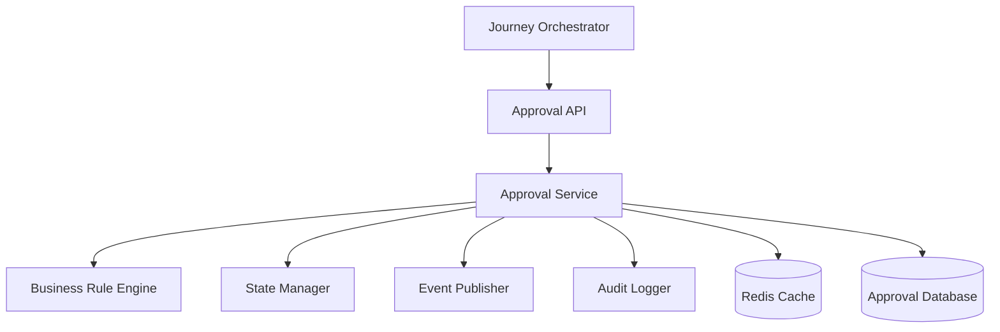
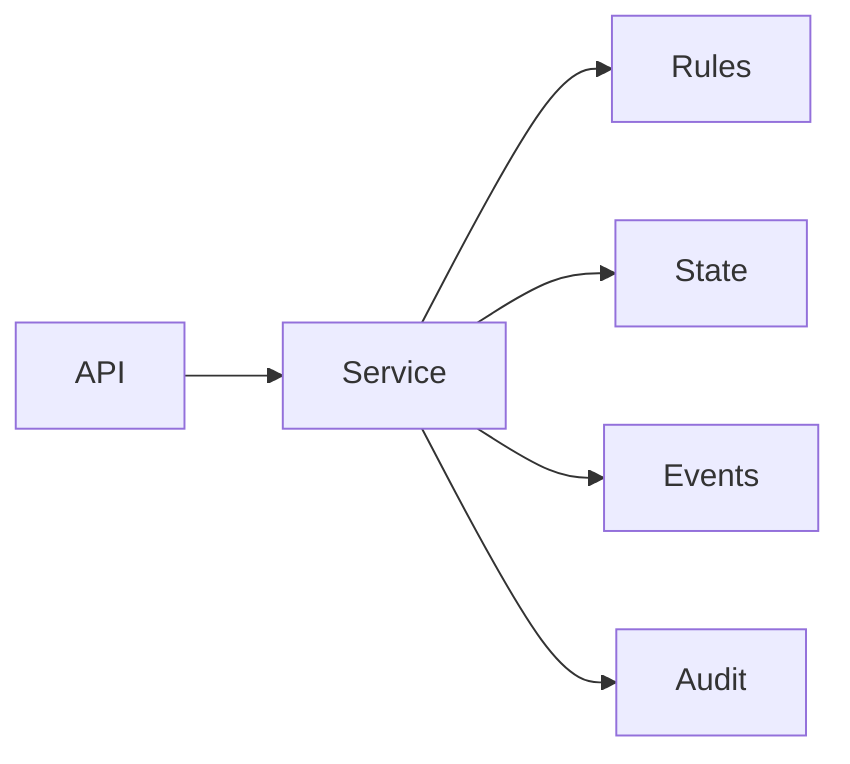
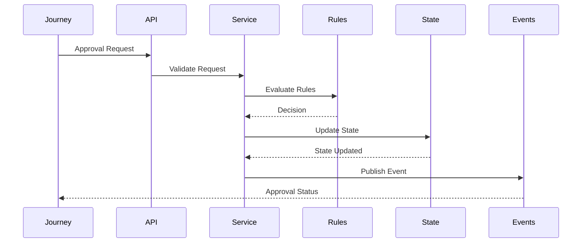

# Component Inventory

## Document Information

| Property | Value |
|----------|-------|
| Module | Approval |
| Layer | Layer 2 – Guided Journey |
| Document | Component Inventory |
| Status | Production |
| Version | 1.0 |

---

# Purpose

This document provides an inventory of all logical components that make up the Approval module.

It defines the responsibility of each component, its dependencies, and how the components collaborate to execute approval workflows.

---

# Component Architecture

---

# Component Dependency

---

# Component List

| Component | Responsibility |
|-----------|----------------|
| Approval API | Receives approval requests and exposes REST endpoints |
| Approval Service | Coordinates approval workflow execution |
| Business Rule Engine | Evaluates approval policies and business rules |
| State Manager | Maintains approval lifecycle and state transitions |
| Event Publisher | Publishes approval domain events |
| Audit Logger | Records approval activities for compliance |
| Cache Manager | Stores frequently accessed approval data |
| Repository | Persists approval records |
| Validation Engine | Validates requests before processing |
| Retry Manager | Handles transient failures and retries |
| Metrics Collector | Records operational metrics |
| Trace Manager | Maintains distributed tracing information |

---

# Component Responsibilities

## Approval API

Responsible for:

- Request validation
- Authentication
- Authorization
- Response generation

---

## Approval Service

Responsible for:

- Workflow orchestration
- Business coordination
- Calling internal components
- Handling failures

---

## Business Rule Engine

Responsible for:

- Rule evaluation
- Policy validation
- Approval eligibility
- Automatic approval decisions

---

## State Manager

Responsible for:

- State transitions
- State persistence
- Workflow integrity
- Recovery checkpoints

---

## Event Publisher

Responsible for:

- Publishing domain events
- Event consistency
- Correlation IDs
- Event delivery

---

## Audit Logger

Responsible for:

- Immutable audit records
- Compliance logs
- User activity history
- Approval history

---

## Cache Manager

Responsible for:

- Cache lookups
- Cache updates
- Cache invalidation
- Performance optimization

---

## Repository

Responsible for:

- Database access
- CRUD operations
- Transaction handling
- Persistent storage

---

## Validation Engine

Responsible for:

- Input validation
- Business validation
- Request consistency
- Error reporting

---

## Retry Manager

Responsible for:

- Retry policies
- Backoff strategy
- Failure classification
- Recovery execution

---

## Metrics Collector

Responsible for collecting:

- Approval latency
- Success rate
- Error rate
- Retry count
- Processing time

---

## Trace Manager

Responsible for:

- Correlation IDs
- Distributed tracing
- Request tracking
- End-to-end visibility

---

# Component Interaction

---

# External Dependencies

| Dependency | Purpose |
|------------|---------|
| Journey Orchestrator | Starts approval workflow |
| Kafka | Event publishing |
| Redis | Caching |
| Database | Persistent storage |
| Authentication Service | User authentication |
| Monitoring Platform | Metrics and alerts |
| Logging Platform | Centralized logging |

---

# Design Principles

- Single responsibility per component
- Loose coupling
- High cohesion
- Stateless services where possible
- Explicit state management
- Event-driven communication
- Fault tolerance
- Observability by default

---

# Related Documents

- README.md
- architecture.md
- dependency_graph.md
- implementation_manifest.md
- business_rules.md
- state_machine.md
- api_contract.md
- observability.md
- security.md
