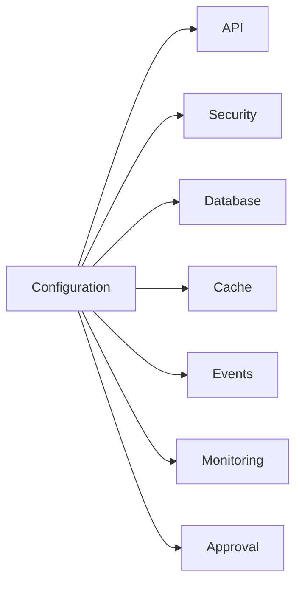
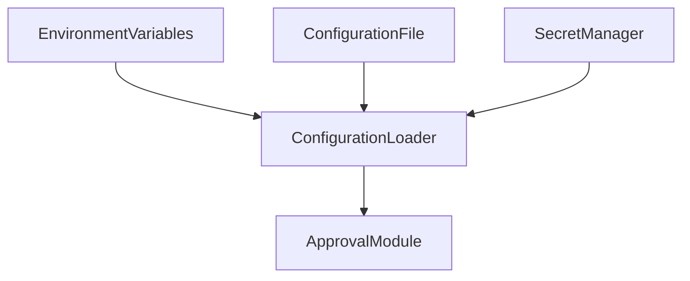
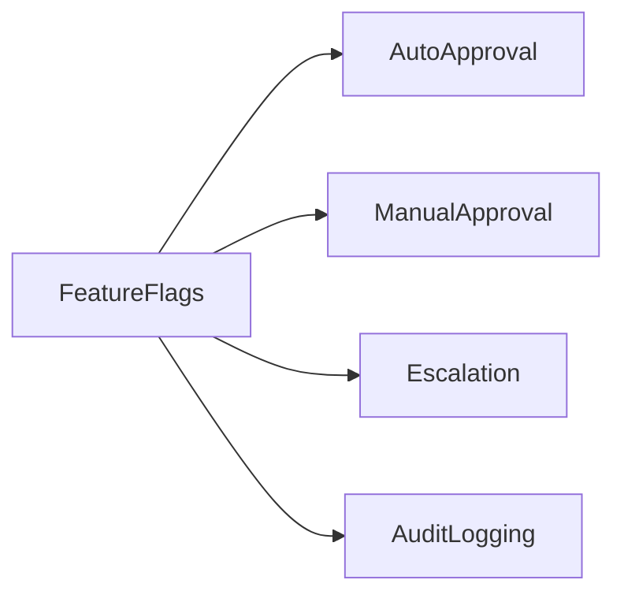
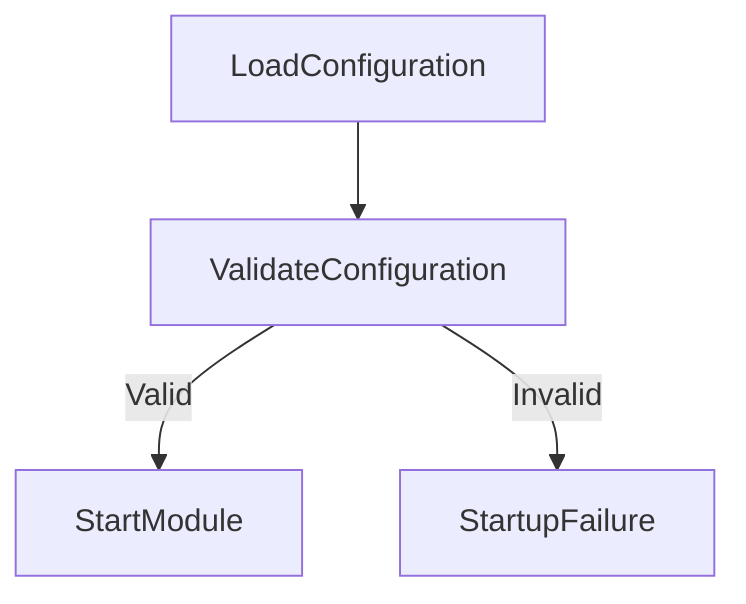

# Configuration

## Document Information

| Property | Value |
|----------|-------|
| Module | Approval |
| Layer | Layer 2 – Guided Journey |
| Document | Configuration |
| Status | Production |
| Version | 1.0 |

---

# Purpose

This document defines the runtime configuration required by the Approval module.

Configuration values control module behavior without requiring code changes, allowing different environments (Development, Testing, Staging, and Production) to use environment-specific settings.

---

# Configuration Architecture

---

# Configuration Sources

Configuration priority:

1. Environment Variables
2. Secret Manager
3. Configuration File
4. Default Values

---

# Environment Configuration

| Environment | Purpose |
|------------|---------|
| Development | Local development |
| Testing | Automated testing |
| Staging | Pre-production validation |
| Production | Live customer environment |

---

# API Configuration

| Property | Description |
|----------|-------------|
| API Base URL | Approval API endpoint |
| API Version | Supported API version |
| Request Timeout | Maximum request duration |
| Retry Count | Maximum retry attempts |

---

# Approval Configuration

| Property | Description |
|----------|-------------|
| Auto Approval | Enable automatic approvals |
| Manual Approval | Enable manual review |
| Approval Timeout | Maximum approval waiting period |
| Escalation Timeout | Time before escalation |
| Max Retry Count | Retry attempts for transient failures |

---

# Database Configuration

| Property | Description |
|----------|-------------|
| Database URL | Approval database connection |
| Connection Pool Size | Maximum connections |
| Query Timeout | Database timeout |
| Transaction Timeout | Transaction duration |

---

# Cache Configuration

| Property | Description |
|----------|-------------|
| Cache Provider | Redis |
| Default TTL | Cache expiration |
| Cache Prefix | Approval namespace |
| Cache Timeout | Cache request timeout |

---

# Event Configuration

| Property | Description |
|----------|-------------|
| Event Broker | Kafka |
| Topic Name | Approval events topic |
| Consumer Group | Approval consumers |
| Retry Policy | Event retry configuration |

---

# Security Configuration

| Property | Description |
|----------|-------------|
| JWT Validation | Enable JWT verification |
| TLS | Secure communication |
| RBAC | Role-based authorization |
| Audit Logging | Security audit logging |

---

# Observability Configuration

| Property | Description |
|----------|-------------|
| Logging Level | INFO / WARN / ERROR |
| Metrics Enabled | Collect operational metrics |
| Distributed Tracing | Enable tracing |
| Alert Thresholds | Monitoring limits |

---

# Feature Flags

Example feature flags:

- Auto Approval
- Manual Review
- Approval Escalation
- Audit Logging
- Metrics Collection
- Distributed Tracing

---

# Configuration Validation

Validation checks include:

- Required values present
- Valid formats
- Secure defaults
- Connection availability
- Dependency validation

---

# Configuration Principles

- Configuration must be externalized.
- Secrets must never be stored in source code.
- Environment-specific values must be isolated.
- Default values should be safe.
- Runtime validation is mandatory.

---

# Best Practices

- Use environment variables for deployment-specific settings.
- Store secrets in a dedicated secret manager.
- Version configuration changes.
- Document every configurable property.
- Keep production configuration immutable where possible.

---

# Related Documents

- README.md
- architecture.md
- implementation_rules.md
- security.md
- observability.md
- cache.md
- performance.md
- api_contract.md
