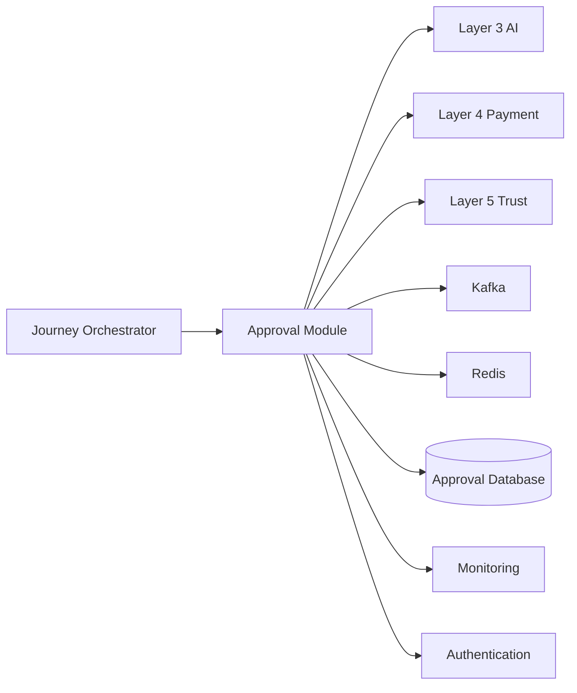
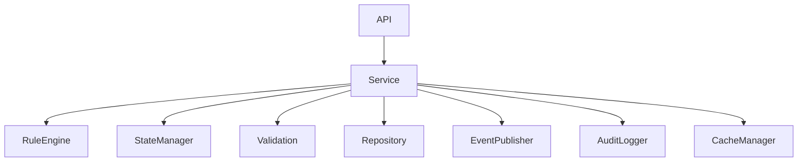
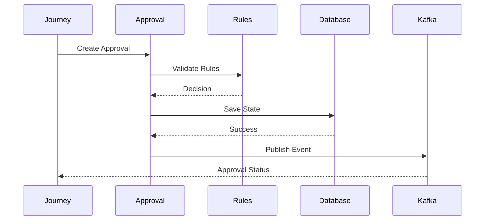
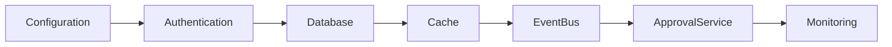
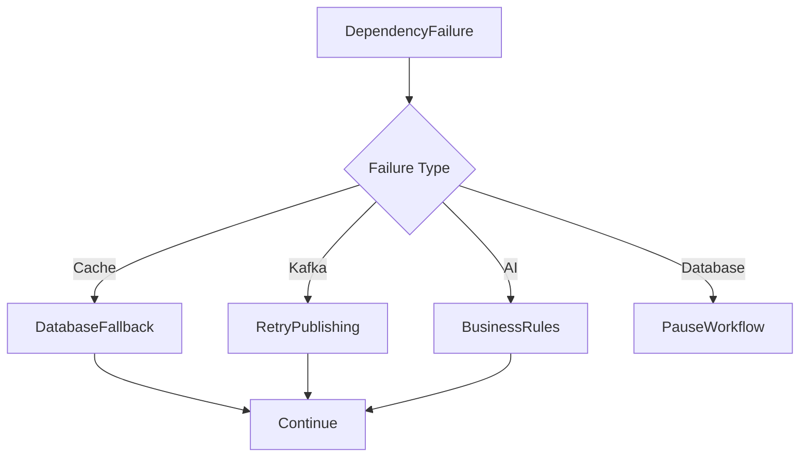

# Dependencies

## Document Information

| Property | Value |
|----------|-------|
| Module | Approval |
| Layer | Layer 2 – Guided Journey |
| Document | Dependencies |
| Status | Production |
| Version | 1.0 |

---

# Purpose

This document defines the internal and external dependencies of the Approval module.

Understanding these dependencies ensures proper integration, deployment sequencing, and reliable communication between platform components.

---

# Dependency Overview

---

# Internal Dependencies

---

# External Dependencies

| Dependency | Purpose |
|------------|---------|
| Journey Orchestrator | Starts and resumes approval workflows |
| Layer 3 AI | Provides advisory recommendations |
| Layer 4 Payment | Receives approval status before payment execution |
| Layer 5 Trust | Provides verification data when required |
| Kafka | Publishes and consumes approval events |
| Redis | Caches approval metadata |
| Approval Database | Stores approval records and state |
| Authentication Service | Validates user identity |
| Monitoring Platform | Collects logs, metrics, and traces |

---

# Runtime Dependency Flow

---

# Dependency Categories

| Category | Examples |
|----------|----------|
| Business | Journey Orchestrator, AI, Payment |
| Infrastructure | Database, Redis, Kafka |
| Security | Authentication, Authorization |
| Observability | Logging, Metrics, Tracing |

---

# Startup Dependencies

The Approval module should initialize components in the following order:

---

# Failure Dependencies

Rules:

- Redis failure → Read from database.
- Kafka failure → Retry publishing.
- AI failure → Continue with business rules.
- Database failure → Pause approval processing.
- Authentication failure → Reject request.

---

# Dependency Principles

- Services should communicate through well-defined APIs.
- Dependencies must be loosely coupled.
- Business services should remain stateless.
- Events should be preferred over synchronous communication where appropriate.
- Database remains the source of truth.
- Cache is an optimization layer only.

---

# Monitoring Dependencies

Monitor:

- Database availability
- Redis availability
- Kafka health
- Authentication service
- Approval API latency
- Event publishing success
- Dependency timeout rate

---

# Version Compatibility

| Dependency | Version Strategy |
|------------|------------------|
| Approval API | Semantic Versioning |
| Kafka Events | Backward compatible schemas |
| Database | Managed schema migrations |
| Redis | Backward compatible cache keys |

---

# Best Practices

- Minimize direct dependencies.
- Prefer asynchronous communication.
- Validate dependency health during startup.
- Apply retries only for transient failures.
- Use circuit breakers for external services.
- Implement graceful degradation when optional dependencies are unavailable.

---

# Related Documents

- README.md
- architecture.md
- component_inventory.md
- configuration.md
- implementation_manifest.md
- api_contract.md
- cache.md
- observability.md
- security.md
