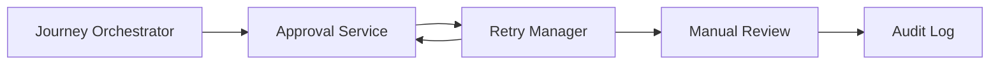
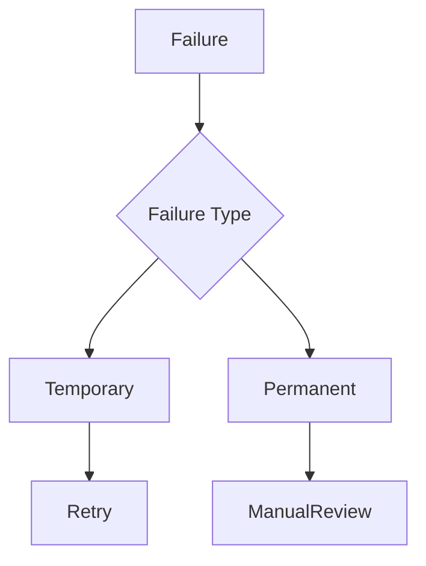
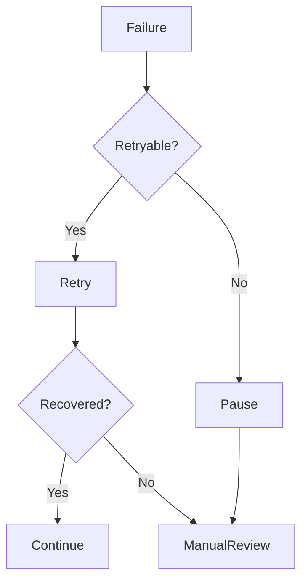
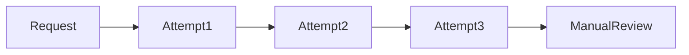
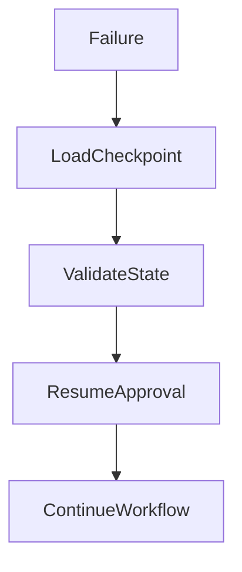
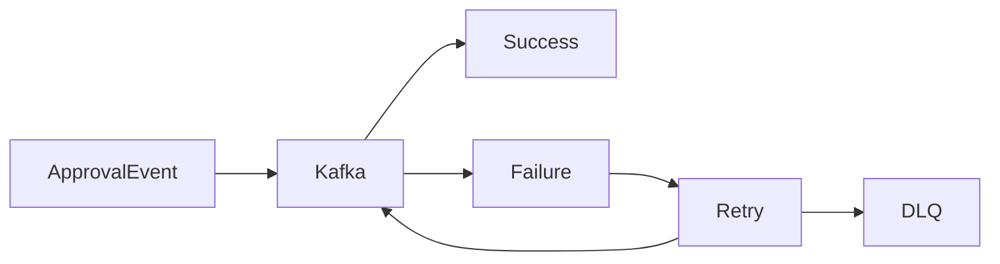
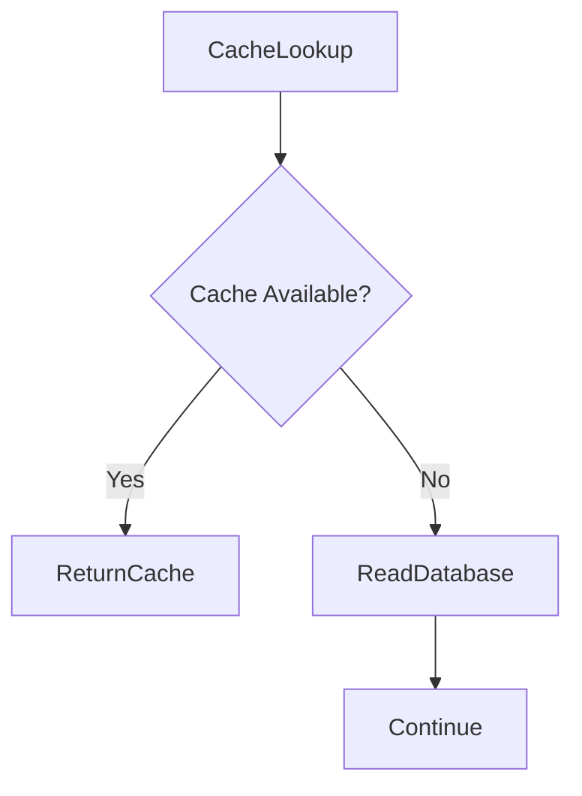
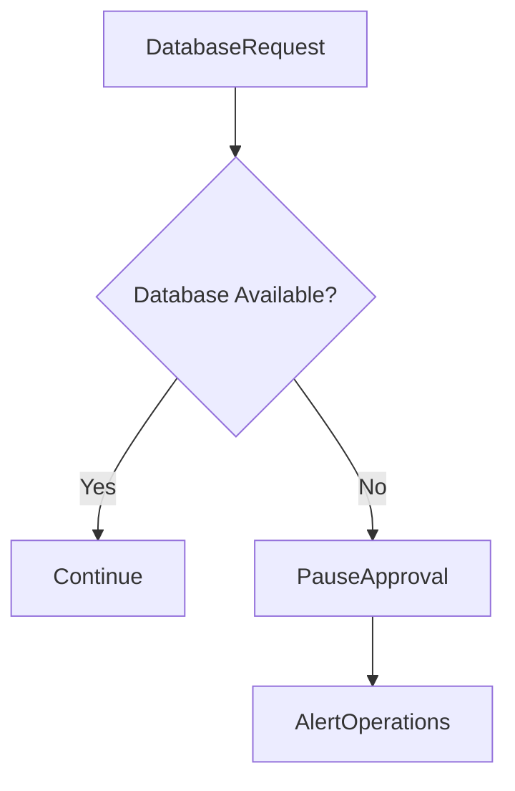

# Failure Strategy

## Document Information

| Property | Value |
|----------|-------|
| Module | Approval |
| Layer | Layer 2 – Guided Journey |
| Document | Failure Strategy |
| Status | Production |
| Version | 1.0 |

---

# Purpose

This document defines how the Approval module detects, handles, recovers from, and reports failures.

The strategy ensures that approval workflows remain reliable, recoverable, and consistent without compromising workflow integrity or customer experience.

---

# Objectives

- Detect failures quickly
- Recover automatically whenever possible
- Prevent duplicate approvals
- Preserve workflow state
- Maintain auditability
- Ensure business continuity

---

# Failure Handling Architecture



---

# Failure Classification



---

# Failure Categories

| Failure Type | Recovery Strategy |
|--------------|------------------|
| Network timeout | Retry |
| Temporary service unavailable | Retry with backoff |
| Kafka unavailable | Retry event publication |
| Cache unavailable | Read from database |
| AI unavailable | Continue using business rules |
| Validation failure | Reject request |
| Authorization failure | Reject request |
| Duplicate request | Return existing result |
| Database unavailable | Pause approval workflow |
| Business rule violation | Reject request |

---

# Failure Recovery Flow



---

# Retry Strategy

Retry only for transient failures.



Recommended retry policy:

- Exponential backoff
- Maximum retry attempts
- Retry timeout
- Circuit breaker support

---

# State Recovery



Rules:

- Resume from the last persisted state.
- Never restart the entire approval process.
- Preserve correlation IDs.
- Maintain idempotency.

---

# Event Recovery



If retries are exhausted:

- Send the event to the Dead Letter Queue (DLQ).
- Generate an operational alert.
- Preserve the event for investigation.

---

# Cache Failure Strategy



Cache failures must never block approval processing.

---

# Database Failure Strategy



The database is the source of truth. If it is unavailable, approval processing should pause until connectivity is restored.

---

# Security Failure Strategy

Reject immediately when:

- JWT validation fails
- Authorization fails
- Invalid request signature
- Request tampering detected
- Input validation fails

These failures must **not** be retried.

---

# Monitoring

Monitor:

- Failure rate
- Retry count
- Recovery success rate
- Manual review rate
- Database failures
- Cache failures
- Kafka failures
- Approval timeout rate

---

# Best Practices

- Retry only transient failures.
- Never retry validation errors.
- Preserve workflow state before recovery.
- Use idempotent operations.
- Log every failure with a Correlation ID.
- Alert operations for unrecoverable failures.
- Ensure every failure is traceable through audit logs.

---

# Success Criteria

The failure strategy is successful when:

- Temporary failures recover automatically.
- Permanent failures enter manual review safely.
- No duplicate approvals are created.
- Approval state remains consistent.
- Events are not lost.
- Workflow integrity is maintained.

---

# Related Documents

- README.md
- architecture.md
- state_machine.md
- cache.md
- dependencies.md
- observability.md
- security.md
- implementation_manifest.md
- business_rules.md
- api_contract.md
```
