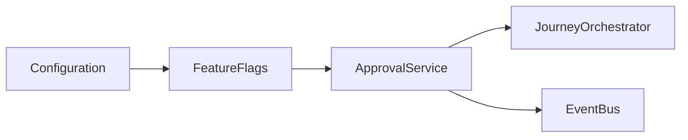
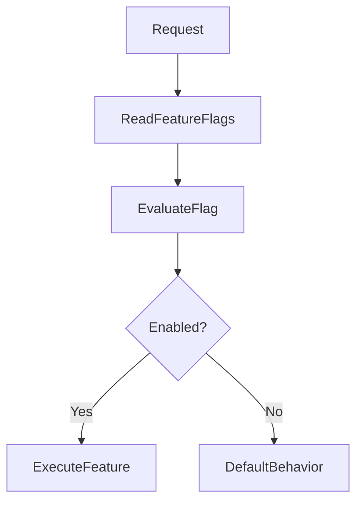
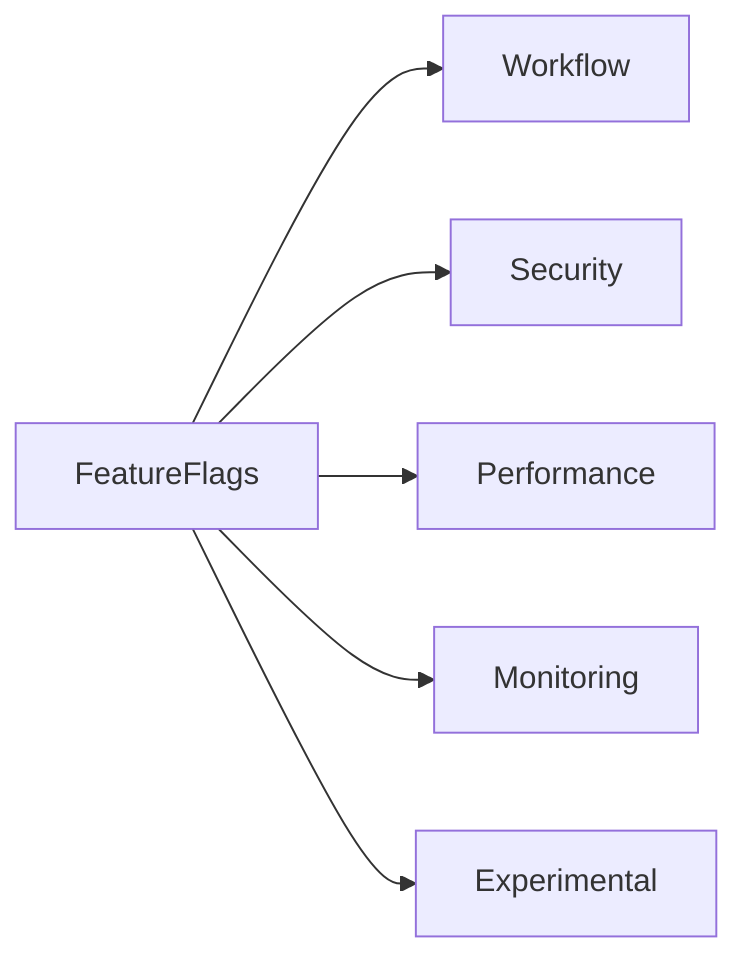
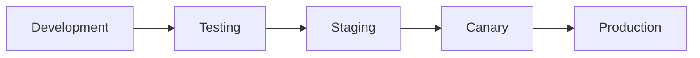
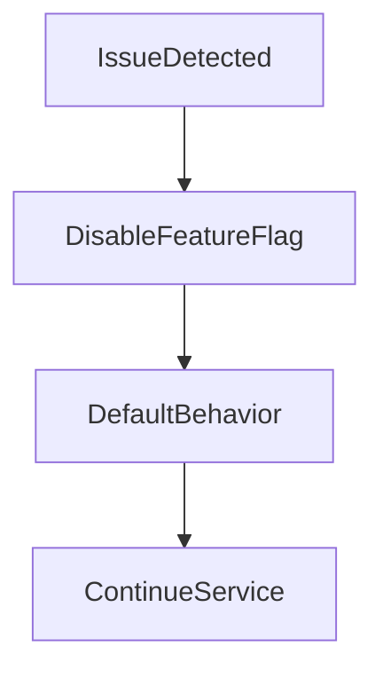

# Feature Flags

## Document Information

| Property | Value |
|----------|-------|
| Module | Approval |
| Layer | Layer 2 – Guided Journey |
| Document | Feature Flags |
| Status | Production |
| Version | 1.0 |

---

# Purpose

This document defines the feature flags used by the Approval module.

Feature flags allow functionality to be enabled, disabled, or gradually rolled out without requiring code changes or redeployment.

---

# Objectives

- Enable controlled feature rollout
- Reduce deployment risk
- Support A/B testing
- Enable gradual releases
- Allow rapid rollback
- Simplify operational management

---

# Feature Flag Architecture

---

# Runtime Evaluation

---

# Feature Categories

---

# Approval Feature Flags

| Feature Flag | Purpose | Default |
|--------------|---------|---------|
| ApprovalEnabled | Enable Approval module | Enabled |
| AutoApproval | Enable automatic approval | Disabled |
| ManualReview | Enable manual review workflow | Enabled |
| ApprovalEscalation | Enable escalation workflow | Enabled |
| RetryApproval | Enable retry processing | Enabled |
| AuditLogging | Enable audit logging | Enabled |
| EventPublishing | Publish approval events | Enabled |
| DistributedTracing | Enable tracing | Enabled |
| MetricsCollection | Collect metrics | Enabled |
| ApprovalNotifications | Send approval notifications | Enabled |

---

# Rollout Strategy

Feature rollout should progress through each environment before reaching production.

---

# Rollback Strategy

If a feature causes unexpected behavior:

- Disable the feature flag.
- Continue using the stable implementation.
- Investigate the issue before re-enabling.

---

# Configuration Sources

Feature flags may be loaded from:

- Environment Variables
- Configuration Files
- Central Configuration Service
- Feature Flag Management Platform

Configuration should be refreshed without requiring application restarts whenever possible.

---

# Flag Evaluation Rules

- Evaluate flags at runtime.
- Keep evaluation lightweight.
- Use safe default values.
- Avoid nested feature flags.
- Ensure deterministic behavior.
- Log significant flag changes.

---

# Operational Guidelines

Feature flags should be used for:

- Gradual rollouts
- Experimental functionality
- Performance optimizations
- Emergency feature disablement
- Controlled migration

Feature flags should **not** be used for:

- Business rules
- Permanent configuration
- Authorization logic
- Security policies

---

# Monitoring

Monitor:

- Feature adoption
- Flag evaluation latency
- Rollback frequency
- Feature failures
- Approval success rate
- Approval latency

---

# Best Practices

- Give feature flags descriptive names.
- Remove obsolete flags after full rollout.
- Document every flag.
- Keep default behavior safe.
- Test both enabled and disabled states.
- Review feature flags regularly.

---

# Related Documents

- README.md
- configuration.md
- implementation_manifest.md
- release_strategy.md
- observability.md
- performance.md
- security.md
- architecture.md
