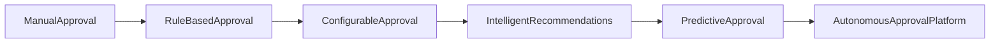
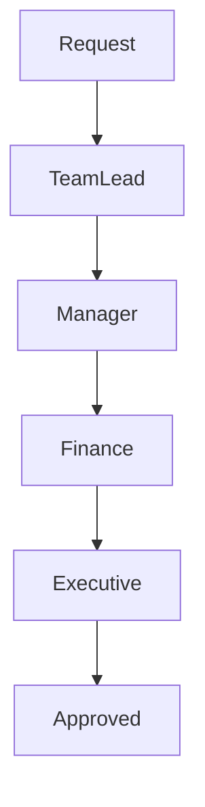
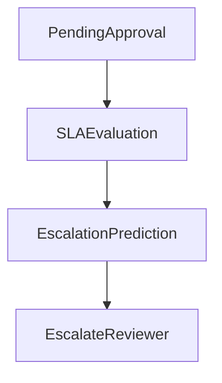
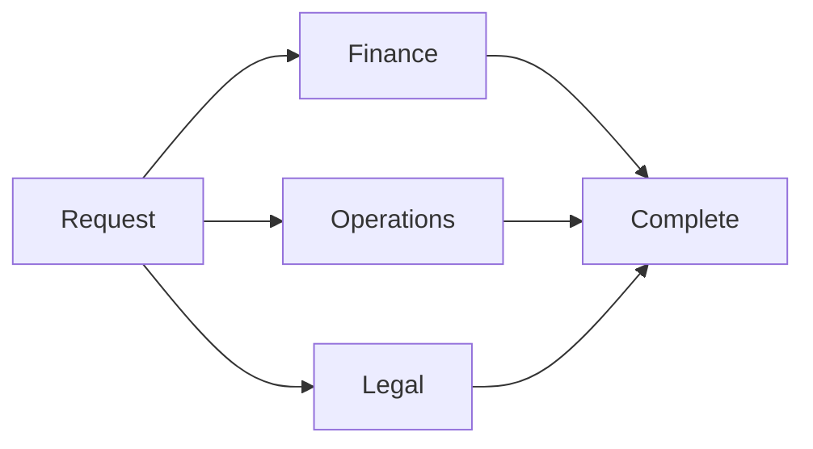
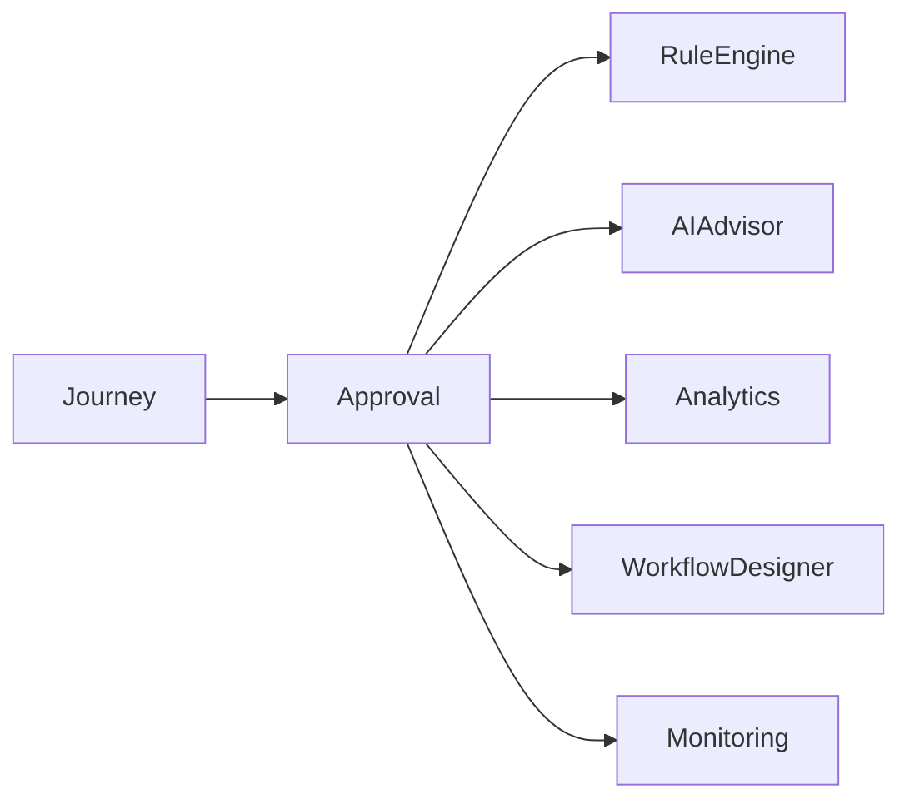

# Future Scope

## Document Information

| Property | Value |
|----------|-------|
| Module | Approval |
| Layer | Layer 2 – Guided Journey |
| Document | Future Scope |
| Status | Future Planning |
| Version | 1.0 |

---

# Purpose

This document outlines potential future enhancements for the Approval module.

These initiatives are not part of the current implementation but represent opportunities to improve scalability, automation, governance, user experience, and operational efficiency.

---

# Future Vision

The Approval module should evolve from a rule-based approval engine into an intelligent, adaptive, and highly configurable approval platform while preserving deterministic business workflows.

---

# Evolution Roadmap

---

# Planned Enhancements

## Configurable Approval Workflows

Allow administrators to define approval workflows without code changes.

Possible capabilities:

- Visual workflow designer
- Dynamic approval chains
- Configurable approval stages
- Organization-specific workflows

---

## Multi-Level Approval

Support hierarchical approval processes.

Examples:

- Team Lead
- Project Manager
- Finance
- Executive Approval

---

## AI-Assisted Approval

Introduce AI to assist reviewers by:

- Risk scoring
- Approval recommendations
- Similar historical approvals
- Decision explanations
- Priority recommendations

Business rules remain the final authority.

---

## Dynamic Business Rules

Replace static rule configuration with a centralized business rule engine supporting:

- Runtime rule updates
- Versioned policies
- Rule simulation
- Approval policy testing

---

## Approval Analytics

Provide operational dashboards including:

- Approval trends
- Average approval time
- Approval bottlenecks
- Reviewer workload
- Rejection patterns

---

## Predictive Escalation

Automatically identify approvals likely to exceed SLA and escalate them proactively.

---

## Parallel Approvals

Support simultaneous approval by multiple reviewers.

---

## Delegated Approval

Allow authorized users to delegate approval authority temporarily.

Example use cases:

- Leave periods
- Business travel
- Organizational changes

---

## Approval Templates

Introduce reusable approval templates for:

- Project approval
- Budget approval
- Design approval
- Vendor approval

---

## Workflow Simulation

Enable simulation before deployment to verify:

- Workflow correctness
- Rule execution
- Escalation paths
- Timing constraints

---

## Cross-Region Approval

Support geographically distributed approval workflows.

Features:

- Regional routing
- Time-zone awareness
- Localization
- Multi-region deployment

---

## Mobile Approval

Support approval workflows from mobile devices.

Potential features:

- Push notifications
- One-click approval
- Offline approval synchronization

---

## Integration Expansion

Future integrations may include:

- ERP systems
- CRM platforms
- Document management systems
- Enterprise identity providers
- Collaboration tools

---

# Long-Term Architecture

---

# Expected Benefits

- Faster approval cycles
- Improved governance
- Reduced manual effort
- Better operational visibility
- Greater workflow flexibility
- Enhanced scalability
- Improved user experience

---

# Implementation Principles

Future enhancements should:

- Preserve backward compatibility.
- Maintain deterministic approval decisions.
- Keep business rules authoritative.
- Minimize operational complexity.
- Support independent deployment.
- Follow event-driven architecture.

---

# Related Documents

- README.md
- architecture.md
- ADR.md
- implementation_manifest.md
- business_rules.md
- feature_flags.md
- release_strategy.md
- observability.md
- roadmap.md
