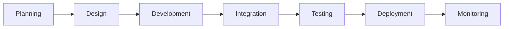
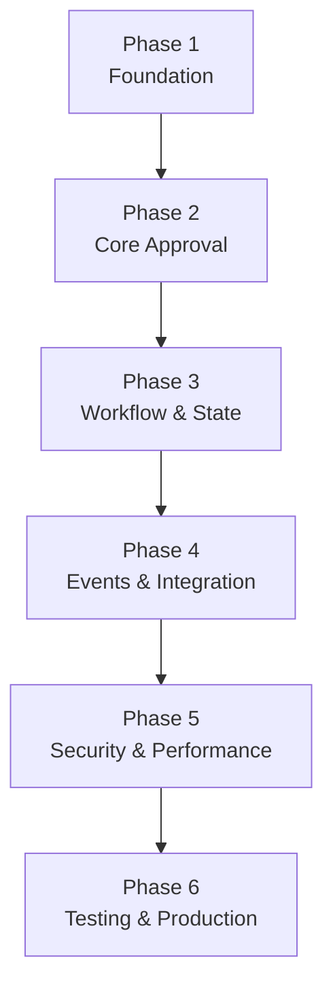
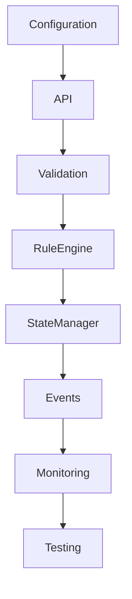

# Implementation Plan

## Document Information

| Property | Value |
|----------|-------|
| Module | Approval |
| Layer | Layer 2 – Guided Journey |
| Document | Implementation Plan |
| Status | Planned |
| Version | 1.0 |

---

# Purpose

This document defines the phased implementation plan for the Approval module.

The objective is to deliver the Approval module incrementally while ensuring stability, security, scalability, and production readiness at every phase.

---

# Implementation Roadmap

---

# Development Timeline

---

# Phase 1 — Foundation

### Objectives

- Establish project structure
- Configure environments
- Define interfaces
- Create module skeleton

### Deliverables

- Project setup
- Configuration
- Logging framework
- Dependency registration
- Basic documentation

---

# Phase 2 — Core Approval Engine

### Objectives

- Implement approval workflow
- Validate requests
- Enforce business rules

### Deliverables

- Approval Service
- Validation Engine
- Business Rule Engine
- API endpoints
- Error handling

---

# Phase 3 — Workflow & State Management

### Objectives

- Implement approval lifecycle
- Persist workflow state
- Support recovery

### Deliverables

- State Manager
- State persistence
- Checkpoint recovery
- Retry manager
- Manual review flow

---

# Phase 4 — Integration & Events

### Objectives

- Integrate with platform services
- Publish domain events

### Deliverables

- Kafka integration
- Event publisher
- Event consumer
- Journey integration
- Cache integration

---

# Phase 5 — Security & Performance

### Objectives

- Secure the module
- Optimize performance
- Improve observability

### Deliverables

- JWT authentication
- RBAC authorization
- Redis caching
- Metrics
- Distributed tracing
- Audit logging

---

# Phase 6 — Testing & Production Readiness

### Objectives

- Validate production readiness
- Complete deployment preparation

### Deliverables

- Unit tests
- Integration tests
- Performance tests
- Security tests
- Documentation
- Release validation

---

# Implementation Dependencies

---

# Milestones

| Milestone | Outcome |
|-----------|---------|
| M1 | Foundation completed |
| M2 | Approval workflow operational |
| M3 | State management implemented |
| M4 | Platform integration completed |
| M5 | Security and monitoring enabled |
| M6 | Production-ready release |

---

# Risk Management

| Risk | Mitigation |
|------|------------|
| Integration failures | Mock external services during development |
| Rule complexity | Modularize business rules |
| Event delivery issues | Retry policies and Dead Letter Queue |
| Performance bottlenecks | Caching and performance testing |
| Security vulnerabilities | Security reviews and automated scanning |

---

# Success Criteria

The implementation plan is complete when:

- Approval workflows execute correctly.
- Business rules are fully enforced.
- State transitions are reliable.
- Events are published successfully.
- Security controls are enabled.
- Performance targets are achieved.
- Monitoring and alerting are operational.
- Documentation is complete.
- All automated tests pass.

---

# Related Documents

- README.md
- IMPLEMENTATION_MANIFEST.md
- implementation_rules.md
- implementation_order.md
- architecture.md
- ADR.md
- testing_strategy.md
- release_strategy.md
- observability.md
- checklist.md
