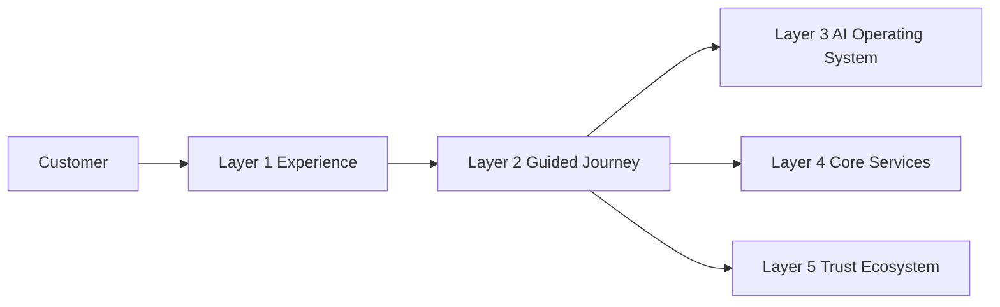
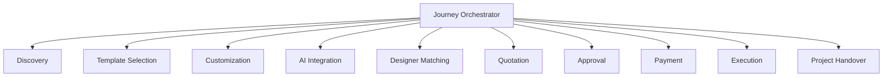
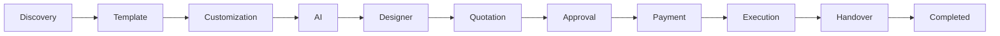
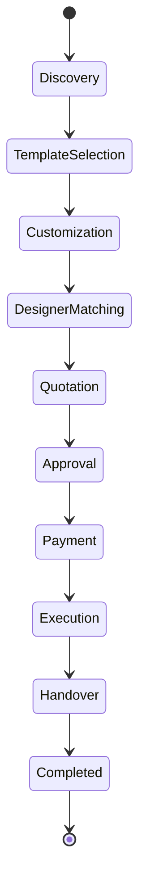
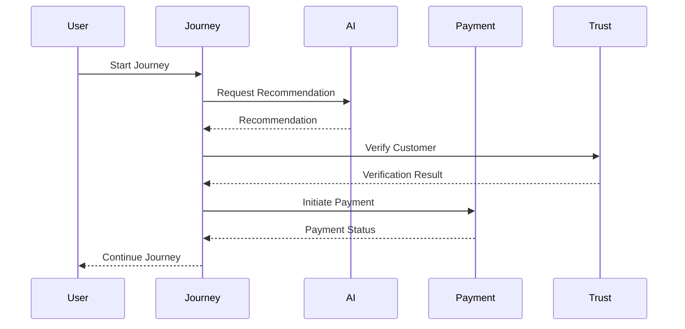

# Layer 2 Architecture

## Document Information

| Property | Value |
|----------|-------|
| Layer | Layer 2 – Guided Journey |
| Document | Architecture |
| Status | Production |
| Version | 1.0 |

---

# Overview

Layer 2 is responsible for orchestrating the complete customer journey across the platform.

It coordinates business workflows, invokes AI capabilities, interacts with payment services, performs trust verification, manages workflow state, and drives project execution.

Layer 2 does not implement AI models, payment gateways, or trust algorithms. Instead, it orchestrates these capabilities through well-defined interfaces.

---

# Responsibilities

- Journey orchestration
- Workflow management
- Business rule enforcement
- AI integration
- Payment orchestration
- Trust verification
- Event coordination
- State management
- Failure recovery
- Observability

---

# Layer Architecture

---

# Internal Component Architecture

---

# Journey Flow

---

# State Lifecycle

---

# Service Communication

---

# Communication Patterns

Layer 2 uses:

- REST APIs
- Event-driven messaging
- Saga orchestration
- State machines
- Transactional Outbox
- Idempotent APIs

---

# Design Principles

- Event-driven architecture
- Deterministic workflows
- Loose coupling
- High cohesion
- Stateless services
- Horizontal scalability
- Fault tolerance
- Security by design

---

# External Dependencies

Layer 2 communicates with:

- Layer 1 Experience
- Layer 3 AI Operating System
- Layer 4 Core Services
- Layer 5 Trust Ecosystem
- Kafka Event Bus
- Redis Cache
- Journey Database

---

# Failure Strategy

- Retry transient failures.
- Pause long-running workflows when necessary.
- Resume from checkpoints.
- Prevent duplicate operations using idempotency.
- Publish failure events for downstream recovery.

---

# Security

- JWT Authentication
- Role-Based Access Control (RBAC)
- TLS Encryption
- Input Validation
- Audit Logging

---

# Observability

Monitor:

- Journey latency
- API latency
- Event processing
- Workflow completion
- Retry count
- Error rate
- Service availability

---

# Related Documents

- README.md
- ADR.md
- AI_CONTEXT.md
- AI_EXECUTION_RULES.md
- accessibility.md
- api_usage_rules.md
- payment/overview.md
- diagrams/component_hierarchy.md
- diagrams/state_diagram.md
