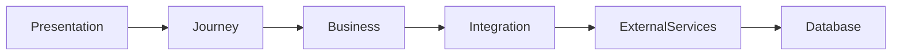
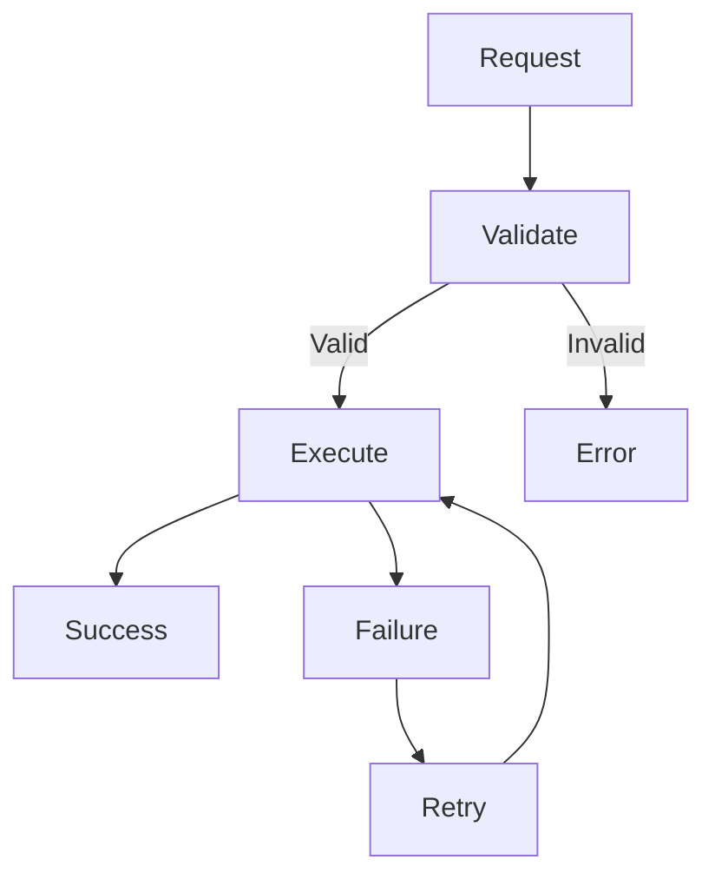
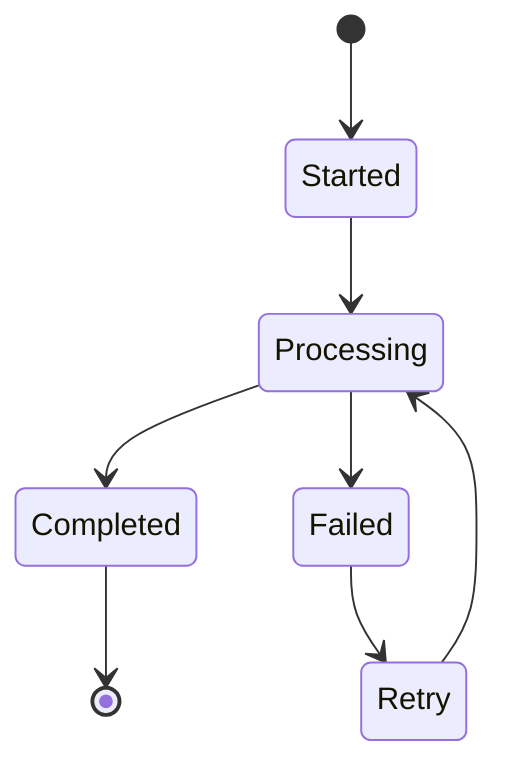

# Coding Rules

## Document Information

| Property | Value |
|----------|-------|
| Layer | Layer 2 – Guided Journey |
| Document | Coding Rules |
| Status | Production |
| Version | 1.0 |

---

# Purpose

This document defines the coding standards for Layer 2.

The objective is to ensure that the Guided Journey remains maintainable, scalable, secure, and consistent across all modules.

---

# Development Principles

- Write clean, readable code.
- Prefer simplicity over complexity.
- Keep modules loosely coupled.
- Maintain high cohesion.
- Follow SOLID principles.
- Avoid duplicate logic.
- Keep business logic deterministic.

---

# Architecture Rules

---

# Layer Responsibilities

Layer 2 may:

- Orchestrate workflows
- Invoke downstream services
- Publish events
- Consume events
- Enforce business rules

Layer 2 must not:

- Execute AI models
- Implement payment gateways
- Store business data permanently
- Perform trust verification
- Bypass workflow validation

---

# Naming Conventions

Use meaningful names.

Examples

- PaymentService
- JourneyOrchestrator
- DesignerRecommendation
- ApprovalWorkflow

Avoid

- Temp
- Data1
- TestClass
- Util

---

# API Rules

Every API should

- Validate inputs
- Return consistent responses
- Support idempotency where required
- Use versioning
- Return appropriate status codes

---

# Error Handling

Rules

- Never swallow exceptions.
- Log unexpected failures.
- Return meaningful errors.
- Retry only transient failures.

---

# Event Rules

- Events must be immutable.
- Publish events only after successful business operations.
- Use correlation IDs.
- Ensure consumers are idempotent.

---

# State Management

Rules

- State transitions must be explicit.
- Reject invalid transitions.
- Persist checkpoints before external calls.

---

# Security Rules

- Authenticate every request.
- Authorize every operation.
- Never trust client input.
- Encrypt sensitive data in transit.
- Avoid logging secrets.

---

# Logging Rules

Always log

- Correlation ID
- Journey ID
- Service name
- Error details
- Execution time

Do not log

- Passwords
- Tokens
- Payment credentials
- Personal secrets

---

# Performance Rules

- Avoid unnecessary database queries.
- Cache frequently accessed data.
- Prefer asynchronous processing.
- Minimize synchronous dependencies.

---

# Testing Rules

Every feature should include

- Unit tests
- Integration tests
- Failure tests
- Security validation

---

# Code Review Checklist

Before merging

- Code compiles
- Tests pass
- Documentation updated
- Security reviewed
- No duplicate logic
- Naming is consistent
- Error handling implemented

---

# Best Practices

- Keep methods small.
- Prefer composition over inheritance.
- Avoid hardcoded values.
- Use configuration files.
- Keep services stateless.
- Document public APIs.
- Use meaningful commit messages.

---

# Related Documents

- architecture.md
- ADR.md
- api_usage_rules.md
- AI_EXECUTION_RULES.md
- security.md
- testing.md
