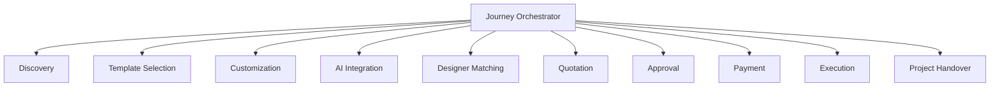
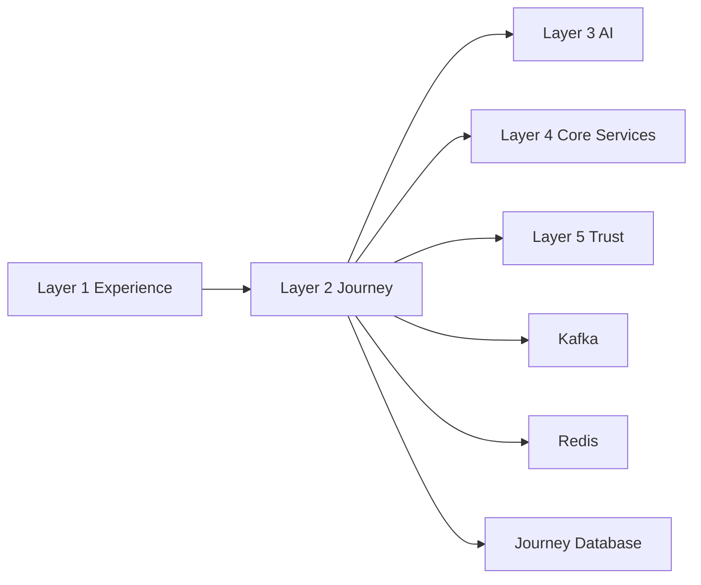
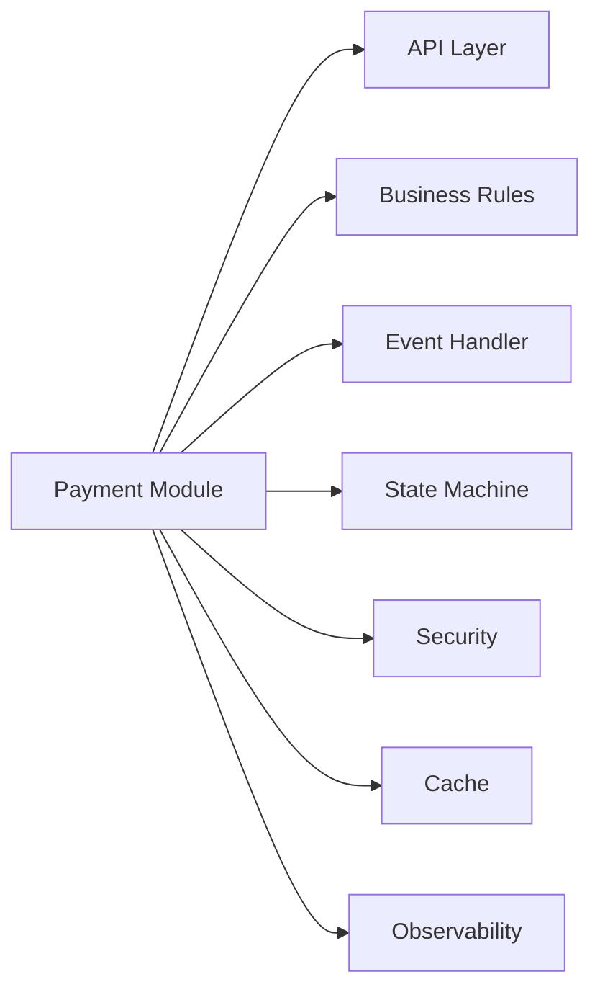
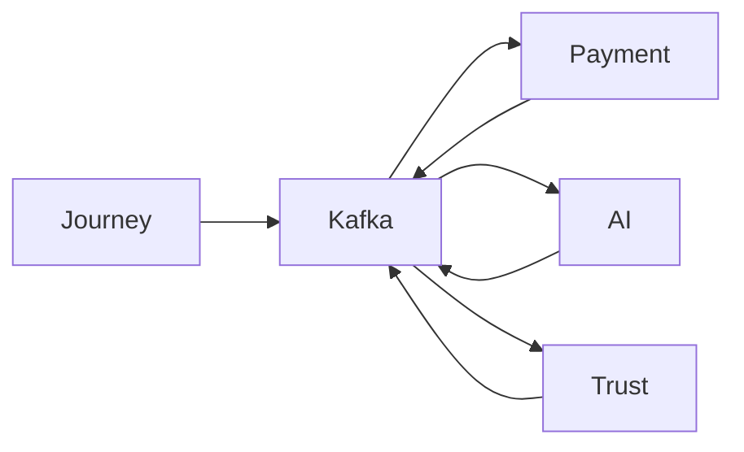

# Dependency Graph

## Overview

This document illustrates the dependency relationships between the major components of Layer 2.

Layer 2 follows a layered dependency model where the Journey Orchestrator coordinates business modules and integrates with external platform services.

---

# Internal Dependency Graph

---

# External Dependencies

---

# Payment Module Dependencies

---

# Event Dependencies

---

# Dependency Rules

- Components communicate through defined interfaces.
- External services are accessed only through integration modules.
- Business modules remain loosely coupled.
- Events are preferred over direct service calls for asynchronous workflows.
- Circular dependencies are not permitted.

---

# Related Documents

- architecture.md
- README.md
- ADR.md
- diagrams/component_hierarchy.md
- diagrams/state_diagram.md
- payment/overview.md
