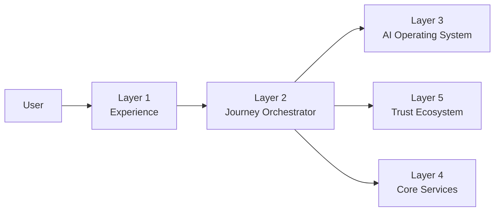
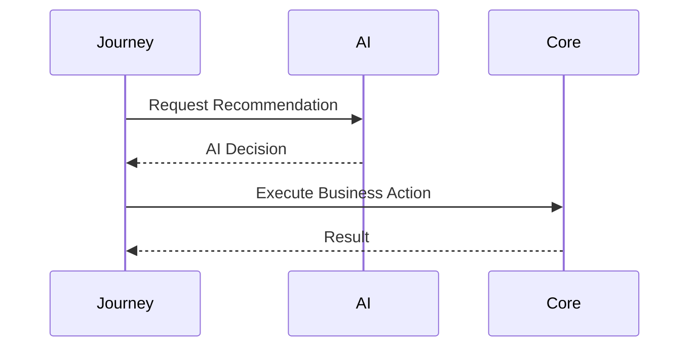
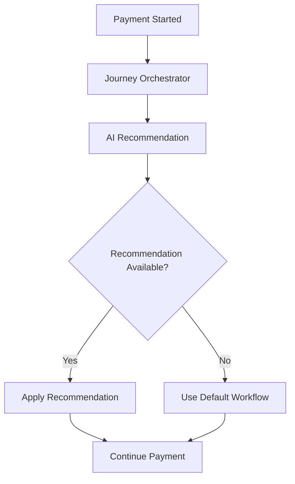

# AI Integration Flow

## Purpose

This document describes how the Guided Journey (Layer 2) interacts with the AI Operating System (Layer 3).

Layer 2 never performs AI inference directly.

Instead, it sends contextual requests to Layer 3 and continues workflow execution using the returned recommendations.

---

# Design Principles

- AI is optional.
- Journey remains deterministic.
- AI provides recommendations only.
- Business rules always take precedence.
- Journey can continue if AI is unavailable.
- AI services remain independently deployable.

---

# High-Level Architecture

---

# AI Integration Flow

---

# Payment Example

---

# AI Capabilities

Layer 3 may provide

- Designer recommendation
- Product recommendation
- Dynamic pricing insights
- Budget estimation
- Timeline prediction
- Risk assessment
- Journey personalization

---

# Failure Handling

If AI is unavailable

↓

Log warning

↓

Continue Journey

↓

Use default business rules

AI failure must never block customer workflows.

---

# Communication Pattern

Journey → AI

- REST
- gRPC

AI → Journey

- Recommendation Response

No direct database sharing.

---

# Security

- JWT Authentication
- mTLS
- Correlation IDs
- Trace IDs

---

# Observability

Monitor

- AI latency
- Recommendation accuracy
- AI availability
- Timeout rate
- Error rate

---

# Related Documents

- layer_3/overview.md
- layer_2/payment/overview.md
- layer_2/payment/journey_rules.md
