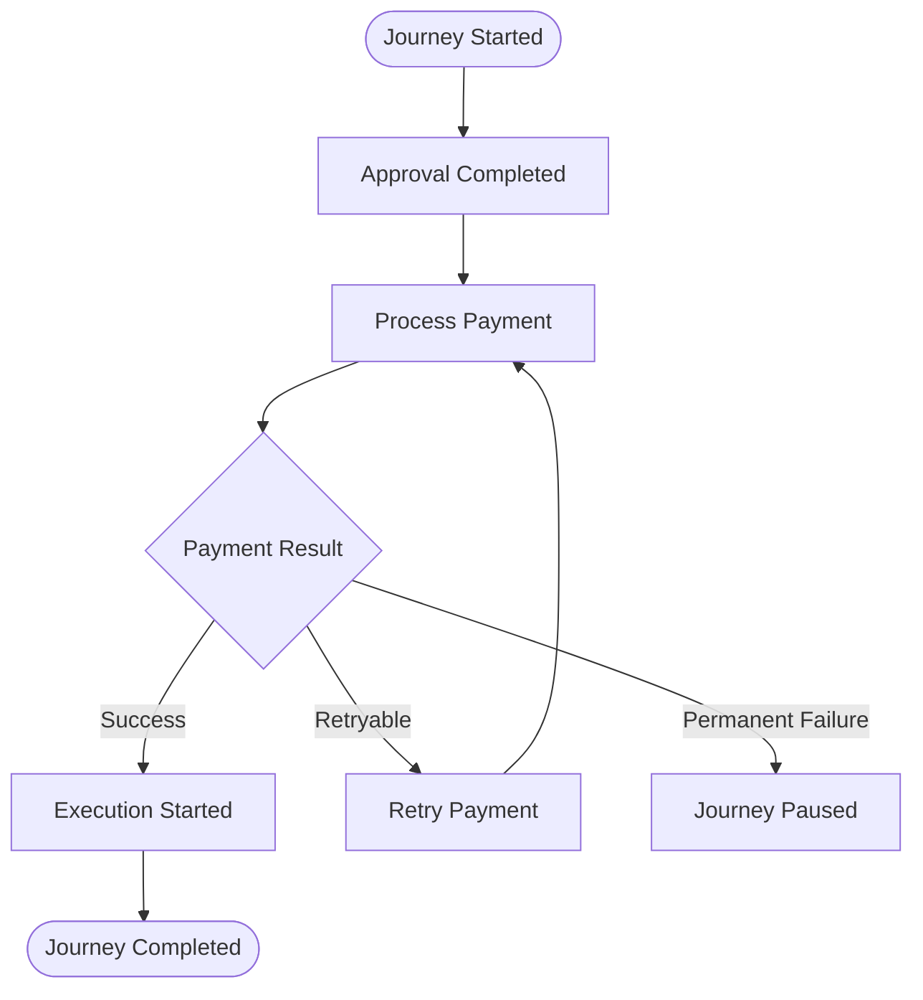

```mermaid
flowchart TD
    A([Journey Started])
    B[Approval Completed]
    C[Process Payment]
    D{Payment Result}

    E[Execution Started]
    F[Retry Payment]
    G[Journey Paused]
    H([Journey Completed])

    A --> B
    B --> C
    C --> D

    D -->|Success| E
    D -->|Retryable| F
    D -->|Permanent Failure| G

    F --> C
    E --> H
```
