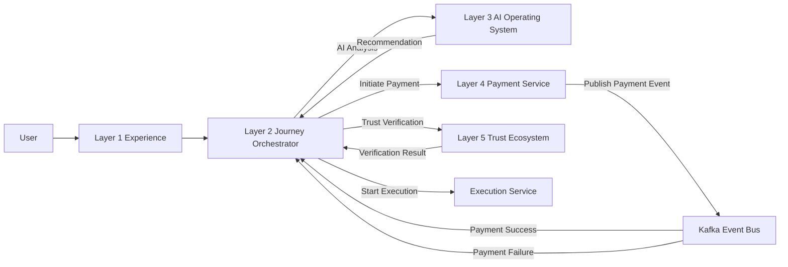

```mermaid
flowchart LR

    User[User]
    Experience[Layer 1 Experience]
    Journey[Layer 2 Journey Orchestrator]

    AI[Layer 3 AI Operating System]
    Payment[Layer 4 Payment Service]
    Trust[Layer 5 Trust Ecosystem]
    Execution[Execution Service]

    Kafka[Kafka Event Bus]

    User --> Experience
    Experience --> Journey

    Journey -->|AI Analysis| AI
    AI -->|Recommendation| Journey

    Journey -->|Initiate Payment| Payment
    Payment -->|Publish Payment Event| Kafka
    Kafka -->|Payment Success| Journey
    Kafka -->|Payment Failure| Journey

    Journey -->|Trust Verification| Trust
    Trust -->|Verification Result| Journey

    Journey -->|Start Execution| Execution
```
