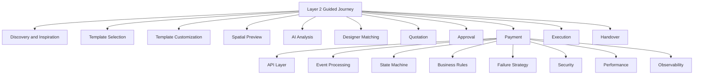

```mermaid
flowchart TD

    Layer2[Layer 2 Guided Journey]

    Layer2 --> Discovery[Discovery and Inspiration]
    Layer2 --> Template[Template Selection]
    Layer2 --> Customization[Template Customization]
    Layer2 --> Spatial[Spatial Preview]
    Layer2 --> AIAnalysis[AI Analysis]
    Layer2 --> Designer[Designer Matching]
    Layer2 --> Quotation[Quotation]
    Layer2 --> Approval[Approval]
    Layer2 --> Payment[Payment]
    Layer2 --> Execution[Execution]
    Layer2 --> Handover[Handover]

    Payment --> API[API Layer]
    Payment --> Events[Event Processing]
    Payment --> StateMachine[State Machine]
    Payment --> BusinessRules[Business Rules]
    Payment --> Failure[Failure Strategy]
    Payment --> Security[Security]
    Payment --> Performance[Performance]
    Payment --> Observability[Observability]
```
