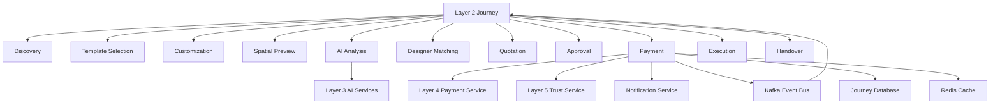

```mermaid
flowchart TD

    A[Layer 2 Journey]

    B[Discovery]
    C[Template Selection]
    D[Customization]
    E[Spatial Preview]
    F[AI Analysis]
    G[Designer Matching]
    H[Quotation]
    I[Approval]
    J[Payment]
    K[Execution]
    L[Handover]

    M[Layer 3 AI Services]
    N[Layer 4 Payment Service]
    O[Layer 5 Trust Service]
    P[Notification Service]
    Q[Kafka Event Bus]
    R[Journey Database]
    S[Redis Cache]

    A --> B
    A --> C
    A --> D
    A --> E
    A --> F
    A --> G
    A --> H
    A --> I
    A --> J
    A --> K
    A --> L

    F --> M

    J --> N
    J --> O
    J --> P
    J --> Q
    J --> R
    J --> S

    Q --> A
```
