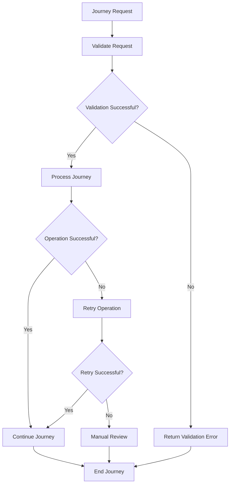

```mermaid
flowchart TD

    A[Journey Request]

    B[Validate Request]

    C{Validation Successful?}

    D[Process Journey]

    E{Operation Successful?}

    F[Continue Journey]

    G[Retry Operation]

    H{Retry Successful?}

    I[Manual Review]

    J[End Journey]

    K[Return Validation Error]

    A --> B
    B --> C

    C -->|Yes| D
    C -->|No| K

    D --> E

    E -->|Yes| F
    E -->|No| G

    G --> H

    H -->|Yes| F
    H -->|No| I

    F --> J
    I --> J
    K --> J
```
