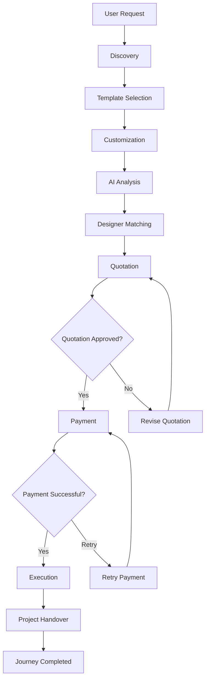

```mermaid
flowchart TD

    A[User Request]

    B[Discovery]

    C[Template Selection]

    D[Customization]

    E[AI Analysis]

    F[Designer Matching]

    G[Quotation]

    H{Quotation Approved?}

    I[Payment]

    J{Payment Successful?}

    K[Execution]

    L[Project Handover]

    M[Journey Completed]

    N[Revise Quotation]

    O[Retry Payment]

    A --> B
    B --> C
    C --> D
    D --> E
    E --> F
    F --> G

    G --> H

    H -->|Yes| I
    H -->|No| N
    N --> G

    I --> J

    J -->|Yes| K
    J -->|Retry| O
    O --> I

    K --> L
    L --> M
```
