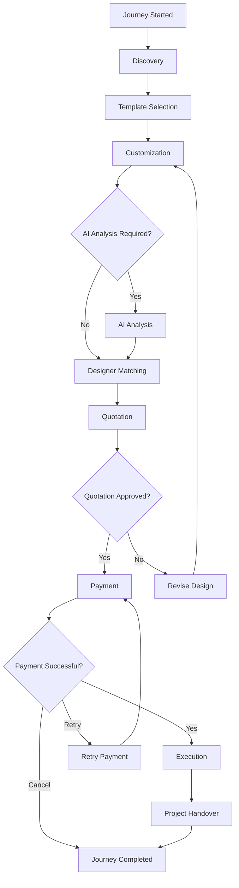

```mermaid
flowchart TD

    A[Journey Started]

    B[Discovery]

    C[Template Selection]

    D[Customization]

    E{AI Analysis Required?}

    F[AI Analysis]

    G[Designer Matching]

    H[Quotation]

    I{Quotation Approved?}

    J[Payment]

    K{Payment Successful?}

    L[Execution]

    M[Project Handover]

    N[Journey Completed]

    O[Revise Design]

    P[Retry Payment]

    A --> B
    B --> C
    C --> D

    D --> E

    E -->|Yes| F
    E -->|No| G

    F --> G

    G --> H

    H --> I

    I -->|Yes| J
    I -->|No| O

    O --> D

    J --> K

    K -->|Yes| L
    K -->|Retry| P
    K -->|Cancel| N

    P --> J

    L --> M
    M --> N
```
