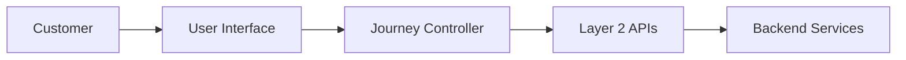
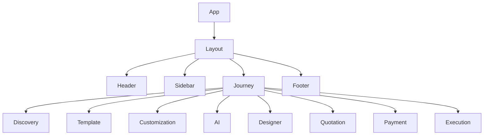
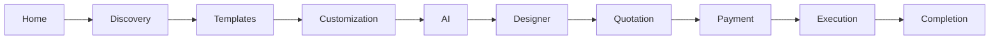
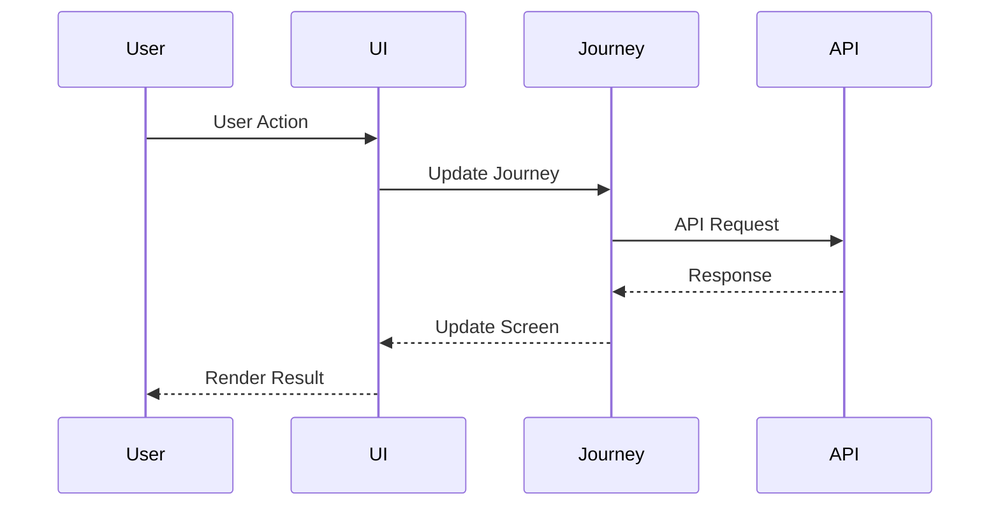

# Frontend Architecture

## Document Information

| Property | Value |
|----------|-------|
| Layer | Layer 2 – Guided Journey |
| Document | Frontend Architecture |
| Status | Production |
| Version | 1.0 |

---

# Overview

The frontend architecture provides a responsive, modular, and scalable user interface for the Guided Journey.

The presentation layer communicates with Layer 2 APIs while remaining independent of backend implementation details.

---

# Objectives

- Modular UI components
- Responsive design
- Reusable pages
- Scalable architecture
- Accessible interface
- Consistent navigation

---

# High-Level Frontend Architecture

---

# Component Hierarchy

---

# Navigation Flow

---

# Request Flow

---

# Frontend Modules

- Layout
- Authentication
- Guided Journey
- AI Interaction
- Payment
- Notifications
- Profile
- Settings

---

# State Management

Frontend state includes:

- User session
- Journey progress
- Selected template
- AI recommendations
- Payment status
- Notifications

---

# Design Principles

- Component-based architecture
- Responsive layouts
- Accessibility-first
- Lazy loading
- Reusable components
- Separation of concerns

---

# Security

- JWT authentication
- Secure API communication
- Client-side validation
- Role-based access
- CSRF protection

---

# Performance

- Lazy loading
- Code splitting
- Asset optimization
- API caching
- Skeleton loading

---

# Related Documents

- README.md
- architecture.md
- accessibility.md
- animation_architecture.md
- api_usage_rules.md
