# Guided Journey Operations

# 26. API Contracts

The Guided Journey Layer exposes RESTful APIs that enable client applications to initiate, monitor, update, and manage customer journeys. These APIs do not contain business logic; they orchestrate downstream services and return the current workflow state.

---

## API Design Principles

* RESTful architecture
* Stateless communication
* Idempotent operations
* Versioned endpoints
* JWT-based authentication
* Standardized error responses
* Correlation IDs for tracing
* Rate limiting

---

## Journey APIs

### Start Journey

```http
POST /api/v1/journeys
```

**Request**

```json
{
  "customerId": "CUS-1001",
  "projectType": "Residential",
  "templateId": "TMP-204",
  "requirements": {
    "rooms": 3,
    "budget": 2500000
  }
}
```

**Response**

```json
{
  "journeyId": "JRN-5001",
  "status": "Draft",
  "nextStep": "CollectRequirements"
}
```

---

### Get Journey Status

```http
GET /api/v1/journeys/{journeyId}
```

Returns:

* Current workflow state
* Completed steps
* Pending activities
* Estimated completion

---

### Resume Journey

```http
POST /api/v1/journeys/{journeyId}/resume
```

Resumes a paused workflow from the last persisted checkpoint.

---

### Cancel Journey

```http
POST /api/v1/journeys/{journeyId}/cancel
```

Triggers workflow cancellation and compensation activities.

---

### Retry Failed Step

```http
POST /api/v1/journeys/{journeyId}/retry
```

Retries only the failed activity instead of restarting the entire workflow.

---

## Standard Error Response

```json
{
  "timestamp": "2026-07-12T11:20:00Z",
  "status": 503,
  "error": "ServiceUnavailable",
  "message": "Designer Matching Service is unavailable.",
  "correlationId": "abc123xyz"
}
```

---

# 27. Service Communication

The Guided Journey Layer communicates with downstream services using a hybrid communication model.

## Synchronous Communication

Used when an immediate response is required.

Examples:

* Fetch journey details
* Validate customer session
* Retrieve template information

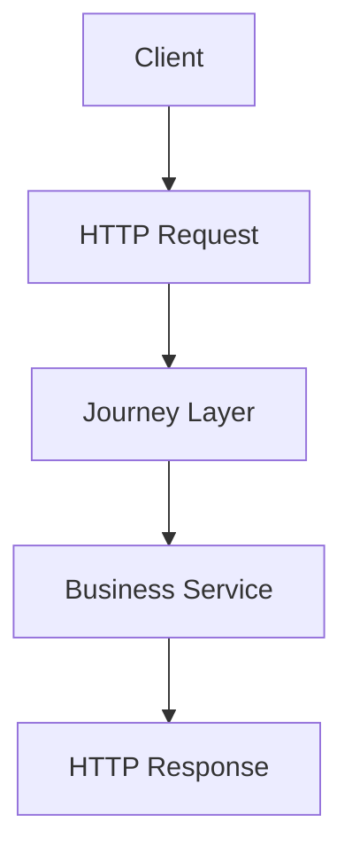

---

## Asynchronous Communication

Used for long-running operations.

Examples:

* AI Analysis
* Proposal Generation
* Designer Matching
* Notifications

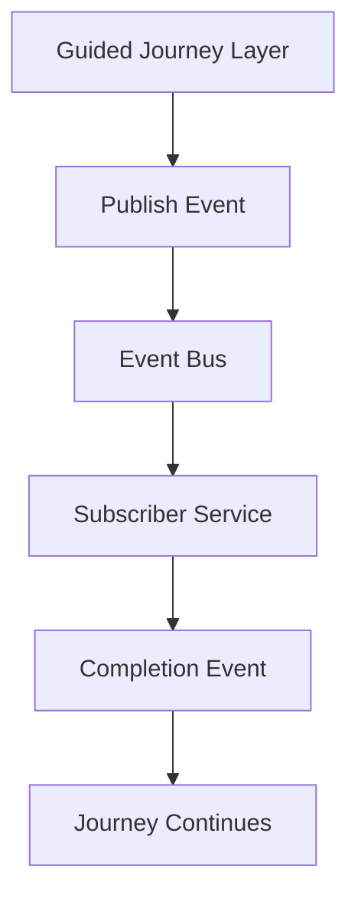

---

# 28. Data Flow

The Guided Journey Layer manages workflow execution while delegating business processing.

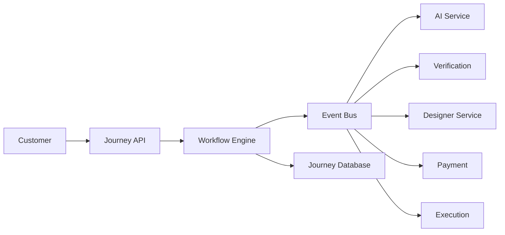

---

## Data Flow Description

1. Customer initiates a journey.
2. Journey API validates the request.
3. Workflow instance is created.
4. Workflow state is persisted.
5. Required services are invoked.
6. Services publish completion events.
7. Workflow progresses automatically.
8. Customer receives updated status.

---

# 29. Journey Persistence

Since journeys can span hours, days, or weeks, workflow state must survive failures and restarts.

Persisted information includes:

* Current state
* Completed tasks
* Pending activities
* Retry count
* Compensation history
* Event history
* Correlation IDs
* Workflow metadata

---

## Persistence Strategy

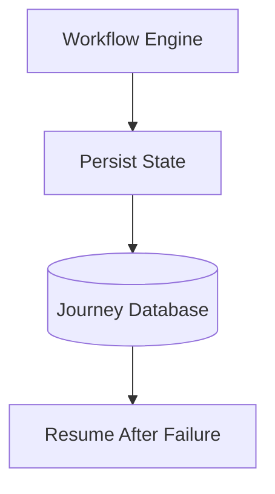

---

# 30. Database Design

The Guided Journey Layer stores orchestration metadata rather than business data.

---

## Journey Table

| Field       | Type      | Description            |
| ----------- | --------- | ---------------------- |
| JourneyId   | UUID      | Primary Key            |
| CustomerId  | UUID      | Customer Reference     |
| Status      | Enum      | Current Workflow State |
| CurrentStep | String    | Active Workflow Step   |
| CreatedAt   | Timestamp | Creation Time          |
| UpdatedAt   | Timestamp | Last Modified          |

---

## Journey Step Table

| Field       | Description                   |
| ----------- | ----------------------------- |
| StepId      | Unique identifier             |
| JourneyId   | Parent workflow               |
| StepName    | Workflow activity             |
| Status      | Pending / Running / Completed |
| StartedAt   | Execution time                |
| CompletedAt | Completion time               |

---

## Journey Event Table

Stores every published domain event.

| Field         | Description      |
| ------------- | ---------------- |
| EventId       | Unique ID        |
| EventType     | Domain Event     |
| SourceService | Publisher        |
| Timestamp     | Event Time       |
| CorrelationId | Trace Identifier |

---

## Workflow History

Maintains an immutable audit trail.

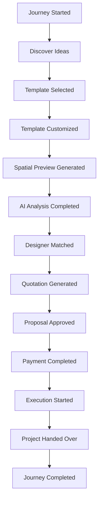

---

# 31. CQRS Strategy

The Guided Journey Layer adopts **Command Query Responsibility Segregation (CQRS)** to optimize performance.

## Write Model

Responsible for:

* Starting journeys
* Updating workflow state
* Publishing events

---

## Read Model

Optimized for:

* Journey dashboards
* Progress tracking
* Customer history
* Reporting

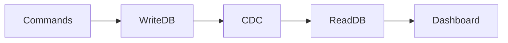

Benefits:

* Faster queries
* Independent scaling
* Reduced contention
* Better reporting performance

---

# 32. Change Data Capture (CDC)

The platform uses CDC to propagate database changes as events without modifying application logic.

Whenever workflow state changes:

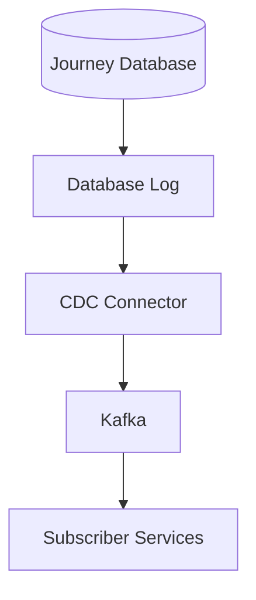

Advantages:

* Real-time synchronization
* Low latency
* Event generation without polling
* Reduced application complexity

---

# 33. Outbox Pattern

To avoid the **Dual Write Problem**, the Guided Journey Layer uses the Outbox Pattern.

Instead of writing directly to both the database and event broker:

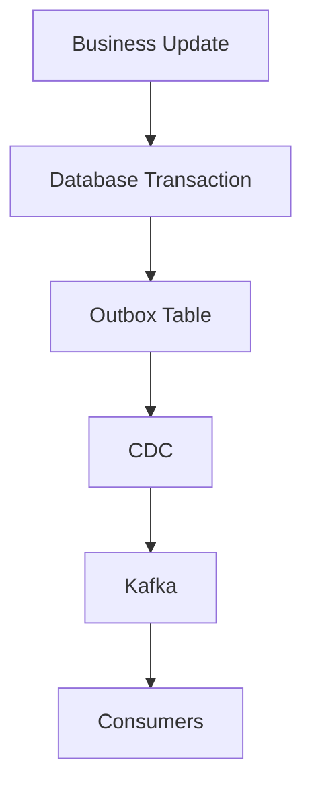

This guarantees that business state and events remain consistent.

---

# 34. Event Store

Every significant workflow transition generates an immutable event.

Examples include:

* JourneyCreated
* RequirementsSubmitted
* AICompleted
* DesignerMatched
* ProposalGenerated
* PaymentSucceeded
* ProjectCompleted

Benefits:

* Auditability
* Replay capability
* Analytics
* Debugging
* Historical reconstruction

---

# 35. Event Versioning

Events evolve over time without breaking consumers.

Example:

```json
{
  "eventVersion": "2.0",
  "eventType": "ProposalGenerated",
  "journeyId": "JRN-5001"
}
```

Schema evolution should remain backward compatible and be governed through a schema registry.

---

# 36. Correlation & Traceability

Every workflow execution receives a unique Correlation ID.

Example:

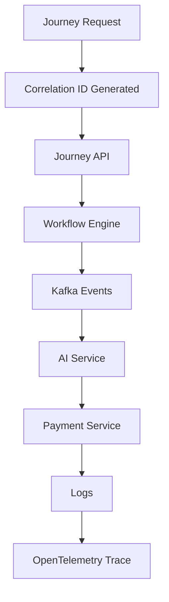

This enables end-to-end observability across distributed services.

---

# 37. Data Consistency

Instead of global ACID transactions, the platform relies on **eventual consistency**.

Consistency is maintained using:

* Saga Pattern
* Outbox Pattern
* CDC
* Idempotent consumers
* Event replay
* Compensation workflows

This approach supports scalability while ensuring reliable workflow progression.

---

# 38. API Versioning

All APIs follow URI-based versioning.

Example:

```http
/api/v1/journeys

/api/v2/journeys
```

Backward compatibility should be maintained wherever possible to avoid disrupting existing clients.

---

# 39. Security Architecture

The Guided Journey Layer acts as the orchestration backbone of the platform and therefore handles sensitive workflow metadata, customer requests, and communication between distributed services. While it does not implement authentication or authorization logic, it must ensure that every request and service interaction is secure.

The security model follows **Zero Trust Architecture**, assuming that no user, service, or network boundary is inherently trusted.

## Security Objectives

* Secure customer interactions
* Protect workflow state
* Prevent unauthorized workflow execution
* Secure service-to-service communication
* Ensure auditability
* Minimize attack surface

---

## Security Principles

| Principle             | Description                                         |
| --------------------- | --------------------------------------------------- |
| Zero Trust            | Verify every request regardless of source           |
| Least Privilege       | Services receive only the permissions they require  |
| Defense in Depth      | Multiple security layers protect workflow execution |
| Secure by Default     | Security policies enforced automatically            |
| End-to-End Encryption | Encrypt data both in transit and at rest            |

---

## Authentication

Authentication is delegated to the platform's Identity & Access Management (IAM) service.

Supported mechanisms include:

* OAuth 2.0
* OpenID Connect (OIDC)
* JWT Access Tokens
* Refresh Tokens

The Guided Journey Layer validates JWTs before processing requests but does not issue or manage tokens.

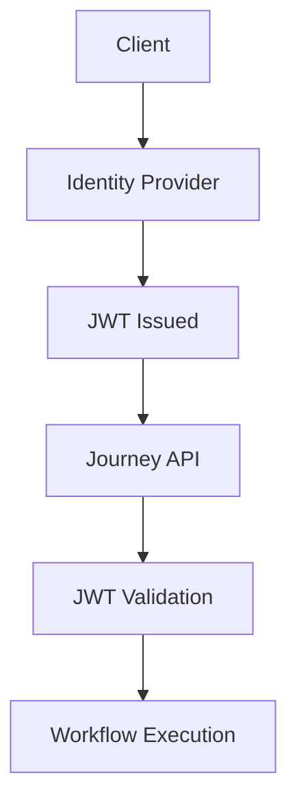

---

## Authorization

Authorization decisions are enforced using **Role-Based Access Control (RBAC)** and **Attribute-Based Access Control (ABAC)**.

### Example Roles

| Role            | Permissions                    |
| --------------- | ------------------------------ |
| Customer        | Create and manage own journeys |
| Designer        | Access assigned projects       |
| Project Manager | Monitor execution workflows    |
| Administrator   | Full operational access        |

ABAC enables context-aware policies based on attributes such as project ownership, organization, or workflow state.

---

## Service-to-Service Security

Communication between internal services uses:

* Mutual TLS (mTLS)
* Service Identity (SPIFFE/SPIRE)
* Short-lived service certificates
* API Gateway validation

Benefits include:

* Encrypted communication
* Verified service identity
* Prevention of service impersonation
* Secure internal APIs

---

## API Security

Every public API should enforce:

* HTTPS only
* JWT validation
* Rate limiting
* Request validation
* Input sanitization
* Correlation IDs
* Idempotency keys

Example headers:

```http
Authorization: Bearer <JWT>
X-Correlation-ID: 3fd28d9a
Idempotency-Key: 91f83d
```

---

## Workflow Security

Each workflow instance is isolated.

Workflow metadata includes:

* Owner ID
* Tenant ID
* Workflow ID
* Permissions
* Current state

Only authorized users and services can perform state transitions.

---

## Audit Logging

Every significant workflow action generates an immutable audit record.

Captured events include:

* Journey creation
* State transitions
* Workflow completion
* API requests
* Security failures
* Manual interventions

Example:

| Timestamp | User       | Action             |
| --------- | ---------- | ------------------ |
| 10:30     | Customer   | Journey Created    |
| 10:42     | AI Service | Analysis Completed |
| 11:05     | Customer   | Proposal Approved  |

---

# 40. Observability & Monitoring

The Guided Journey Layer must provide complete visibility into workflow execution across distributed services.

Observability is built on three pillars:

* Metrics
* Logs
* Distributed Traces

---

## Distributed Tracing

Every request receives a unique Correlation ID that propagates across services.

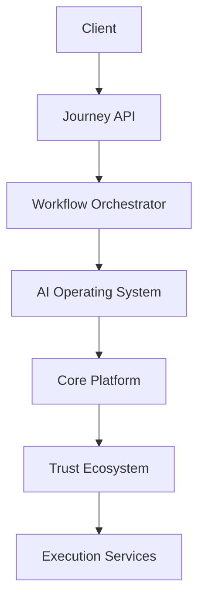

Tracing enables engineers to identify latency, failures, and bottlenecks in end-to-end workflows.

---

## Metrics

The platform should expose operational metrics such as:

| Metric                   | Description            |
| ------------------------ | ---------------------- |
| Active Journeys          | Running workflows      |
| Journey Completion Rate  | Completed vs. Started  |
| Workflow Duration        | Average execution time |
| Retry Count              | Number of retries      |
| Failed Activities        | Failed workflow steps  |
| Queue Length             | Pending workflow tasks |
| Event Processing Latency | Time to process events |

---

## Logging

Structured logs should include:

* Journey ID
* Workflow ID
* Correlation ID
* User ID
* Service Name
* Event Type
* Timestamp
* Execution Duration

Example:

```json
{
  "journeyId": "JRN-10001",
  "workflowState": "ProposalGenerated",
  "correlationId": "abc-123",
  "status": "SUCCESS"
}
```

---

## Health Monitoring

Health endpoints should expose:

* API availability
* Workflow engine status
* Event broker connectivity
* Database connectivity
* Queue health

---

# 41. Performance Optimization

Performance is achieved through asynchronous execution and efficient resource utilization.

## Strategies

* Stateless APIs
* Background workers
* Event-driven processing
* Connection pooling
* Lazy loading
* Response caching
* Batch processing
* Pagination

---

## Caching Strategy

Frequently accessed data should be cached.

Examples:

* Journey summaries
* Design templates
* Customer preferences
* Workflow metadata

Suggested technologies:

* Redis
* Distributed Cache
* CDN (static resources)

---

## Async Processing

Long-running operations should execute asynchronously.

Examples:

* AI Analysis
* Designer Matching
* Proposal Generation
* Notifications
* Report Generation

This prevents API blocking and improves responsiveness.

---

# 42. Scalability Strategy

The Guided Journey Layer is designed for horizontal scalability.

## Horizontal Scaling

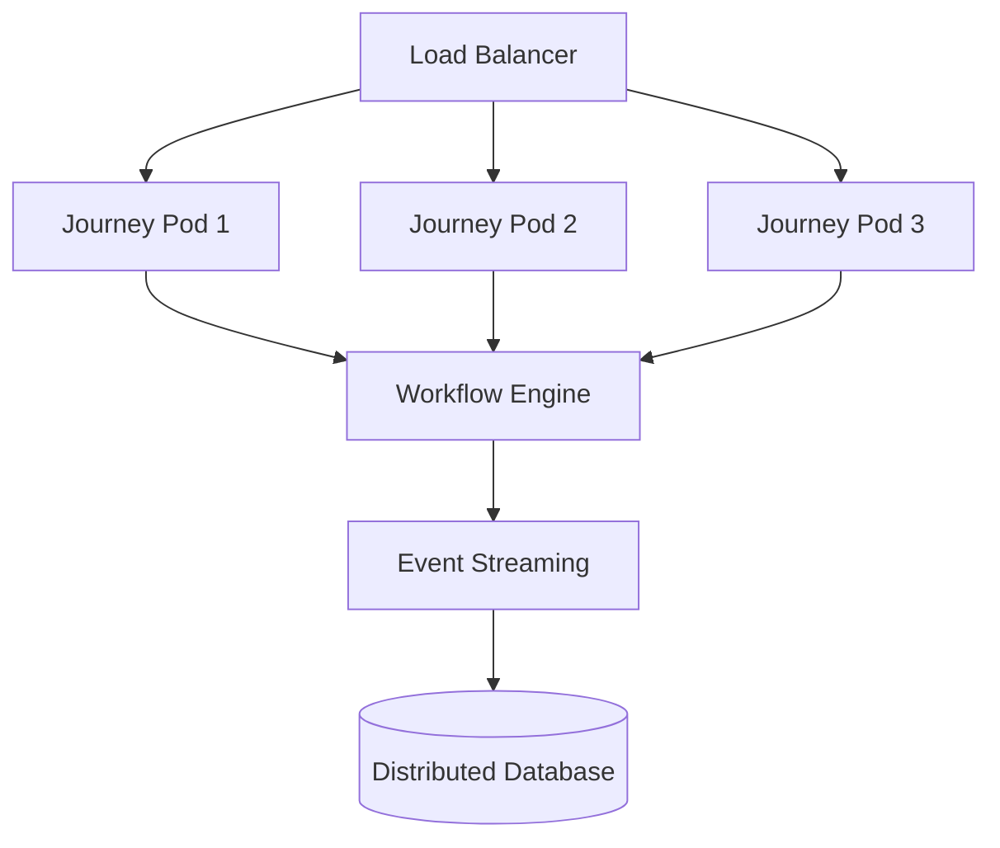

Additional application instances can be added without affecting workflow execution.

---

## Stateless Services

Application servers do not maintain session state.

All workflow state is persisted in shared storage, enabling:

* Auto scaling
* Rolling deployments
* Failover recovery
* High availability

---

## Queue-Based Processing

Queues decouple producers from consumers.

Advantages:

* Independent scaling
* Traffic smoothing
* Failure isolation
* Back-pressure handling

---

# 43. Cost Optimization

The architecture minimizes operational cost while maintaining performance.

## Strategies

### Event-Driven Processing

Services execute only when events occur, eliminating continuous polling.

---

### Auto Scaling

Scale workers based on:

* Queue depth
* CPU usage
* Active workflows

---

### Resource Optimization

* Use asynchronous workers for long-running tasks
* Scale workflow workers independently
* Archive completed journeys
* Apply data lifecycle policies

---

### Storage Optimization

Separate data into:

* Active workflows
* Historical workflows
* Audit archives

This reduces storage costs while preserving compliance.

---

# 44. Reliability & Resilience

Distributed systems must tolerate failures without losing workflow state.

## Resilience Features

* Durable workflow execution
* Persistent checkpoints
* Automatic retries
* Compensation workflows
* Dead Letter Queues (DLQ)
* Event replay
* Circuit breakers
* Timeout management

---

## Recovery Flow

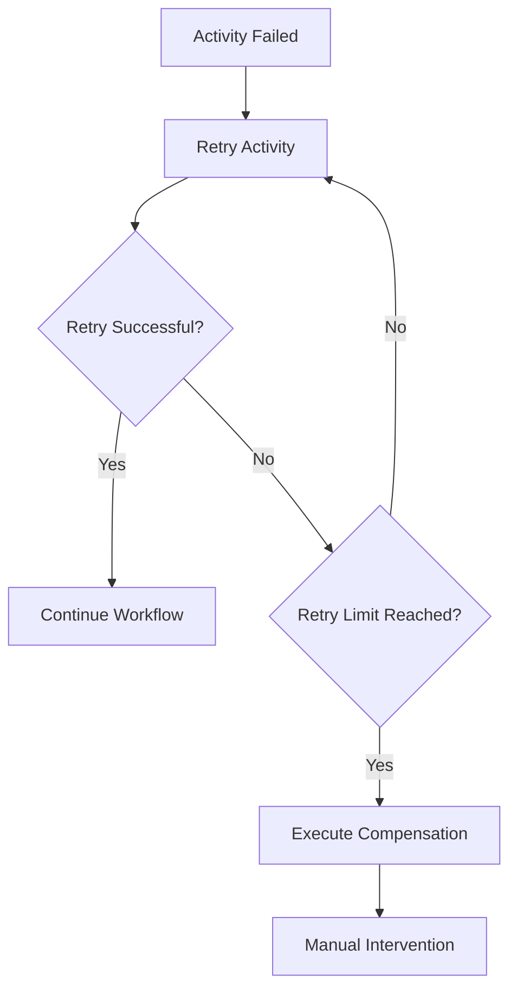

---

# 45. Deployment Considerations

The Guided Journey Layer should support cloud-native deployment.

## Recommended Platform

* Kubernetes
* Docker
* Service Mesh (Istio/Linkerd)
* API Gateway
* Kafka/Event Bus
* Workflow Engine Cluster

---

## Deployment Goals

* High Availability
* Zero Downtime Deployment
* Rolling Updates
* Canary Releases
* Automatic Rollback

---

# 46. Engineering Best Practices

* Keep orchestration logic separate from business logic.
* Prefer asynchronous workflows for long-running tasks.
* Use Saga instead of distributed transactions.
* Ensure all operations are idempotent.
* Define explicit retry and timeout policies.
* Store workflow state externally.
* Version APIs and events.
* Use structured logging and distributed tracing.
* Monitor queue depth and workflow latency.
* Apply least-privilege access to all services.

---

# 47. Future Enhancements

Potential improvements include:

| Enhancement                     | Benefit                     |
| ------------------------------- | --------------------------- |
| AI-driven workflow optimization | Dynamic journey adaptation  |
| Predictive failure detection    | Reduced operational issues  |
| Multi-region workflow execution | Higher availability         |
| Dynamic workflow configuration  | Faster business changes     |
| Event replay dashboard          | Simplified troubleshooting  |
| Workflow analytics              | Customer journey insights   |
| BPMN-based workflow designer    | Low-code process management |

---

# 48. Conclusion

The Guided Journey Layer serves as the orchestration core of the Allure Interiors platform, coordinating long-running customer workflows across distributed microservices while maintaining clear separation from business logic. By leveraging workflow orchestration, event-driven communication, durable execution, Saga-based consistency, and cloud-native deployment practices, the architecture delivers a resilient, scalable, and cost-efficient foundation for managing complex customer journeys.

The combination of Zero Trust security, distributed observability, horizontal scalability, and resilient workflow execution ensures that the platform can support enterprise-scale operations while remaining maintainable and extensible. Future enhancements such as adaptive workflows and advanced analytics can be integrated without disrupting the core orchestration model, preserving the flexibility required for long-term platform evolution.

