# Guided Journey System

# 1. Introduction

The **Guided Journey Layer** is the orchestration layer of the Allure Interiors platform. It is responsible for managing and coordinating the complete customer journey—from the moment a user enters the platform until the successful delivery and handover of the interior design project.

Unlike business service layers, the Guided Journey Layer does **not** implement domain-specific logic such as AI analysis, verification, payments, trust scoring, or project execution. Instead, it orchestrates these capabilities by interacting with dedicated services through APIs, asynchronous events, and workflow engines.

The primary goal of this layer is to provide a seamless, fault-tolerant, and scalable workflow that coordinates multiple distributed services while maintaining a consistent customer experience.

---

# 2. Purpose

The Guided Journey Layer serves as the central workflow orchestrator within the platform.

Its responsibilities include:

* Coordinating user interactions across different stages of the journey.
* Managing workflow state transitions.
* Invoking downstream services through APIs.
* Publishing and consuming domain events.
* Handling workflow failures and retries.
* Maintaining journey progress and session state.
* Supporting long-running business processes.
* Providing a unified orchestration interface for all customer journeys.

Rather than performing business operations, the layer ensures that every service is executed in the correct sequence while remaining loosely coupled.

---

# 3. Scope

The Guided Journey Layer focuses exclusively on workflow orchestration.

## In Scope

* Customer journey orchestration
* Workflow management
* State management
* API orchestration
* Event publishing and subscription
* Journey progress tracking
* Session persistence
* Retry orchestration
* Compensation workflow triggering
* Journey analytics events

## Out of Scope

The following capabilities belong to other architectural layers and **must not** be implemented here.

| Capability              | Responsible Layer       |
| ----------------------- | ----------------------- |
| AI Design Generation    | AI Services Layer       |
| Designer Recommendation | AI Services Layer       |
| Identity Verification   | Verification Layer      |
| Trust & Reputation      | Trust Layer             |
| Authentication          | Security Layer          |
| Authorization           | Security Layer          |
| Payment Processing      | Platform Services Layer |
| Notifications           | Communication Layer     |
| Project Management      | Execution Layer         |

The Guided Journey Layer communicates with these services through well-defined interfaces without duplicating their business logic.

---

# 4. Design Goals

The architecture of the Guided Journey Layer is designed around modern distributed systems principles.

## Functional Goals

* Orchestrate complete customer workflows.
* Support long-running business processes.
* Enable resumable user journeys.
* Coordinate multiple downstream services.
* Maintain workflow consistency.
* Handle failures gracefully.

## Non-Functional Goals

### Scalability

* Horizontal service scaling
* Stateless API instances
* Queue-driven processing
* Distributed workflow execution

### Reliability

* Durable workflow execution
* Automatic retry mechanisms
* Compensation workflows
* Event persistence

### Maintainability

* Clear service boundaries
* Independent deployment
* Modular workflow definitions
* API-first communication

### Cost Efficiency

* Event-driven communication
* Asynchronous processing
* Lazy service invocation
* Resource auto-scaling

---

# 5. Design Principles

The Guided Journey Layer follows several architectural principles that ensure long-term maintainability and scalability.

## 5.1 Single Responsibility

This layer is responsible only for journey orchestration.

Business logic remains within dedicated services.

---

## 5.2 Loose Coupling

Services communicate using APIs and asynchronous events rather than direct dependencies.

Benefits include:

* Independent deployment
* Easier maintenance
* Improved scalability
* Fault isolation

---

## 5.3 Event-Driven Communication

Workflow progression is primarily driven by domain events.

Example:

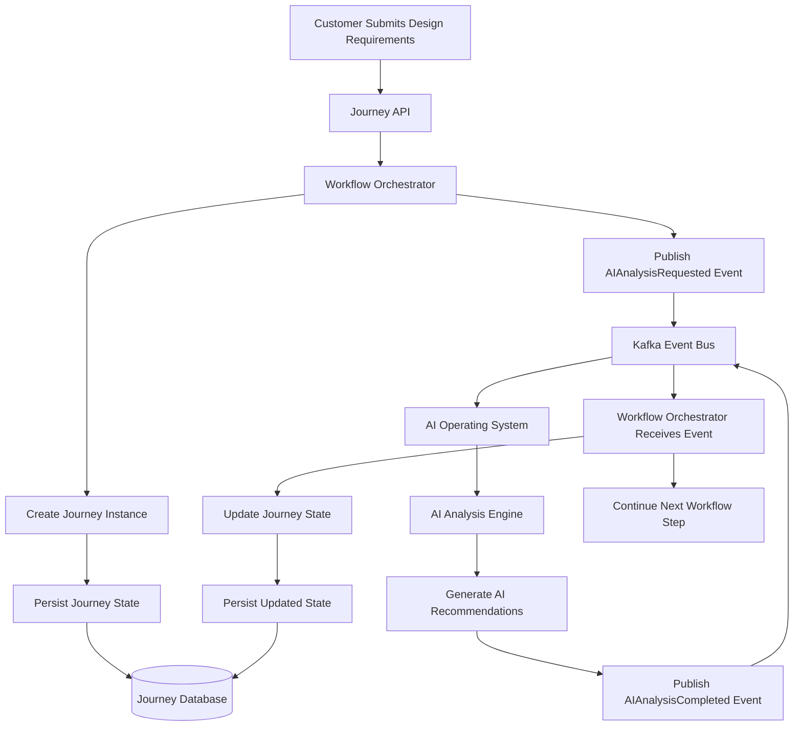

This minimizes synchronous dependencies and improves resilience.

---

## 5.4 Stateless Processing

Application instances remain stateless.

Workflow state is stored in persistent storage, enabling:

* Horizontal scaling
* Rolling deployments
* Automatic failover
* Multi-region support

---

## 5.5 Durable Workflow Execution

Long-running workflows are persisted so they can resume after failures without restarting the entire journey.

Durability ensures:

* Crash recovery
* Retry capability
* Workflow continuation
* Reduced manual intervention

---

## 5.6 Eventual Consistency

Because multiple distributed services participate in a customer journey, strict ACID transactions are impractical.

Instead, the platform adopts **eventual consistency**, ensuring that all participating services converge toward a consistent state through asynchronous processing and compensation mechanisms.

---

# 6. Architecture Position

The Guided Journey Layer acts as the orchestration backbone between the presentation layer and downstream business services.

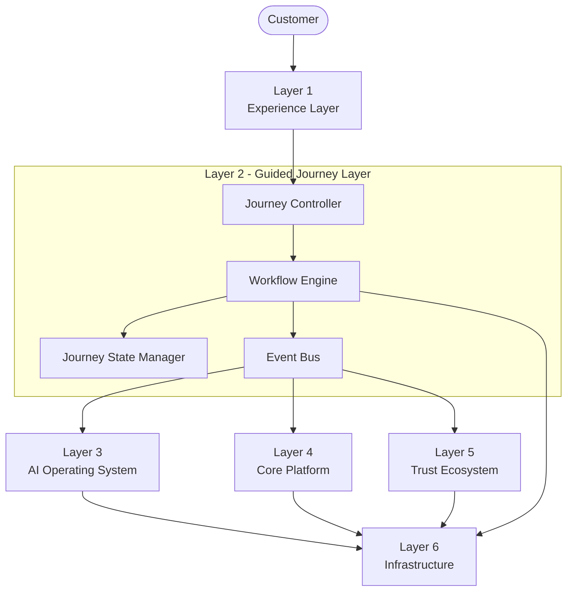

The layer coordinates workflows but delegates all domain-specific processing to the appropriate service.

---

# 7. Responsibilities

The Guided Journey Layer provides the following core capabilities.

| Responsibility           | Description                               |
| ------------------------ | ----------------------------------------- |
| Workflow Orchestration   | Coordinates multi-step customer workflows |
| Journey State Management | Tracks current journey stage              |
| Service Coordination     | Invokes downstream services through APIs  |
| Event Management         | Publishes and consumes domain events      |
| Progress Tracking        | Tracks customer completion status         |
| Session Recovery         | Allows interrupted journeys to resume     |
| Failure Recovery         | Handles retries and workflow continuation |
| Workflow Persistence     | Maintains long-running process state      |

---

# 8. Non-Responsibilities

To preserve architectural separation, the Guided Journey Layer deliberately excludes several capabilities.

| Capability             | Reason                            |
| ---------------------- | --------------------------------- |
| AI Processing          | Implemented by AI Layer           |
| Verification Logic     | Implemented by Verification Layer |
| Reputation Calculation | Implemented by Trust Layer        |
| Payment Processing     | Implemented by Payment Services   |
| Authentication         | Managed by Security Layer         |
| Notifications          | Managed by Communication Services |
| File Storage           | Managed by Storage Layer          |

Maintaining these boundaries prevents duplicated logic and reduces operational complexity.

---

# 9. High-Level Architecture

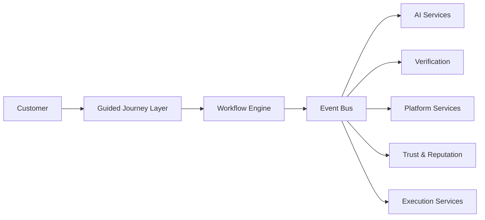

The Guided Journey Layer delegates workflow execution to a workflow engine and coordinates distributed services through an event bus, enabling loose coupling and scalable communication.

---

# 10. Guided Journey Lifecycle

Every customer project progresses through a predefined lifecycle.

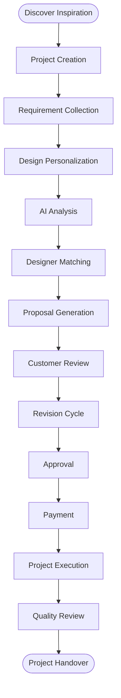

Each stage represents an independent workflow state and is completed only after receiving the required events or API responses from downstream services.

---

# 11. Customer Journey Overview

The customer journey is modeled as a long-running workflow rather than a single synchronous request.

Key characteristics include:

* Multi-session support
* Resume-after-interruption capability
* Asynchronous processing
* Event-driven progression
* Automatic recovery from transient failures
* Persistent workflow state
* Auditability across the entire lifecycle

This approach enables the platform to manage complex interior design projects that may span several days or weeks without losing workflow context.

---

# 12. Key Architectural Decisions

| Decision                  | Rationale                                                            |
| ------------------------- | -------------------------------------------------------------------- |
| Event-Driven Architecture | Reduces service coupling and improves scalability                    |
| Workflow Engine           | Supports durable long-running processes                              |
| Stateless APIs            | Enables horizontal scaling                                           |
| Persistent Workflow State | Allows recovery after failures                                       |
| Eventual Consistency      | Better suited for distributed microservices than global transactions |
| API-First Communication   | Standardizes service interactions                                    |
| Workflow Orchestration    | Centralizes business flow while keeping domain logic distributed     |

---

# 13. Workflow Orchestration

The Guided Journey Layer orchestrates the complete customer journey by coordinating multiple independent services. Rather than embedding business logic, it manages the execution order, monitors progress, handles failures, and ensures workflow continuity across distributed components.

Each workflow represents a **long-running business process** composed of multiple independent tasks executed by specialized services.

## Objectives

* Coordinate multi-step customer journeys
* Execute workflows reliably across distributed services
* Support long-running operations
* Recover automatically from failures
* Enable resumable workflows
* Maintain eventual consistency

---

# 14. Journey State Machine

Every customer journey is modeled as a finite state machine. A journey transitions between predefined states based on successful completion of tasks or business events.

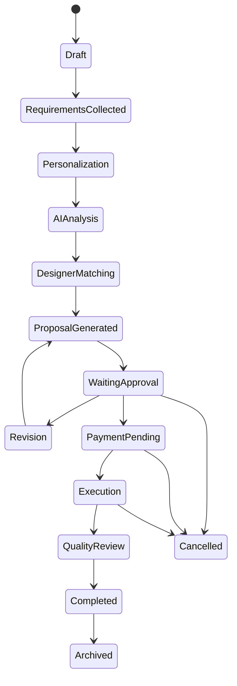

---

## State Descriptions

| Journey State           | Guided Journey Layer Responsibility                                                                                                          |
| ----------------------- | -------------------------------------------------------------------------------------------------------------------------------------------- |
| **Discover Ideas**      | Initializes the customer journey and orchestrates the discovery workflow by collecting inspiration preferences and preparing the next stage. |
| **Template Selected**   | Records the selected design template, validates workflow progression, and updates the journey state.                                         |
| **Template Customized** | Coordinates the customization workflow and persists customer preferences before requesting downstream services.                              |
| **Spatial Preview**     | Invokes the Spatial Intelligence service to generate a 3D preview and waits for completion before advancing the workflow.                    |
| **AI Analysis**         | Requests AI-driven design analysis from the AI Operating System and transitions the workflow after receiving analysis results.               |
| **Designer Matched**    | Coordinates designer recommendation services and updates the workflow once a suitable designer has been selected.                            |
| **Quotation Generated** | Initiates quotation generation through the Core Platform and tracks quotation availability for customer review.                              |
| **Proposal Compared**   | Maintains proposal comparison state while coordinating proposal evaluation and customer selection.                                           |
| **Revision**            | Creates and tracks revision requests until the updated proposal satisfies customer requirements.                                             |
| **Final Walkthrough**   | Coordinates the final walkthrough process and records customer verification before approval.                                                 |
| **Approval**            | Waits for customer approval and validates workflow completion before progressing to payment.                                                 |
| **Payment**             | Coordinates payment processing by invoking the Payment Engine and advances the workflow after payment confirmation.                          |
| **Execution**           | Transfers the approved project to execution services while monitoring project progress through workflow events.                              |
| **Handover**            | Coordinates project closure, documentation delivery, and customer handover activities before completing the journey.                         |
| **Completed**           | Marks the workflow as successfully completed, archives journey metadata, and publishes completion events.                                    |

---

# 15. Workflow Lifecycle

Every workflow follows a standardized lifecycle regardless of business functionality.

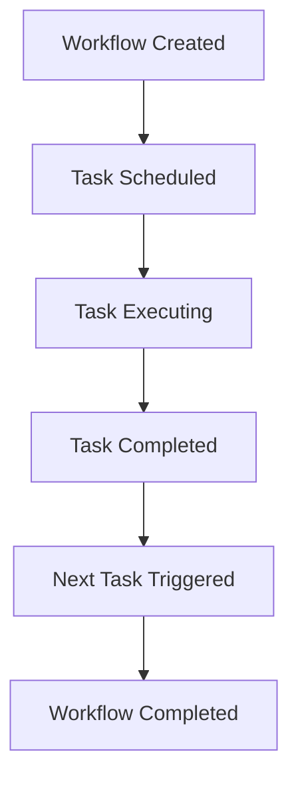

If any task fails, the workflow transitions into retry or compensation logic before continuing.

---

# 16. Workflow Orchestration Model

The Guided Journey Layer adopts an **orchestration-based** workflow model.

A central workflow engine manages:

* Task sequencing
* Retry policies
* Timeouts
* State persistence
* Failure handling
* Compensation execution

Example workflow:

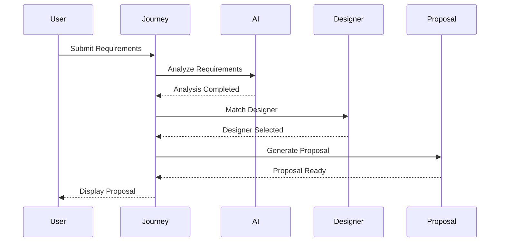

---

# 17. Orchestration vs Choreography

The platform combines orchestration and choreography where appropriate.

## Orchestration

Used within a bounded workflow.

Characteristics:

* Central workflow engine
* Explicit workflow definition
* Easier monitoring
* Better timeout handling
* Simplified retries

Suitable for:

* Customer journey execution
* Proposal generation
* Approval workflow
* Payment coordination

---

## Choreography

Used between independent business domains.

Characteristics:

* Event-driven communication
* Independent services
* Loose coupling
* Autonomous scaling

Suitable for:

* Notifications
* Analytics
* Audit logging
* Recommendation updates

---

## Hybrid Architecture

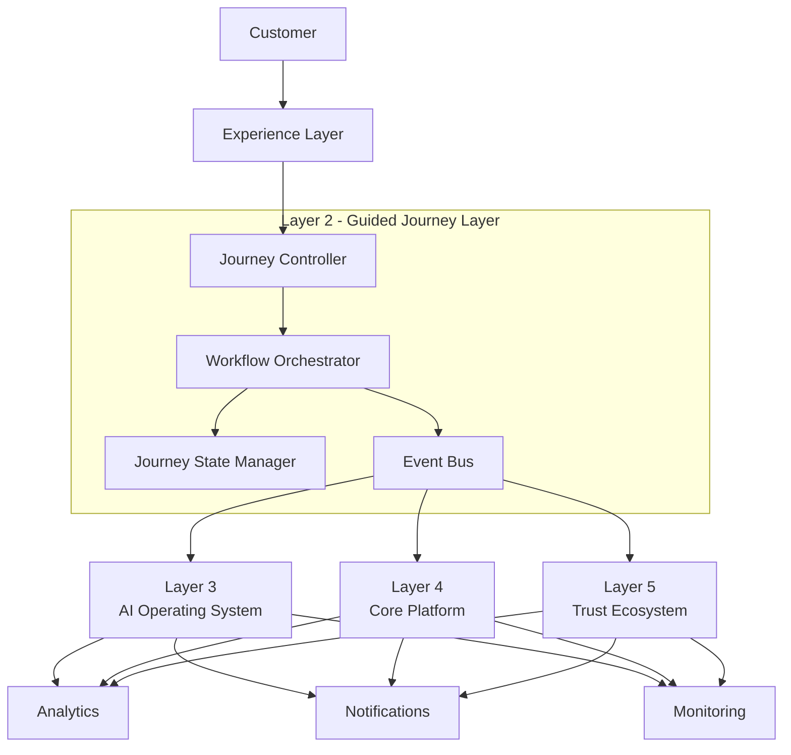

This hybrid model balances centralized workflow control with decentralized event-driven communication.

---

# 18. Saga Pattern

The Guided Journey Layer coordinates distributed transactions using the **Saga Pattern** instead of traditional two-phase commit (2PC).

Each business step executes as an independent local transaction.

If a downstream step fails, compensating actions restore consistency.

---

## Why Not Two-Phase Commit?

Traditional distributed transactions introduce:

* Resource locking
* Tight coupling
* Reduced scalability
* Single transaction coordinator
* High latency

These characteristics conflict with cloud-native microservices.

---

## Saga Workflow

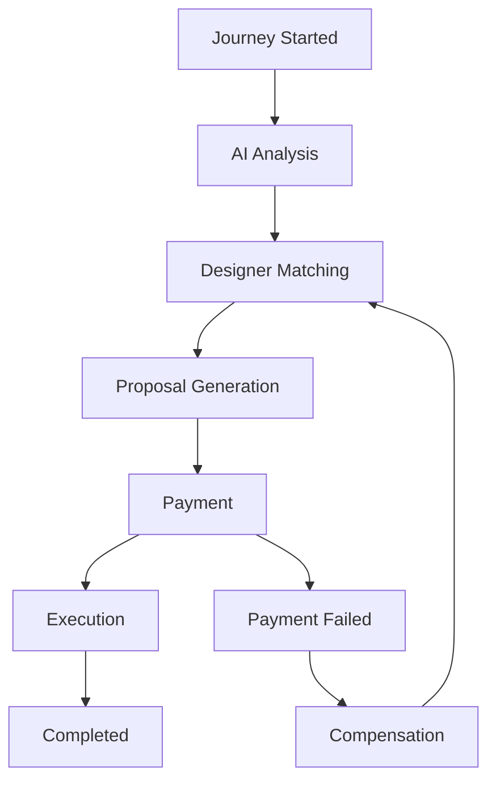

---

## Compensation Example

Suppose payment fails after proposal approval.

Compensation actions may include:

* Release designer allocation
* Revert proposal status
* Unlock reserved resources
* Publish failure event
* Notify customer

This restores workflow consistency without requiring global transactions.

---

# 19. Event-Driven Communication

The Guided Journey Layer communicates with downstream services primarily through asynchronous events.

Benefits include:

* Loose coupling
* Independent deployments
* Improved scalability
* Better resilience
* Non-blocking execution

---

## Example Event Flow

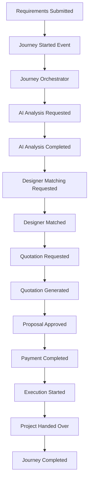

---

## Core Domain Events

| Event                   | Purpose                 |
| ----------------------- | ----------------------- |
| JourneyStarted          | Initialize workflow     |
| RequirementsSubmitted   | Customer input received |
| AIAnalysisRequested     | Invoke AI services      |
| AIAnalysisCompleted     | AI task completed       |
| DesignerMatched         | Designer allocated      |
| ProposalGenerated       | Proposal available      |
| ProposalApproved        | Customer approved       |
| PaymentCompleted        | Payment successful      |
| ProjectExecutionStarted | Execution begins        |
| ProjectCompleted        | Journey finished        |

---

# 20. Service Coordination

The Guided Journey Layer acts as the coordinator between distributed services.

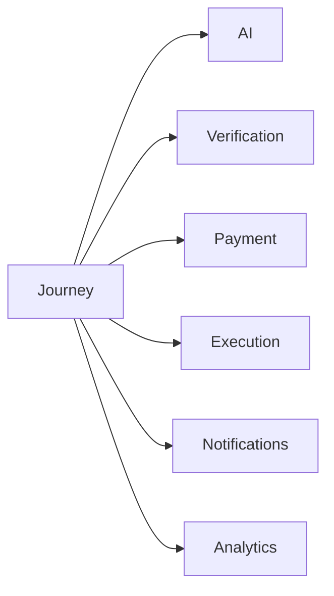

The orchestration layer never performs these operations internally. Instead, it delegates execution and waits for responses or events before progressing.

---

# 21. Retry Strategy

Distributed systems experience transient failures such as:

* Network interruptions
* Service unavailability
* Database timeouts
* API throttling

The Guided Journey Layer implements configurable retry policies.

| Failure Type        | Strategy              |
| ------------------- | --------------------- |
| Network Error       | Exponential Backoff   |
| Timeout             | Retry                 |
| Rate Limit          | Delayed Retry         |
| Service Unavailable | Queue for Retry       |
| Permanent Failure   | Compensation Workflow |

Retries should always be **idempotent** to prevent duplicate processing.

---

# 22. Timeout Management

Every workflow activity includes an execution timeout.

Example:

| Activity          | Timeout    |
| ----------------- | ---------- |
| AI Analysis       | 10 minutes |
| Designer Matching | 5 minutes  |
| Payment           | 15 minutes |
| Proposal Approval | 7 days     |
| Quality Review    | 48 hours   |

Timeout expiration triggers retry, compensation, or manual intervention based on workflow configuration.

---

# 23. Failure Recovery

Failures are inevitable in distributed systems. The Guided Journey Layer incorporates automatic recovery mechanisms.

Recovery includes:

* Persistent workflow state
* Automatic retries
* Compensation workflows
* Manual escalation
* Event replay
* Dead-letter queue support

---

## Failure Flow

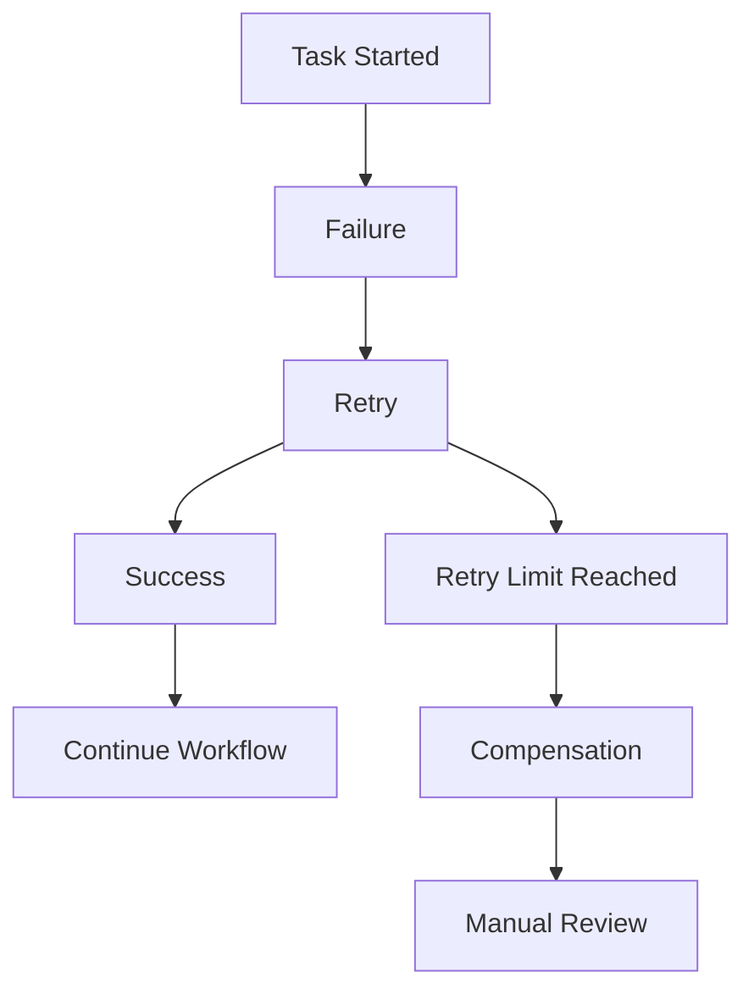
<!-- @import "[TOC]" {cmd="toc" depthFrom=1 depthTo=6 orderedList=false} -->

---

# 24. Idempotency

All workflow operations must be idempotent.

If duplicate requests occur because of retries or network failures, executing the same request multiple times must not produce duplicate business effects.

Examples include:

* Duplicate payment confirmation
* Duplicate proposal approval
* Duplicate workflow resume
* Duplicate event delivery

Idempotency keys and workflow execution identifiers ensure safe reprocessing.

---

# 25. Edge Cases

| Scenario                | Handling Strategy              |
| ----------------------- | ------------------------------ |
| User disconnects        | Persist state and allow resume |
| Duplicate submission    | Ignore using idempotency keys  |
| AI service timeout      | Retry or switch to fallback    |
| Designer unavailable    | Re-run matching algorithm      |
| Payment failure         | Trigger compensation workflow  |
| Event duplication       | Deduplicate using event IDs    |
| Workflow engine restart | Resume from persisted state    |
| Service outage          | Queue events until recovery    |

---

