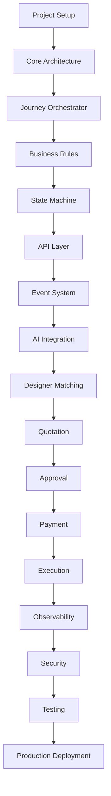
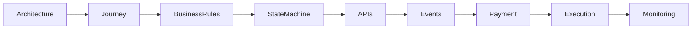

# Implementation Order

## Document Information

| Property | Value |
|----------|-------|
| Layer | Layer 2 – Guided Journey |
| Document | Implementation Order |
| Status | Production |
| Version | 1.0 |

---

# Purpose

This document defines the recommended implementation sequence for Layer 2.

Following this order ensures that foundational components are established before dependent features are developed.

---

# Implementation Roadmap

---

# Dependency Order

---

# Development Phases

| Phase | Components |
|--------|------------|
| Phase 1 | Project Setup, Architecture |
| Phase 2 | Journey Orchestrator, Business Rules |
| Phase 3 | State Machine, API Layer |
| Phase 4 | Event Processing, AI Integration |
| Phase 5 | Designer Matching, Quotation |
| Phase 6 | Approval, Payment |
| Phase 7 | Execution, Handover |
| Phase 8 | Security, Observability, Testing |

---

# Implementation Principles

- Build foundational services first.
- Keep modules loosely coupled.
- Validate each phase before continuing.
- Implement security from the beginning.
- Add observability throughout development.
- Test every completed module before the next phase.

---

# Validation Checklist

- Core architecture implemented
- Journey orchestration operational
- Business rules validated
- State transitions verified
- APIs documented and tested
- Events published successfully
- AI integration verified
- Payment workflow operational
- Security controls enabled
- Monitoring configured
- End-to-end tests completed

---

# Related Documents

- README.md
- architecture.md
- ADR.md
- dependency_graph.md
- coding_rules.md
- testing.md
