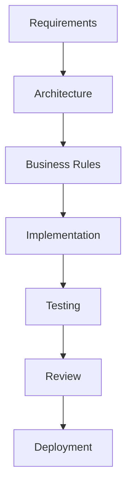
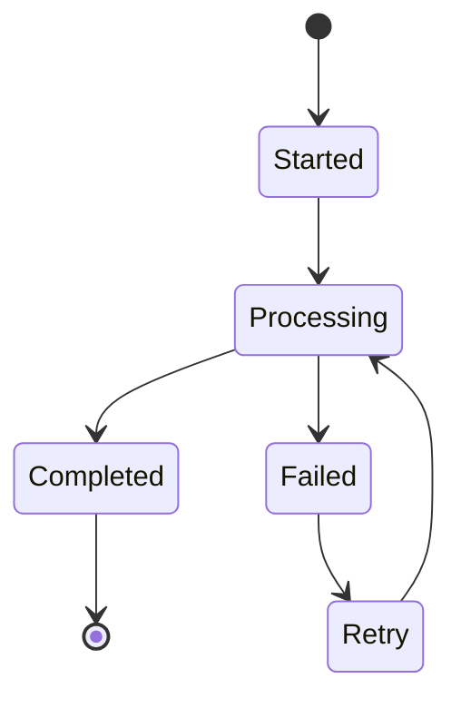
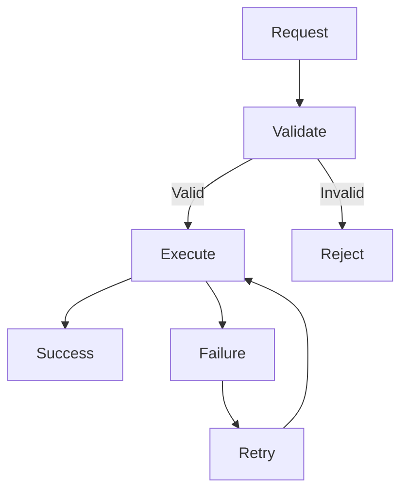

# Implementation Rules

## Document Information

| Property | Value |
|----------|-------|
| Layer | Layer 2 – Guided Journey |
| Document | Implementation Rules |
| Status | Production |
| Version | 1.0 |

---

# Purpose

This document defines the implementation rules for Layer 2.

Every implementation must follow these rules to ensure consistency, scalability, maintainability, and reliability across the Guided Journey.

---

# Implementation Principles

- Keep services stateless.
- Follow modular architecture.
- Build loosely coupled components.
- Prefer composition over inheritance.
- Keep business logic deterministic.
- Design for scalability.
- Ensure backward compatibility.

---

# Implementation Workflow

---

# Component Dependency Rule

---

# Implementation Constraints

Developers must:

- Validate all inputs.
- Handle all failures gracefully.
- Maintain idempotent operations.
- Log important events.
- Publish business events only after successful execution.
- Use asynchronous communication where appropriate.
- Avoid circular dependencies.

---

# API Rules

Every implementation must:

- Use versioned APIs.
- Support authentication.
- Validate requests.
- Validate responses.
- Return consistent error messages.

---

# Event Rules

- Events must be immutable.
- Events must contain correlation IDs.
- Consumers must be idempotent.
- Failed events should support retry mechanisms.
- Dead-letter queues should be used for unrecoverable failures.

---

# State Management Rules

Rules:

- Only valid state transitions are allowed.
- Reject invalid transitions.
- Persist workflow checkpoints before external operations.

---

# Error Handling Rules

---

# Security Rules

- Authenticate every request.
- Authorize every operation.
- Encrypt all communication.
- Never expose internal services.
- Validate all external inputs.
- Avoid logging sensitive information.

---

# Performance Rules

- Prefer asynchronous workflows.
- Use caching where appropriate.
- Minimize synchronous dependencies.
- Optimize database access.
- Avoid unnecessary network calls.

---

# Testing Rules

Every implementation must include:

- Unit tests
- Integration tests
- API tests
- Failure scenario tests
- Security validation
- Performance validation

---

# Code Review Checklist

Before merging:

- Architecture follows standards
- Tests pass
- Documentation updated
- No circular dependencies
- Error handling implemented
- Logging added
- Security reviewed
- Performance considered

---

# Best Practices

- Write readable code.
- Keep methods focused.
- Avoid duplicate logic.
- Document public interfaces.
- Prefer configuration over hardcoding.
- Keep modules independently deployable.

---

# Related Documents

- implementation_order.md
- coding_rules.md
- architecture.md
- ADR.md
- dependency_graph.md
- testing.md
- security.md
