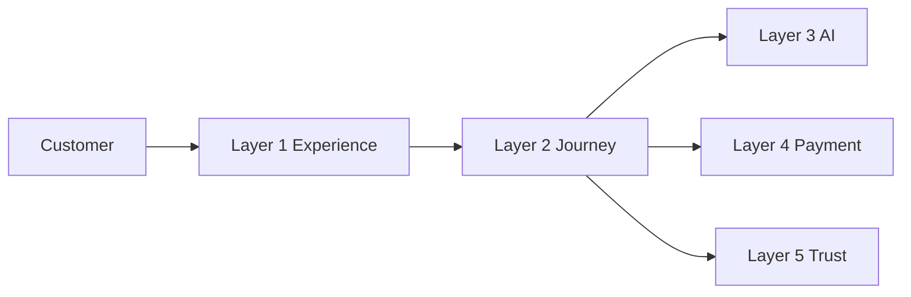
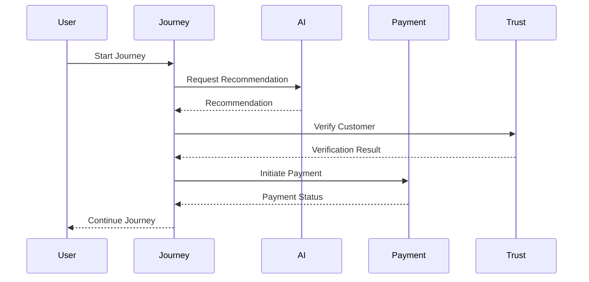
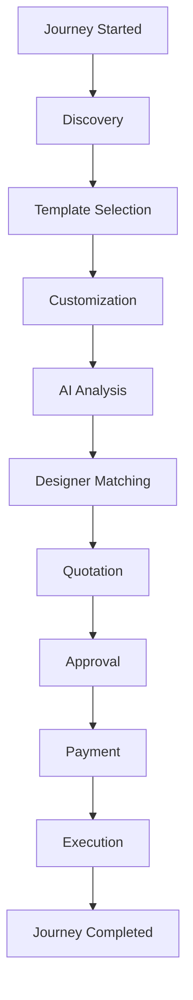
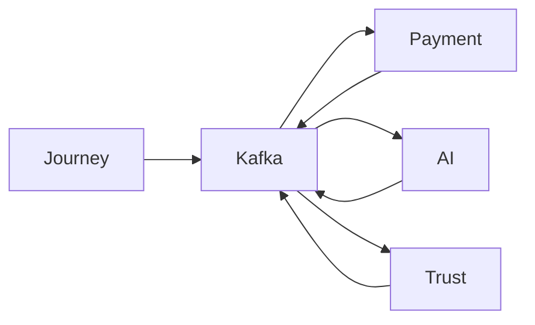

# Interaction Architecture

## Document Information

| Property | Value |
|----------|-------|
| Layer | Layer 2 – Guided Journey |
| Document | Interaction Architecture |
| Status | Production |
| Version | 1.0 |

---

# Overview

The Interaction Architecture defines how users, Layer 2 components, and external platform services communicate during the Guided Journey.

Layer 2 acts as the orchestration layer, coordinating interactions while enforcing business rules and maintaining workflow state.

---

# Objectives

- Coordinate customer interactions
- Manage workflow progression
- Integrate external services
- Support asynchronous communication
- Ensure reliable state transitions

---

# High-Level Interaction

---

# Interaction Lifecycle

---

# Journey Interaction Flow

---

# Event Interaction

---

# Interaction Principles

- User interactions are validated before processing.
- Business rules control workflow progression.
- AI provides recommendations only.
- Long-running operations use asynchronous events.
- Failed interactions support retry and recovery.
- Every interaction is traceable using correlation IDs.

---

# Security

- JWT authentication
- Role-based authorization
- HTTPS/TLS
- Request validation
- Audit logging

---

# Observability

Monitor:

- User interactions
- API latency
- Event processing
- Journey completion
- Error rate
- Retry count

---

# Related Documents

- README.md
- architecture.md
- frontend_architecture.md
- AI_CONTEXT.md
- api_usage_rules.md
- dependency_graph.md
- journey_rules.md
